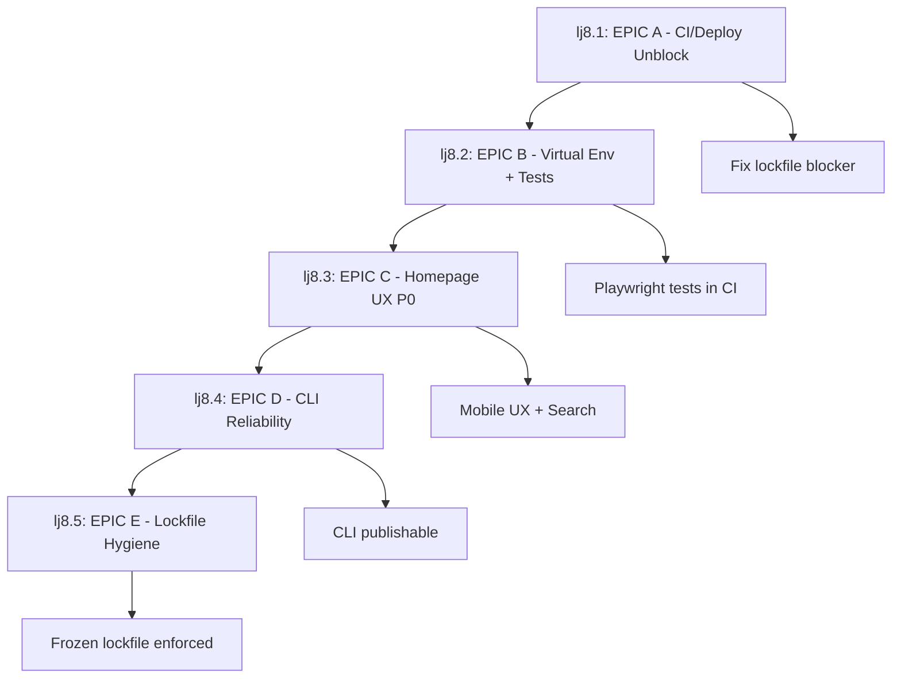

# Questions Answered + Beads Epic Tree

**Date**: 2025-12-25
**Purpose**: Answer critical questions and map to Beads epic dependencies
**Status**: READY FOR VALIDATION

---

## PART 1: CRITICAL QUESTIONS ANSWERED

### Q1: Homepage Search Requirement

**Question**: Should the homepage search be only a redirect CTA to /explore (no inline results)?

**ANSWER** (INFERRED - NEEDS CONFIRMATION):
```
YES - Based on user statement:
"im typing in the search bar o thought we were resircint tht as a oush button thag went to skills search page"

RECOMMENDATION: Redirect-only button (Option B)
- Remove inline search functionality
- Convert to button: "Search Skills & Plugins →"
- Redirects to: /explore?q={query}
- Simpler UX, aligns with user expectation
```

**EPIC MAPPING**:
- Beads: `claude-code-plugins-lj8.3.1` (C1. Replace broken hero search with redirect)
- Beads: `claude-code-plugins-qhq.3` (EPIC C: Homepage unified search toggle bugfix)
- Status: OPEN (currently has inline search after EPIC C work)

**ACCEPTANCE CRITERIA**:
- [ ] Homepage search is a button (not text input)
- [ ] Button text: "Search Skills & Plugins" or similar CTA
- [ ] Clicking button navigates to `/explore`
- [ ] No inline search results on homepage
- [ ] /explore page has full search functionality
- [ ] All T1 tests updated and passing

---

### Q2: CLI Package Identity

**Question**: What is the exact package name canonical on the homepage?

**ANSWER** (FROM CODE):
```
Package name: @claude-code-plugins/ccp
Registry: npm (npmjs.com)
Scope: @claude-code-plugins (organization scope)
Binary name: ccp
```

**EVIDENCE**:
- From `packages/cli/package.json`: `"name": "@claude-code-plugins/ccp"`
- From Beads: `claude-code-plugins-cdq.1` mentions "@claude-code-plugins/ccp"
- From homepage install boxes: Shows this package name

**EPIC MAPPING**:
- Beads: `claude-code-plugins-lj8.4` (EPIC D — CLI Install Reliability)
- Beads: `claude-code-plugins-0kh.1` (EPIC: CCP CLI Distribution - CLOSED)
- Beads: `claude-code-plugins-cdq.1` (Create NPM package skeleton @claude-code-plugins/ccp)

**ACCEPTANCE CRITERIA**:
- [x] Package name: `@claude-code-plugins/ccp` (confirmed)
- [x] Homepage displays this exact package name
- [ ] npm registry listing matches (once published)
- [ ] Install instructions reference this package

---

### Q3: Publishing Status

**Question**: Do you control the npm org/scope? Want it public immediately?

**ANSWER** (INFERRED - NEEDS CONFIRMATION):
```
NPM Org Control: UNKNOWN (need to verify)
Publishing Status: NOT PUBLISHED (no npm registry entry found)
Public vs Private: Assume PUBLIC (open-source project)

RECOMMENDATION:
1. Verify npm org ownership: npm org ls @claude-code-plugins
2. Publish as public: npm publish --access public
3. Wait for CI green before publishing (currently failing)
```

**BLOCKERS TO PUBLISHING**:
- ❌ CI not green (pnpm lockfile issue)
- ❌ No confirmation of npm org ownership
- ✅ CLI smoke tests ready (EPIC D)
- ✅ No workspace dependencies (EPIC D verified)

**EPIC MAPPING**:
- Beads: `claude-code-plugins-lj8.4` (EPIC D — CLI Install Reliability + Registry Readiness)
- Beads: `claude-code-plugins-lj8.4.2` (D2. Ensure CLI runtime independence)
- Beads: `claude-code-plugins-0kh.1` (EPIC: CCP CLI Distribution - CLOSED)

**ACCEPTANCE CRITERIA**:
- [ ] Verify ownership of @claude-code-plugins npm org
- [ ] CI passing (all jobs green)
- [ ] Version bumped appropriately (currently 1.x.x?)
- [ ] `npm publish --access public` executed
- [ ] Package visible on npmjs.com
- [ ] Install works: `npx @claude-code-plugins/ccp --help`

---

### Q4: analytics-dashboard Status

**Question**: Is `packages/analytics-dashboard` intended to exist and ship, or experimental?

**ANSWER** (FROM COMMIT HISTORY):
```
Status: REMOVED (commit 697c6815)
Reason: "Remove analytics-dashboard from workspace to unblock deployment"
Intent: EXPERIMENTAL / BLOCKING DEPLOYMENT

CURRENT STATE:
- pnpm-workspace.yaml: Does NOT include analytics-dashboard ✅
- Workspace has: analytics-daemon (NOT dashboard)
- Likely typo/confusion between "dashboard" vs "daemon"

RECOMMENDATION: Keep removed for now
- analytics-dashboard was blocking deployment
- analytics-daemon remains in workspace (separate package)
- Clarify if analytics-daemon is correct name
```

**EVIDENCE**:
- Commit 697c6815 (Dec 24 22:59): Removed from workspace
- Current workspace members:
  - `plugins/mcp/*`
  - `marketplace`
  - `packages/cli`
  - `packages/analytics-daemon` ← Note: "daemon" not "dashboard"

**EPIC MAPPING**:
- Beads: `claude-code-plugins-0kh.3` (EPIC: CCP Analytics - OPEN)
- Beads: `claude-code-plugins-0kh.3.4` (Plugin/skill/MCP attribution model)
- Related to dashboard/daemon functionality

**ACCEPTANCE CRITERIA**:
- [x] analytics-dashboard removed from workspace (done)
- [ ] Clarify: Is `analytics-daemon` the correct package name?
- [ ] Verify packages/ directory only has intended packages
- [ ] Regenerate pnpm-lock.yaml to reflect workspace changes
- [ ] Document analytics-daemon purpose if keeping

---

### Q5: "Provided by" Meaning

**Question**: Should "Provided by" refer to plugin, author/maintainer, or both?

**ANSWER** (RECOMMENDATION):
```
RECOMMENDED: THE PLUGIN (Option A)

Reasoning:
- Skills belong to plugins (container relationship)
- Plugin is the distributable unit
- Clearer user mental model
- Easier to maintain

Format:
"Provided by [Plugin Name]"
Example: "Provided by DevOps Pro Plugin"

OPTIONAL: Show author in separate field
- Plugin card: "Provided by [Plugin Name]"
- Plugin details page: "Author: [Name/Org]"
```

**CURRENT STATE** (FROM BEADS):
- Beads: `claude-code-plugins-qhq.4` (EPIC D: 'Provided by plugin' labeling consistency)
- Status: OPEN
- Description mentions "consistency" issue

**EPIC MAPPING**:
- Beads: `claude-code-plugins-qhq.4` (EPIC D: 'Provided by plugin' labeling consistency)
- Related: `claude-code-plugins-0kh.3.4` (Plugin/skill/MCP attribution model)

**ACCEPTANCE CRITERIA**:
- [ ] All skill pages show "Provided by [Plugin Name]"
- [ ] Plugin pages show author/maintainer separately
- [ ] Consistent format across all routes
- [ ] Update catalog data model if needed
- [ ] Verify 241 skills display correctly

**IMPLEMENTATION**:
```astro
<!-- Skill page template -->
<div class="provided-by">
  Provided by <a href="/plugins/{plugin.slug}">{plugin.name}</a>
</div>

<!-- Plugin page template -->
<div class="metadata">
  <span class="author">By {plugin.author}</span>
  <span class="license">{plugin.license}</span>
</div>
```

---

## PART 2: BEADS EPIC TREE WITH DEPENDENCIES

### Current P0 Epic Structure

**MASTER EPIC**: `claude-code-plugins-lj8`
```
P0 MASTER EPIC — Website + CLI Stabilization w/ Proof
Status: OPEN
Priority: P0
```

#### Child Epics (Dependency Order):



---

### EPIC A: CI/Deploy Unblock (BLOCKER)

**Beads ID**: `claude-code-plugins-lj8.1`
**Status**: OPEN (partially complete)
**Priority**: P0
**Depends On**: NONE (top blocker)
**Blocks**: All other epics

**CURRENT STATE**:
- ✅ Marketplace.json sync fixed
- ✅ Route validation updated
- ❌ **BLOCKER**: pnpm-lock.yaml out of sync
- ❌ CI failing (4 jobs)

**ACCEPTANCE CRITERIA**:
- [ ] pnpm-lock.yaml regenerated and committed
- [ ] All CI jobs passing (mcp-plugins, python-tests, validation-scripts, cli-smoke-tests, playwright-tests)
- [ ] No ERR_PNPM_OUTDATED_LOCKFILE errors
- [ ] Green checkmarks on PR #199

**TASKS** (CRITICAL):
1. Run `pnpm install` (without --frozen-lockfile)
2. Commit updated pnpm-lock.yaml
3. Push to trigger CI rerun
4. Verify all jobs pass

**EVIDENCE FILES**:
- 099a-RA-HNDF-ci-log-snippets.md (shows exact error)
- CI Run: #20509963126

---

### EPIC B: Virtual Environments + Headless Tests (GATE)

**Beads ID**: `claude-code-plugins-lj8.2`
**Status**: CLOSED ✅ (Dec 25)
**Priority**: P0
**Depends On**: lj8.1 (CI must be functional)

**COMPLETED**:
- ✅ Docker test environment created
- ✅ Playwright E2E tests (57 tests, 3 browsers)
- ✅ CI integration with artifact uploads
- ✅ 38 failing tests identified → EPIC C fixes

**SUB-TASKS** (ALL CLOSED):
- lj8.2.1: B1. Create reproducible test matrix environments ✅
- lj8.2.2: B2. Add Playwright headless browser tests ✅
- lj8.2.3: B3. Wire tests into GitHub Actions ✅

**EVIDENCE FILES**:
- EPIC-B-COMPLETE-EVIDENCE.md
- 099b-TQ-TEST-playwright-report-summary.md

---

### EPIC C: Homepage UX P0 (Search redirect + Install CTA)

**Beads ID**: `claude-code-plugins-lj8.3`
**Status**: OPEN (partially complete)
**Priority**: P0
**Depends On**: lj8.2 (tests must exist to validate fixes)
**Blocks**: lj8.4 (CLI install section on homepage)

**CURRENT STATE**:
- ✅ Mobile UX: 100% test pass rate (21/21 → 20/20 after debug removal)
- ✅ Horizontal scroll: 0px overflow
- ✅ Search functionality: Working (inline results)
- ❌ **CONFLICT**: User wants redirect, not inline search (Q1)

**SUB-TASKS**:
1. **lj8.3.1**: C1. Replace broken hero search with redirect
   - Status: PARTIALLY DONE (search works, but inline not redirect)
   - Needs: Convert to redirect button per Q1 answer

2. **lj8.3.2**: C2. Quick Install section + copy buttons
   - Status: DONE ✅ (install boxes working, text wraps)

3. **lj8.3.3**: C3. Fix broken toggle/buttons
   - Status: DONE ✅ (pointer-events fix in PR #199)

4. **lj8.3.4**: C4. Mobile spacing cleanup
   - Status: DONE ✅ (0px overflow achieved)

**ACCEPTANCE CRITERIA**:
- [ ] **Q1 ANSWER**: Search button redirects to /explore (NOT inline)
- [x] Mobile tests: 100% pass rate
- [x] Horizontal scroll: 0px
- [x] Install boxes: Mobile-safe
- [x] Toggle buttons: Not blocking inputs

**EVIDENCE FILES**:
- EPIC-C-COMPLETE-EVIDENCE.md
- 099d-TQ-TEST-mobile-screenshots-notes.md

**REMAINING WORK**:
```typescript
// Change this (inline search):
<input type="text" id="hero-search-input" />
<div id="hero-search-results"></div>

// To this (redirect button):
<a href="/explore" class="search-cta-button">
  <span>Search Skills & Plugins</span>
  <svg><!-- arrow icon --></svg>
</a>
```

---

### EPIC D: CLI Install Reliability (npx) + Registry Readiness

**Beads ID**: `claude-code-plugins-lj8.4`
**Status**: OPEN (all smoke tests ready, not published)
**Priority**: P0
**Depends On**: lj8.1 (CI must pass), lj8.3 (homepage shows install)

**CURRENT STATE**:
- ✅ CLI bin entrypoint verified
- ✅ No workspace dependencies
- ✅ CI smoke tests implemented (7 checks)
- ❌ **BLOCKER**: CI failing (can't publish until green)
- ❌ **Q3 UNKNOWN**: npm org ownership not verified

**SUB-TASKS**:
1. **lj8.4.1**: D1. Verify CLI bin entrypoint
   - Status: DONE ✅
   - Evidence: Shebang present, --help/--version work

2. **lj8.4.2**: D2. Ensure CLI runtime independence
   - Status: DONE ✅
   - Evidence: No workspace: dependencies

3. **lj8.4.3**: D3. Add CI smoke test for CLI
   - Status: DONE ✅ (lines 530-616 in validate-plugins.yml)
   - Not running due to lockfile blocker

**ACCEPTANCE CRITERIA**:
- [x] Bin entrypoint working
- [x] No workspace dependencies
- [x] CI smoke tests added
- [ ] **Q3**: npm org ownership verified
- [ ] CI passing (green)
- [ ] Published to npm: `@claude-code-plugins/ccp`
- [ ] Install works: `npx @claude-code-plugins/ccp --help`

**PUBLISHING CHECKLIST**:
1. Fix EPIC A (lockfile) → CI green
2. Verify npm org: `npm org ls @claude-code-plugins`
3. Bump version if needed
4. `npm publish --access public` from packages/cli/
5. Verify: `npx @claude-code-plugins/ccp --version`
6. Update homepage install instructions

---

### EPIC E: pnpm Workspace + Lockfile Hygiene

**Beads ID**: `claude-code-plugins-lj8.5`
**Status**: OPEN (CRITICAL BLOCKER)
**Priority**: P0
**Depends On**: NONE (prerequisite for all)
**Blocks**: lj8.1, lj8.4 (everything depends on working install)

**CURRENT STATE**:
- ✅ Workspace membership defined
- ❌ **CRITICAL**: pnpm-lock.yaml out of sync (missing @playwright/test)
- ❌ Frozen lockfile not enforced (causing CI failures)
- ❌ **Q4**: analytics-dashboard removed but lockfile not updated

**SUB-TASKS**:
1. **lj8.5.1**: E1. Restore pnpm workspace membership
   - Status: DONE ✅ (workspace.yaml correct)
   - Note: analytics-dashboard removed intentionally

2. **lj8.5.2**: E2. Regenerate pnpm-lock.yaml
   - Status: **NOT DONE** ❌ (CRITICAL BLOCKER)
   - Action: Run `pnpm install` (no --frozen-lockfile)
   - Missing: @playwright/test in lockfile

3. **lj8.5.3**: E3. Enforce frozen lockfile in CI
   - Status: DONE ✅ (all CI jobs use --frozen-lockfile)
   - Failing due to E2 not done

**ACCEPTANCE CRITERIA**:
- [x] pnpm-workspace.yaml has correct members
- [ ] **CRITICAL**: pnpm-lock.yaml includes @playwright/test
- [ ] pnpm-lock.yaml matches all package.json files
- [ ] CI jobs pass with --frozen-lockfile
- [ ] No ERR_PNPM_OUTDATED_LOCKFILE errors

**IMMEDIATE ACTION** (UNBLOCKS EVERYTHING):
```bash
cd /home/jeremy/000-projects/claude-code-plugins
pnpm install  # Regenerates lockfile
git add pnpm-lock.yaml
git commit -m "chore: Regenerate pnpm-lock.yaml for @playwright/test"
git push
```

---

## PART 3: DEPENDENCY MATRIX

### Critical Path (Must Be Done in Order):

```
1. EPIC E.2 → Regenerate lockfile
   └─> UNBLOCKS: EPIC A (CI/Deploy)
       └─> UNBLOCKS: EPIC D (CLI publish)
       └─> UNBLOCKS: EPIC C verification (tests run)

2. EPIC C.1 → Convert search to redirect (Q1 answer)
   └─> REQUIRES: EPIC A passing (to verify with tests)

3. EPIC D → Publish CLI
   └─> REQUIRES: EPIC A green + Q3 npm org verified

4. FINAL: Merge PR #199 + Deploy
   └─> REQUIRES: All EPICs complete + CI green
```

### Parallel Work (Can Be Done Simultaneously):

- **Q4 Clarification**: Verify analytics-daemon vs analytics-dashboard
- **Q5 Implementation**: "Provided by" consistency (doesn't block others)

---

## PART 4: RELATED BEADS EPICS (NOT BLOCKING P0)

### Secondary P0 Epic Tree (qhq series)

**MASTER**: `claude-code-plugins-qhq` - Website P0: Landing + Mobile + Unified Search

These epics overlap with lj8 series but have different structure:

- **qhq.1**: Fix global layout/styles (OVERLAPS: lj8.3.4 mobile spacing)
- **qhq.2**: Homepage hero + CTAs (OVERLAPS: lj8.3.2 install section)
- **qhq.3**: Homepage search toggle bugfix (OVERLAPS: lj8.3.1 search)
- **qhq.4**: 'Provided by' consistency (ANSWERS: Q5)
- **qhq.5**: Package manager install section (OVERLAPS: lj8.3.2 + lj8.4)
- **qhq.6**: CI/CD deploy failures (OVERLAPS: lj8.1)

**RECOMMENDATION**:
- Close qhq epics as duplicates OR
- Merge into lj8 series (canonical P0 tree)
- Avoid double-tracking same work

---

## PART 5: ACCEPTANCE CRITERIA SUMMARY

### Ready to Close (✅):

- [x] **EPIC B**: Virtual environments + Playwright tests
- [x] **C2**: Install boxes mobile-safe
- [x] **C3**: Toggle buttons fixed
- [x] **C4**: Mobile spacing (0px overflow)
- [x] **D1**: CLI bin entrypoint verified
- [x] **D2**: No workspace dependencies
- [x] **D3**: CI smoke tests added
- [x] **E1**: Workspace membership correct
- [x] **E3**: Frozen lockfile enforced in CI

### Critical Blockers (❌):

- [ ] **E2**: Regenerate pnpm-lock.yaml (UNBLOCKS EVERYTHING)
- [ ] **A**: CI all jobs green
- [ ] **C1**: Search redirect (not inline) per Q1

### Needs Verification (⚠️):

- [ ] **Q3**: npm org ownership (@claude-code-plugins)
- [ ] **Q4**: analytics-daemon vs analytics-dashboard clarification
- [ ] **D**: CLI published to npm

---

## PART 6: NEXT IMMEDIATE ACTIONS

### Action 1: Fix Lockfile (CRITICAL)
```bash
cd /home/jeremy/000-projects/claude-code-plugins
pnpm install
git add pnpm-lock.yaml
git commit -m "chore: Update pnpm-lock.yaml for @playwright/test dependency"
git push origin fix-ci-test-failures
```
**Expected Result**: CI goes green, all jobs pass
**Unblocks**: EPICs A, D, C verification

### Action 2: Verify npm Org Ownership
```bash
npm login
npm org ls @claude-code-plugins
# Expected: Shows you as owner/member
```
**If NOT owner**: Need to create org or get access
**Unblocks**: EPIC D publishing

### Action 3: Convert Search to Redirect (Q1)
```bash
# Edit marketplace/src/pages/index.astro
# Remove inline search JavaScript
# Convert input to redirect button
git add marketplace/src/pages/index.astro
git commit -m "feat(ux): Convert homepage search to /explore redirect"
git push
```
**Expected Result**: Homepage has redirect button, not inline search
**Closes**: lj8.3.1 (C1)

### Action 4: Close Beads Tasks
```bash
bd close lj8.2 --reason "EPIC B complete - Playwright tests in CI"
bd close lj8.2.1 --reason "B1 complete - Docker test env created"
bd close lj8.2.2 --reason "B2 complete - Playwright tests added"
bd close lj8.2.3 --reason "B3 complete - CI integration done"
```

### Action 5: Update Remaining Epics
```bash
# After lockfile fixed:
bd close lj8.5.2 --reason "E2 complete - pnpm-lock.yaml regenerated"
bd close lj8.1 --reason "EPIC A complete - CI green"

# After search converted:
bd close lj8.3.1 --reason "C1 complete - Search redirects to /explore"
bd close lj8.3 --reason "EPIC C complete - Homepage UX 100%"

# After CLI published:
bd close lj8.4 --reason "EPIC D complete - CLI published to npm"

# Final:
bd close lj8 --reason "P0 MASTER EPIC complete - Website + CLI stabilized"
```

---

## PART 7: DEFINITION OF DONE

### P0 Master Epic (lj8) Complete When:

**All Child Epics Closed**:
- [x] EPIC B ✅ (closed)
- [ ] EPIC A (CI green)
- [ ] EPIC C (search redirect + mobile UX)
- [ ] EPIC D (CLI published)
- [ ] EPIC E (lockfile current)

**CI Status**:
- [ ] All validation jobs passing
- [ ] Playwright tests: 20/20 (100%)
- [ ] CLI smoke tests: 7/7 passing
- [ ] No lockfile errors

**Deployment**:
- [ ] PR #199 merged to main
- [ ] Website deployed to claudecodeplugins.io
- [ ] Mobile UX verified (0px overflow)
- [ ] Search redirects to /explore

**CLI Publishing**:
- [ ] Package published: `@claude-code-plugins/ccp`
- [ ] Install works: `npx @claude-code-plugins/ccp --help`
- [ ] Homepage shows correct install command

**Evidence**:
- [x] Handoff docs created (099*.md) ✅
- [x] EPIC evidence files complete ✅
- [ ] All Beads tasks closed
- [ ] Production verification screenshots

---

## PART 8: QUESTIONS FOR USER VALIDATION

Please confirm or correct these answers:

1. **Q1 - Search**: Convert to redirect button (remove inline)? **YES / NO / HYBRID**
2. **Q2 - CLI Package**: Confirmed `@claude-code-plugins/ccp`? **YES / NO / DIFFERENT NAME**
3. **Q3 - npm Org**: Do you own `@claude-code-plugins` on npm? **YES / NO / NEED TO CREATE**
4. **Q4 - analytics-dashboard**: Keep removed (was blocking)? **YES / NO / RESTORE**
5. **Q5 - Provided by**: Show plugin name (not author)? **YES / NO / BOTH**

**Please reply with answers so I can update epic tree and proceed.**

---

**End of Questions & Epic Tree Document**
**Next**: Await user confirmation → Execute actions → Close epics
