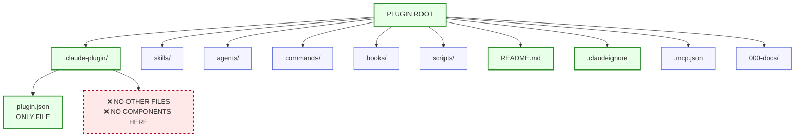
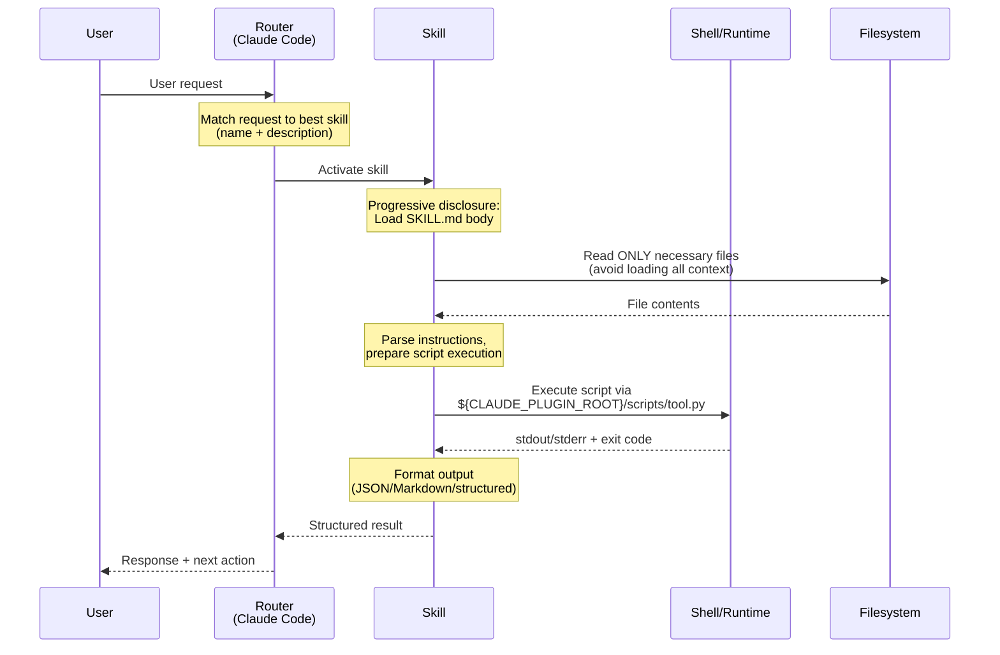
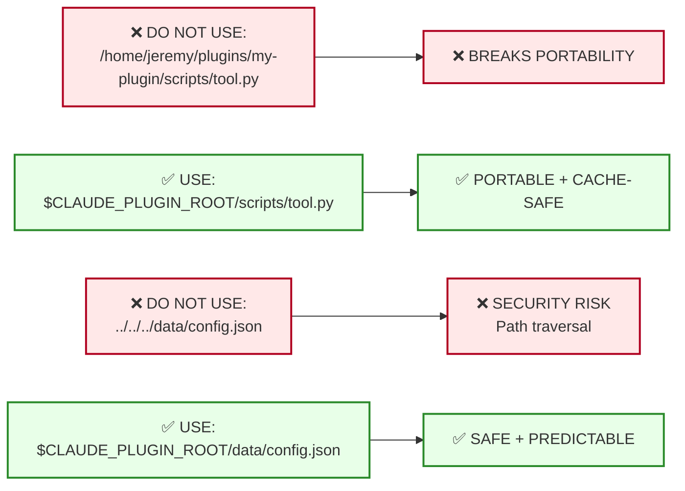

# 6767-f-AT-ARCH-plugin-scaffold-diagrams.md

**Document Type**: Architecture & Technical - Architecture (AT-ARCH)
**Document ID**: 6767-f-AT-ARCH-plugin-scaffold-diagrams
**Title**: Plugin Scaffold Diagrams (Enforceable)
**Version**: 3.0.0
**Status**: CANONICAL (Enterprise-Only)
**Date**: 2025-12-20
**Companion To**: 6767-c (Extensions Standard), 6767-d (Schema), 6767-e (Validation)
**Authority**: Intent Solutions (Enterprise Marketplace)
**Normative Language**: This document uses MUST / SHOULD / MAY

---

## 1. Non-Negotiable Constraints (MUST)

### 1.1 Directory Structure Rules

| Rule | Constraint | Validator Check ID |
|------|------------|-------------------|
| `.claude-plugin/` MUST contain ONLY `plugin.json` | Exactly 1 file | `DIR_002` |
| Plugin root MUST be parent of all component directories | skills/, agents/, commands/, hooks/, scripts/ at root | `DIR_004` |
| No component directories inside `.claude-plugin/` | Components NOT in `.claude-plugin/` | `DIR_005` |

### 1.2 Manifest Rules (plugin.json)

| Rule | Constraint | Validator Check ID |
|------|------------|-------------------|
| `plugin.json.name` MUST be kebab-case | Pattern: `^[a-z0-9-]+$` | `PLUGIN_003` |
| `plugin.json.name` MUST be ≤64 characters | Max length: 64 | `PLUGIN_005` |
| `plugin.json.name` MUST NOT contain reserved substrings | Ban: "claude", "anthropic" | `PLUGIN_006` |
| `plugin.json.version` MUST be SemVer | Pattern: `\d+\.\d+\.\d+` (MAJOR.MINOR.PATCH) | `PLUGIN_012` |

### 1.3 Documentation Rules

| Rule | Constraint | Validator Check ID |
|------|------------|-------------------|
| Any plugin docs MUST live in `<repo>/000-docs/` | Flat directory (no subdirs) | `DOC_001` |
| `000-docs/` filenames MUST match pattern | `NNN-CC-ABCD-short-description.ext` | `DOC_002` |

### 1.4 Portability Rules

| Rule | Constraint | Validator Check ID |
|------|------------|-------------------|
| Paths in manifests MUST be relative to plugin root | No absolute paths | `SEC_005` |
| Executed scripts MUST use `${CLAUDE_PLUGIN_ROOT}` | No `/home/...` paths | `SEC_005` |

### 1.5 Context Hygiene Rules

| Rule | Constraint | Validator Check ID |
|------|------------|-------------------|
| Projects MUST include `.claudeignore` | File exists at plugin root | (Future: `CONTEXT_001`) |
| `.claudeignore` SHOULD be kept updated | Exclude build artifacts, data files | (Manual review) |

---

## 2. Canonical Directory Tree (Reference)

### 2.1 Minimal Plugin (Required Only)

```
my-plugin/                              ← Plugin root
├── .claude-plugin/                     ← REQUIRED: Metadata directory
│   └── plugin.json                     ← REQUIRED: ONLY file allowed here
├── README.md                           ← REQUIRED: Documentation
└── .claudeignore                       ← REQUIRED: Context exclusions
```

**Validator Checks**:
- `DIR_001`: `.claude-plugin/` exists
- `DIR_002`: `.claude-plugin/` contains ONLY `plugin.json`
- `DIR_003`: `plugin.json` exists at correct path
- `PLUGIN_001-052`: All plugin.json manifest checks

### 2.2 Full Plugin (All Optional Components)

```
my-plugin/                              ← Plugin root
├── .claude-plugin/                     ← REQUIRED: Metadata directory
│   └── plugin.json                     ← REQUIRED: ONLY file allowed
├── skills/                             ← OPTIONAL: Skill capabilities
│   ├── skill-1/
│   │   ├── SKILL.md                    ← Skill definition (frontmatter + body)
│   │   ├── scripts/                    ← Helper scripts for this skill
│   │   ├── references/                 ← Heavy docs (loaded on-demand)
│   │   └── assets/                     ← Templates, config files
│   └── skill-2/
│       └── SKILL.md
├── agents/                             ← OPTIONAL: Agent definitions
│   ├── specialist-1.md                 ← Agent definition (frontmatter + body)
│   └── specialist-2.md
├── commands/                           ← OPTIONAL: Slash commands
│   ├── command-1.md                    ← Command definition
│   └── command-2.md
├── hooks/                              ← OPTIONAL: Event hooks
│   └── hooks.json                      ← Hook configuration
├── scripts/                            ← OPTIONAL: Plugin-level scripts
│   ├── validate_standards.py
│   ├── setup.sh
│   └── ...
├── .mcp.json                           ← OPTIONAL: MCP server config
├── .claudeignore                       ← REQUIRED: Context exclusions
├── README.md                           ← REQUIRED: Documentation
└── 000-docs/                           ← OPTIONAL: Project docs (flat, NNN-CC-ABCD)
    ├── 001-DR-STND-doc-filing.md
    ├── 002-RA-ANLY-analysis.md
    └── 003-AA-AACR-action-report.md
```

**Validator Checks** (per component):
- Skills: `SKILL_001-104` (frontmatter, body, security, naming)
- Agents: `AGENT_001-021` (frontmatter, naming)
- Security: `SEC_001-006` (secrets, paths, Bash scoping)
- Naming: `NAMING_001-005` (kebab-case, reserved words, max length)

---

## 3. Diagrams (Normative + Annotated)

### 3.1 Plugin Anatomy Tree (Allowed/Forbidden Callouts)



**Diagram Node → Validator Mapping**:

| Node | Type | Validator Checks |
|------|------|-----------------|
| **PLUGIN ROOT** | Directory | Plugin root exists and is accessible |
| **.claude-plugin/** | Directory (REQUIRED) | `DIR_001`: Directory exists |
| **plugin.json** | File (REQUIRED) | `DIR_003`: File exists at correct path<br/>`PLUGIN_001-052`: All manifest checks |
| **NO OTHER FILES** | Forbidden Zone | `DIR_002`: ONLY plugin.json allowed in `.claude-plugin/` |
| **skills/** | Directory (OPTIONAL) | `SKILL_001-104`: All skill checks (if present) |
| **agents/** | Directory (OPTIONAL) | `AGENT_001-021`: All agent checks (if present) |
| **commands/** | Directory (OPTIONAL) | (No specific checks; files are simple prompts) |
| **hooks/** | Directory (OPTIONAL) | (Validated via hooks.json schema) |
| **scripts/** | Directory (OPTIONAL) | `SEC_005`: No absolute paths in scripts |
| **README.md** | File (REQUIRED) | (No validator check; documentation requirement) |
| **.claudeignore** | File (REQUIRED) | (Future: `CONTEXT_001`) |
| **.mcp.json** | File (OPTIONAL) | (Validated via MCP schema) |
| **000-docs/** | Directory (OPTIONAL) | `DOC_001-006`: Doc filing compliance (if present) |

### 3.2 Router → Skill → Script Control Loop



**Diagram Step → Validator Mapping**:

| Step | Validator Check | Check ID |
|------|----------------|----------|
| **Router matches skill** | Skill name/description valid, discoverable | `SKILL_002-016` (name, description requirements) |
| **Load SKILL.md body** | Body ≤5,000 words, ≤500 lines | `SKILL_100-102` |
| **Read files** | No absolute paths in skill body | `SKILL_103` |
| **Execute script** | Script path uses `${CLAUDE_PLUGIN_ROOT}` | `SEC_005` |
| **Format output** | (No validator check; runtime behavior) | N/A |

### 3.3 Path Resolution Diagram (Portable vs Broken)



**Diagram Path → Validator Mapping**:

| Path Pattern | Status | Validator Check | Check ID |
|--------------|--------|----------------|----------|
| `/home/jeremy/...` | ❌ FORBIDDEN | Absolute path detected | `SEC_005` |
| `../../../...` | ❌ FORBIDDEN | Path traversal detected | `SEC_005` |
| `${CLAUDE_PLUGIN_ROOT}/...` | ✅ ALLOWED | Portable environment variable | (Passes) |
| `./relative/path` | ✅ ALLOWED | Relative to plugin root | (Passes) |

---

## 4. Enforcement Rules (Validator Checks)

### 4.1 Manifest Validation (plugin.json)

**Check Category**: `PLUGIN_*`

| Check ID | Severity | Rule | Expected | Error Message |
|----------|----------|------|----------|---------------|
| `PLUGIN_001` | CRITICAL | plugin.json type is object | JSON object | "plugin.json must be a valid JSON object" |
| `PLUGIN_002` | CRITICAL | name field present | String field "name" | "plugin.json missing required field: name" |
| `PLUGIN_003` | CRITICAL | name pattern | `^[a-z0-9-]+$` | "name must be kebab-case (lowercase, hyphens only)" |
| `PLUGIN_004` | CRITICAL | name min length | ≥1 character | "name must not be empty" |
| `PLUGIN_005` | CRITICAL | name max length | ≤64 characters | "name must be ≤64 characters (found: {actual})" |
| `PLUGIN_006` | CRITICAL | name reserved words | No "claude" or "anthropic" | "name must not contain reserved words: {words}" |
| `PLUGIN_011` | CRITICAL | version field present | String field "version" | "plugin.json missing required field: version" |
| `PLUGIN_012` | CRITICAL | version pattern | `^\d+\.\d+\.\d+$` | "version must be SemVer MAJOR.MINOR.PATCH (found: {actual})" |
| `PLUGIN_021` | CRITICAL | description field present | String field "description" | "plugin.json missing required field: description" |
| `PLUGIN_023` | HIGH | description max length | ≤1024 characters | "description must be ≤1024 characters" |
| `PLUGIN_031` | CRITICAL | author field present | Object field "author" | "plugin.json missing required field: author" |
| `PLUGIN_032` | CRITICAL | author.name and author.email present | Subfields exist | "author must have 'name' and 'email' fields" |
| `PLUGIN_034` | CRITICAL | author.email format | Valid email pattern | "author.email must be valid email format" |
| `PLUGIN_041` | CRITICAL | license field present | String field "license" | "plugin.json missing required field: license" |
| `PLUGIN_051` | CRITICAL | keywords field present | Array field "keywords" | "plugin.json missing required field: keywords" |
| `PLUGIN_052` | CRITICAL | keywords min items | ≥1 item in array | "keywords must have at least 1 item" |

### 4.2 Directory Structure Validation

**Check Category**: `DIR_*`

| Check ID | Severity | Rule | Expected | Error Message |
|----------|----------|------|----------|---------------|
| `DIR_001` | CRITICAL | .claude-plugin/ exists | Directory present | ".claude-plugin/ directory not found" |
| `DIR_002` | CRITICAL | .claude-plugin/ contains ONLY plugin.json | Exactly 1 file | ".claude-plugin/ must contain ONLY plugin.json (found: {files})" |
| `DIR_003` | CRITICAL | plugin.json exists | File at `.claude-plugin/plugin.json` | "plugin.json not found at .claude-plugin/plugin.json" |
| `DIR_004` | CRITICAL | Components at plugin root | skills/, agents/, etc. at root | "Component directory {name}/ must be at plugin root, not inside .claude-plugin/" |
| `DIR_005` | CRITICAL | No components inside .claude-plugin/ | Empty except plugin.json | "Component directory {name}/ found inside .claude-plugin/ (FORBIDDEN)" |
| `DIR_006` | MEDIUM | No empty directories | All directories have content | "Empty directory found: {path} (remove or populate)" |

### 4.3 Path Validation

**Check Category**: `SEC_*`

| Check ID | Severity | Rule | Expected | Error Message |
|----------|----------|------|----------|---------------|
| `SEC_005` | CRITICAL | No absolute paths | Relative paths or `${CLAUDE_PLUGIN_ROOT}` | "Absolute path detected: {path} (use ${CLAUDE_PLUGIN_ROOT} or relative paths)" |

### 4.4 Document Filing Validation (if 000-docs/ present)

**Check Category**: `DOC_*`

| Check ID | Severity | Rule | Expected | Error Message |
|----------|----------|------|----------|---------------|
| `DOC_001` | CRITICAL | 000-docs/ is flat | No subdirectories | "000-docs/ must be flat (found subdirectory: {name})" |
| `DOC_002` | CRITICAL | Filename pattern | `NNN-CC-ABCD-short-description.ext` | "Invalid filename pattern: {filename}" |
| `DOC_003` | CRITICAL | NNN uniqueness | No duplicate NNN | "Duplicate NNN found: {nnn} (files: {files})" |
| `DOC_004` | CRITICAL | CC code valid | From master table | "Invalid CC code: {cc}" |
| `DOC_005` | CRITICAL | ABCD valid for CC | Correct ABCD for CC | "Invalid ABCD '{abcd}' for CC '{cc}'" |
| `DOC_006` | HIGH | Short description format | 1-4 words, kebab-case | "Description must be 1-4 words, kebab-case" |

### 4.5 CI Workflow Validation (Recommended)

**Check Category**: (Future: `CI_*`)

| Check | Status | Recommendation |
|-------|--------|----------------|
| PR workflow exists | RECOMMENDED | `.github/workflows/pr.yml` should validate on PRs |
| Main workflow exists | RECOMMENDED | `.github/workflows/main.yml` should validate on main |

---

## 5. Examples (Good vs Bad)

### 5.1 Good plugin.json (Enterprise Compliant)

```json
{
  "name": "analytics-toolkit",
  "version": "1.2.3",
  "description": "Advanced analytics and visualization tools for data-driven insights.",
  "author": {
    "name": "Analytics Team",
    "email": "analytics@example.com"
  },
  "license": "MIT",
  "keywords": ["analytics", "visualization", "data"],
  "homepage": "https://docs.example.com/analytics",
  "repository": "https://github.com/example/analytics-toolkit",
  "skills": ["./skills/data-analysis/"],
  "mcpServers": {
    "data-server": {
      "command": "python",
      "args": ["${CLAUDE_PLUGIN_ROOT}/bin/server.py"]
    }
  }
}
```

**Validator Result**: ✅ **PASS** (all enterprise requirements met)

**Passing Checks**:
- ✅ `PLUGIN_003`: name is kebab-case
- ✅ `PLUGIN_005`: name ≤64 chars (18 chars)
- ✅ `PLUGIN_006`: no reserved words
- ✅ `PLUGIN_012`: version is SemVer (3 parts)
- ✅ `PLUGIN_032`: author has name + email
- ✅ `PLUGIN_051-052`: keywords present (3 items)
- ✅ `SEC_005`: paths use `${CLAUDE_PLUGIN_ROOT}`

### 5.2 Bad plugin.json (Multiple Violations)

```json
{
  "name": "Claude_Analytics_Plugin",
  "version": "1.0",
  "description": "Tool",
  "author": "Analytics Team",
  "keywords": []
}
```

**Validator Result**: ❌ **FAIL** (7 CRITICAL errors)

**Failing Checks**:

1. ❌ `PLUGIN_003`: name must be kebab-case (found: `Claude_Analytics_Plugin`)
   - **Expected**: `^[a-z0-9-]+$`
   - **Actual**: Contains uppercase + underscores
   - **Fix**: Change to `claude-analytics-plugin` or `analytics-plugin`

2. ❌ `PLUGIN_006`: name contains reserved word "claude"
   - **Expected**: No "claude" or "anthropic" in name
   - **Actual**: Starts with "Claude"
   - **Fix**: Remove "Claude_" prefix

3. ❌ `PLUGIN_012`: version must be SemVer MAJOR.MINOR.PATCH
   - **Expected**: `^\d+\.\d+\.\d+$`
   - **Actual**: `1.0` (missing PATCH)
   - **Fix**: Change to `1.0.0`

4. ❌ `PLUGIN_032`: author must be object with name + email
   - **Expected**: `{"name": "...", "email": "..."}`
   - **Actual**: Plain string `"Analytics Team"`
   - **Fix**: Change to `{"name": "Analytics Team", "email": "analytics@example.com"}`

5. ❌ `PLUGIN_041`: license field missing
   - **Expected**: String field "license"
   - **Actual**: Not present
   - **Fix**: Add `"license": "MIT"`

6. ❌ `PLUGIN_052`: keywords array is empty
   - **Expected**: ≥1 item
   - **Actual**: `[]` (0 items)
   - **Fix**: Add keywords: `["analytics", "data"]`

---

## 6. Common Failure Modes + Recovery

### 6.1 "Command not found" due to wrong paths

**Symptom**:
```
Error: python: command not found
File: ${CLAUDE_PLUGIN_ROOT}/bin/server.py
```

**Cause**: Script path is correct but script is not executable OR dependencies not installed.

**Recovery**:
1. **Make script executable**:
   ```bash
   chmod +x bin/server.py
   ```

2. **Verify shebang**:
   ```python
   #!/usr/bin/env python3
   ```

3. **Install dependencies**:
   ```bash
   cd ${CLAUDE_PLUGIN_ROOT}
   pip install -r requirements.txt
   ```

4. **Test manually**:
   ```bash
   cd /path/to/plugin
   python bin/server.py
   ```

**Validator Check**: (Future: `EXEC_001` - verify scripts are executable)

---

### 6.2 "Permission denied" from parent dir access

**Symptom**:
```
PermissionError: [Errno 13] Permission denied: '/home/jeremy/projects/../../etc/passwd'
```

**Cause**: Script uses path traversal (`../`) to access parent directories.

**Root Cause**: Violates `SEC_005` (path traversal forbidden).

**Recovery**:
1. **Identify violating path**:
   ```bash
   grep -r '\.\./\.\.' .
   ```

2. **Fix paths** (use `${CLAUDE_PLUGIN_ROOT}` instead):
   ```python
   # ❌ BAD
   config_path = "../../config/settings.json"

   # ✅ GOOD
   import os
   plugin_root = os.getenv("CLAUDE_PLUGIN_ROOT")
   config_path = os.path.join(plugin_root, "config/settings.json")
   ```

3. **Re-validate**:
   ```bash
   python scripts/validate_standards.py --plugin-root .
   ```

**Validator Check**: `SEC_005` catches `..` in paths

---

### 6.3 "Skill not activating" due to generic description

**Symptom**: Skill exists but Claude doesn't activate it when user requests related functionality.

**Cause**: Description is too generic; lacks "Use when..." clause or trigger phrases.

**Example (Bad)**:
```yaml
description: "Data processing tool"
```

**Why it fails**:
- No "Use when..." clause
- No trigger phrases
- Too vague (what kind of data? what processing?)

**Recovery**:
1. **Add "Use when" clause**:
   ```yaml
   description: "Process CSV files with statistical analysis and generate reports. Use when user uploads CSV data or requests statistical summaries, trend analysis, or data visualization. Trigger with 'analyze csv', 'process data file', or 'generate statistics'."
   ```

2. **Include specific scenarios**:
   - "when user uploads CSV"
   - "when user requests statistical summaries"

3. **Add trigger phrases** (quoted recommended):
   - "analyze csv"
   - "process data file"
   - "generate statistics"

4. **Re-validate**:
   ```bash
   python scripts/validate_standards.py --plugin-root .
   ```

**Validator Checks**:
- `SKILL_015`: Must contain "Use when" (case-insensitive)
- `SKILL_016`: Must contain trigger phrases

---

### 6.4 "CRITICAL: .claude-plugin/ contains extra files"

**Symptom**:
```
[CRITICAL] DIR_002
  Expected: ONLY plugin.json in .claude-plugin/
  Actual: Found: plugin.json, README.md, config.json
  Fix: Remove all files except plugin.json from .claude-plugin/
```

**Cause**: Components or docs placed inside `.claude-plugin/` instead of plugin root.

**Recovery**:
1. **Move components to root**:
   ```bash
   # If you have skills in .claude-plugin/
   mv .claude-plugin/skills/ ./

   # If you have docs in .claude-plugin/
   mv .claude-plugin/README.md ./
   ```

2. **Remove extra files**:
   ```bash
   cd .claude-plugin
   ls -a
   # Should show ONLY: . .. plugin.json

   # Remove any extra files
   rm README.md config.json
   ```

3. **Re-validate**:
   ```bash
   python scripts/validate_standards.py --plugin-root .
   ```

**Validator Check**: `DIR_002` enforces strict `.claude-plugin/` contents

---

## 7. Validator Mapping Table (Comprehensive)

### 7.1 All Check IDs by Category

| Category | Check ID Range | Count | Severity Range |
|----------|---------------|-------|----------------|
| **Plugin Manifest** | `PLUGIN_001-052` | 15+ | CRITICAL - HIGH |
| **Directory Structure** | `DIR_001-006` | 6 | CRITICAL - MEDIUM |
| **Skills** | `SKILL_001-104` | 30+ | CRITICAL - MEDIUM |
| **Agents** | `AGENT_001-021` | 6+ | CRITICAL - HIGH |
| **Security** | `SEC_001-006` | 6 | CRITICAL |
| **Naming** | `NAMING_001-005` | 5 | CRITICAL - HIGH |
| **Documentation** | `DOC_001-006` | 6 | CRITICAL - HIGH |

### 7.2 Critical Path Checks (Must Pass for PR Merge)

| Check ID | Rule | Impact if Failed |
|----------|------|------------------|
| `DIR_002` | .claude-plugin/ ONLY plugin.json | Plugin won't load |
| `PLUGIN_003` | name kebab-case | Marketplace rejection |
| `PLUGIN_006` | No reserved words | Marketplace rejection |
| `PLUGIN_012` | version SemVer | Marketplace rejection |
| `PLUGIN_032` | author complete | Marketplace rejection |
| `SKILL_022` | allowed-tools CSV string | Skill won't authorize tools |
| `SKILL_024` | Bash scoped | Security vulnerability |
| `SEC_005` | No absolute paths | Portability broken |

---

## 8. References

### 8.1 Related Standards

- **6767-c**: Extensions Standard (comprehensive policy)
- **6767-d**: Extensions Schema (validation rules)
- **6767-e**: Validation and CI Gates (enforcement)
- **6767-g**: Skill Scaffold Diagrams (companion document)

### 8.2 Tools

- **Validator Reference**: `/scripts/validate_standards.py`
- **CI Templates**: `.github/workflows/`
- **Diagram Tools**: Mermaid (https://mermaid.js.org/)

---

**END OF SPECIFICATION**

**Version**: 3.0.0
**Status**: CANONICAL (Enterprise-Only)
**Date**: 2025-12-20
