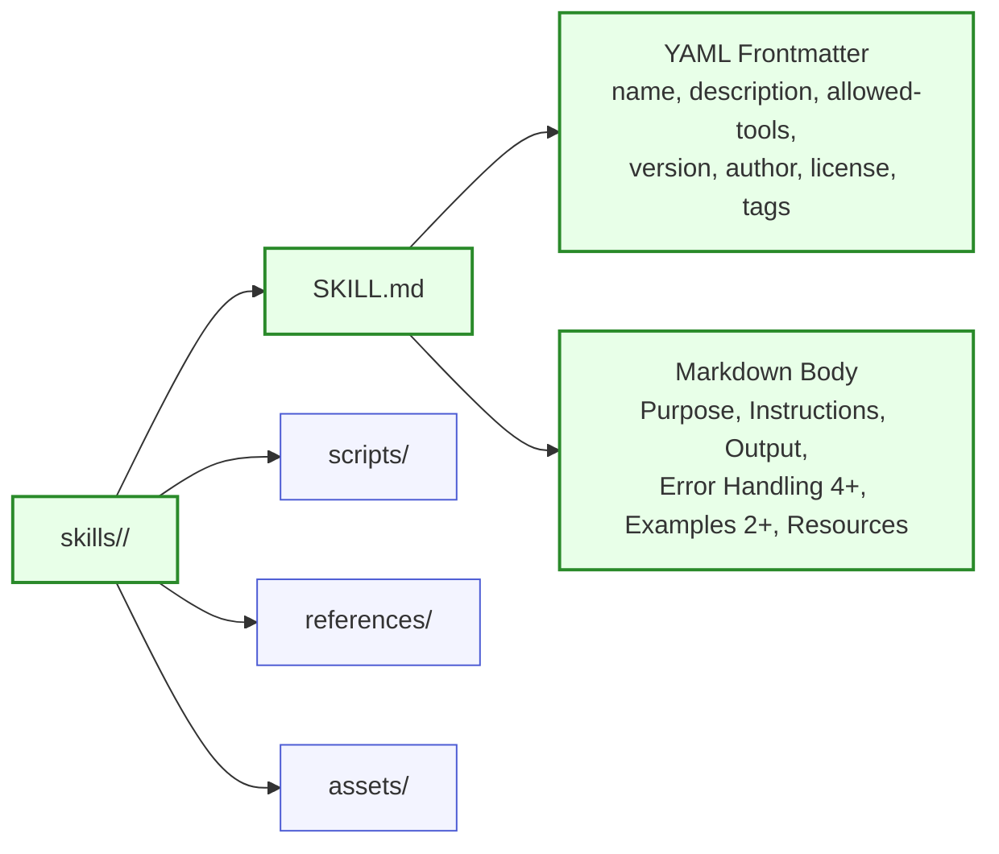
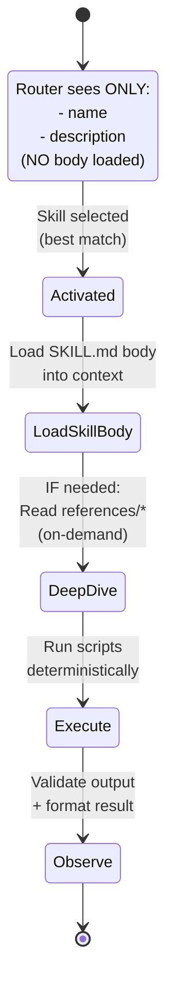
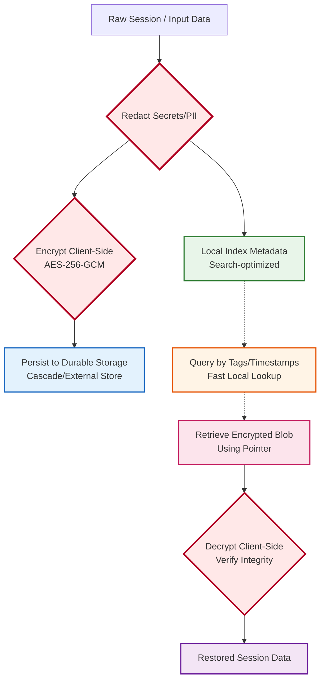

# 6767-g-AT-ARCH-skill-scaffold-diagrams.md

**Document Type**: Architecture & Technical - Architecture (AT-ARCH)
**Document ID**: 6767-g-AT-ARCH-skill-scaffold-diagrams
**Title**: Skill Scaffold Diagrams (Enforceable)
**Version**: 3.0.0
**Status**: CANONICAL (Enterprise-Only)
**Date**: 2025-12-20
**Companion To**: 6767-c (Extensions Standard), 6767-d (Schema), 6767-e (Validation), 6767-f (Plugin Diagrams)
**Authority**: Intent Solutions (Enterprise Marketplace)
**Normative Language**: This document uses MUST / SHOULD / MAY

---

## 1. Enterprise MUSTs (Limits Included)

### 1.1 File Structure Rules

| Rule | Constraint | Validator Check ID |
|------|------------|-------------------|
| Skill MUST exist at `skills/<skill-name>/SKILL.md` | Exact path pattern | `SKILL_001` |
| SKILL.md MUST have valid YAML frontmatter | Parseable YAML between `---` markers | (Parsing check) |
| SKILL.md MUST have markdown body | After frontmatter | (Content check) |

### 1.2 Frontmatter Field Rules (name)

| Rule | Constraint | Validator Check ID |
|------|------------|-------------------|
| `name` MUST be kebab-case | Pattern: `^[a-z0-9-]+$` | `SKILL_003` |
| `name` MUST be ≤64 characters | Max length: 64 | `SKILL_005` |
| `name` MUST exclude reserved substrings | Ban: "claude", "anthropic" | `SKILL_006` |

### 1.3 Frontmatter Field Rules (description)

| Rule | Constraint | Validator Check ID |
|------|------------|-------------------|
| `description` MUST be ≤1024 characters | Max length: 1024 | `SKILL_013` |
| `description` MUST be third-person voice | Objective language, no "I..." | `SKILL_014` |
| `description` MUST include "Use when..." | Pattern: `[Uu]se\s+when` | `SKILL_015` |
| `description` MUST include trigger phrases | 2-6 quoted phrases recommended | `SKILL_016` |
| `description` MUST NOT contain XML/angle-tag patterns | No `<...>` tags | (Future check) |

### 1.4 Frontmatter Field Rules (allowed-tools) - CRITICAL

| Rule | Constraint | Validator Check ID |
|------|------------|-------------------|
| `allowed-tools` MUST be a **CSV string** | Type: string (NOT array) | `SKILL_022` |
| `allowed-tools` MUST be comma-separated | Format: "Tool1,Tool2,Tool3" | `SKILL_022` |
| Bash tool MUST be scoped | Pattern: `Bash(command:*)` NOT just `Bash` | `SKILL_024` |

**CRITICAL RULE**:
```yaml
# ❌ WRONG (YAML array)
allowed-tools:
  - Read
  - Write

# ✅ CORRECT (CSV string)
allowed-tools: "Read,Write,Grep,Glob,Bash(git:*)"
```

### 1.5 Enterprise-Required Frontmatter Fields

| Field | Type | Constraint | Validator Check ID |
|-------|------|------------|-------------------|
| `name` | string | (See 1.2) | `SKILL_002-006` |
| `description` | string | (See 1.3) | `SKILL_011-016` |
| `allowed-tools` | string | CSV format | `SKILL_021-024` |
| `version` | string | SemVer `\d+\.\d+\.\d+` | `SKILL_031-032` |
| `author` | string | "Name <email>" or "Name" | `SKILL_041-043` |
| `license` | string | SPDX identifier | `SKILL_051-052` |
| `tags` | array | Min 1 item | `SKILL_061-062` |

### 1.6 Skill Body Policy Limits

| Limit | Threshold | Validator Check ID | Severity |
|-------|-----------|-------------------|----------|
| Max words | 5,000 words | `SKILL_100` | HIGH |
| Max lines | 500 lines | `SKILL_101` | HIGH |
| Max tokens (approx) | ~7,500 tokens | `SKILL_102` | MEDIUM |
| Path format | `{baseDir}/...` (no absolute) | `SKILL_103` | CRITICAL |
| Reference depth | 1 level (no chains) | `SKILL_104` | MEDIUM |

**Progressive Disclosure Policy**:
- Heavy content MUST go in `references/` subdirectory
- References loaded on-demand, not always in context
- Example: `{baseDir}/skills/my-skill/references/error-codes.md`

### 1.7 Required Sections in Body

| Section | Required | Min Content | Validator Check ID |
|---------|----------|-------------|-------------------|
| **Purpose** | ✅ REQUIRED | 1-2 sentences | (Content check) |
| **Overview** | ✅ REQUIRED | 3-5 sentences | (Content check) |
| **Prerequisites** | ✅ REQUIRED | List of requirements | (Content check) |
| **Instructions** | ✅ REQUIRED | Numbered steps | (Content check) |
| **Output** | ✅ REQUIRED | Format description | (Content check) |
| **Error Handling** | ✅ REQUIRED | ≥4 errors with recovery | (Content check: count errors) |
| **Examples** | ✅ REQUIRED | ≥2 examples with I/O | (Content check: count examples) |
| **Resources** | ✅ REQUIRED | Links/references | (Content check) |

---

## 2. Canonical Skill Directory Scaffold

### 2.1 Minimal Skill (Required Only)

```
skills/my-skill/
└── SKILL.md                            ← REQUIRED: Skill definition
```

**SKILL.md Structure**:
```yaml
---
# Enterprise-required frontmatter
name: my-skill
description: "Brief explanation. Use when [scenarios]. Trigger with 'phrase1', 'phrase2'."
allowed-tools: "Read,Write,Grep,Glob"
version: "1.0.0"
author: "Name <email>"
license: "MIT"
tags: ["category", "function"]
---

# Skill Title

## Purpose
[1-2 sentences]

## Overview
[3-5 sentences]

## Prerequisites
- Requirement 1
- Requirement 2

## Instructions
1. Step 1
2. Step 2
3. Step 3

## Output
[Format description]

## Error Handling
- **Error 1**: Cause + recovery
- **Error 2**: Cause + recovery
- **Error 3**: Cause + recovery
- **Error 4**: Cause + recovery

## Examples
### Example 1
**Input**: ...
**Output**: ...

### Example 2
**Input**: ...
**Output**: ...

## Resources
- Link 1
- Link 2
```

### 2.2 Full Skill (All Optional Components)

```
skills/my-skill/
├── SKILL.md                            ← REQUIRED: Skill definition
├── scripts/                            ← OPTIONAL: Helper scripts
│   ├── process.py
│   └── validate.sh
├── references/                         ← OPTIONAL: Heavy docs (loaded on-demand)
│   ├── error-codes.md
│   ├── api-reference.md
│   └── troubleshooting.md
└── assets/                             ← OPTIONAL: Templates, configs
    ├── template.json
    └── config.yaml
```

**Validator Checks** (if present):
- `scripts/`: `SEC_005` (no absolute paths in scripts)
- `references/`: (No specific checks; loaded on-demand)
- `assets/`: (No specific checks; path references only)

---

## 3. Diagrams (Normative + Annotated)

### 3.1 Skill Scaffold Anatomy



**Diagram Node → Validator Mapping**:

| Node | Type | Validator Checks |
|------|------|-----------------|
| **skills/<skill-name>/** | Directory | Skill directory exists |
| **SKILL.md** | File (REQUIRED) | `SKILL_001`: File exists at correct path |
| **YAML Frontmatter** | Metadata (REQUIRED) | `SKILL_002-062`: All frontmatter checks |
| **Markdown Body** | Content (REQUIRED) | `SKILL_100-104`: Body limits, path safety |
| **scripts/** | Directory (OPTIONAL) | `SEC_005`: No absolute paths in scripts |
| **references/** | Directory (OPTIONAL) | (No validator checks; on-demand loading) |
| **assets/** | Directory (OPTIONAL) | (No validator checks; path references only) |

### 3.2 Discovery → Activation State Machine (Progressive Disclosure)



**Diagram State → Validator Mapping**:

| State | Loaded Content | Validator Checks | Check IDs |
|-------|---------------|-----------------|-----------|
| **Discovery** | name + description only | Name/description valid, discoverable | `SKILL_002-016` |
| **Activated** | (No new content) | (Selection logic, not validated) | N/A |
| **LoadSkillBody** | SKILL.md body | Body ≤5,000 words, ≤500 lines, no absolute paths | `SKILL_100-103` |
| **DeepDive** | references/* (on-demand) | (No validator checks; runtime behavior) | N/A |
| **Execute** | scripts/* (if called) | Scripts use `${CLAUDE_PLUGIN_ROOT}`, no absolute paths | `SEC_005` |
| **Observe** | (Output validation) | (No validator checks; runtime behavior) | N/A |

### 3.3 Read → Process → Write Workflow Diagram

```mermaid
flowchart TD
    A[User Request] --> B{Router<br/>Selects Skill}

    B --> C[Load SKILL.md Body<br/>Progressive Disclosure]:::load

    C --> D[Read Input Files<br/>allowed-tools: Read,Grep]:::read

    D --> E[Process Data<br/>Run scripts via ${CLAUDE_PLUGIN_ROOT}]:::process

    E --> F[Write Output<br/>allowed-tools: Write]:::write

    F --> G[Format Result<br/>JSON/Markdown/Structured]:::output

    G --> H[Return to User]

    classDef load fill:#fff4e6,stroke:#e65100,stroke-width:2px
    classDef read fill:#e8f5e9,stroke:#2e7d32,stroke-width:2px
    classDef process fill:#e3f2fd,stroke:#1565c0,stroke-width:2px
    classDef write fill:#fce4ec,stroke:#c2185b,stroke-width:2px
    classDef output fill:#f3e5f5,stroke:#6a1b9a,stroke-width:2px
```

**Diagram Step → Validator Mapping**:

| Step | Tool Authorization | Validator Checks | Check IDs |
|------|-------------------|-----------------|-----------|
| **Router Selects Skill** | (No tools used) | Description has "Use when" + triggers | `SKILL_015-016` |
| **Load SKILL.md Body** | (Internal operation) | Body ≤5,000 words, ≤500 lines | `SKILL_100-101` |
| **Read Input Files** | `Read,Grep` in allowed-tools | allowed-tools is CSV string | `SKILL_022` |
| **Process Data** | Scripts executed | Paths use `${CLAUDE_PLUGIN_ROOT}` | `SEC_005` |
| **Write Output** | `Write` in allowed-tools | allowed-tools authorizes Write | `SKILL_022` |
| **Format Result** | (Internal operation) | (No validator checks) | N/A |

### 3.4 Security Boundary Diagram (Redact/Encrypt Before Durable Store)



**Diagram Step → Validator Mapping (Security Focus)**:

| Step | Security Control | Validator Checks | Check IDs |
|------|------------------|-----------------|-----------|
| **Redact Secrets/PII** | Detect and block secrets | `SEC_001-004`: Hardcoded secrets, .env files | `SEC_001-004` |
| **Encrypt Client-Side** | AES-256-GCM encryption | (Runtime check; env var `LUMERA_MEMORY_KEY`) | N/A |
| **Persist Durable Storage** | Content-addressed (SHA-256) | (Runtime check; immutable pointers) | N/A |
| **Decrypt Client-Side** | Verify integrity (GCM tag) | (Runtime check; fails on tamper) | N/A |

---

## 4. Enforcement Rules (Validator Checks)

### 4.1 Frontmatter Validation (All Fields)

**Check Category**: `SKILL_*`

| Check ID | Severity | Field | Rule | Error Message |
|----------|----------|-------|------|---------------|
| `SKILL_002` | CRITICAL | name | Field present | "SKILL.md missing required field: name" |
| `SKILL_003` | CRITICAL | name | Pattern `^[a-z0-9-]+$` | "name must be kebab-case (lowercase, hyphens only)" |
| `SKILL_005` | CRITICAL | name | Max 64 characters | "name must be ≤64 characters (found: {actual})" |
| `SKILL_006` | CRITICAL | name | No reserved words | "name must not contain 'claude' or 'anthropic'" |
| `SKILL_011` | CRITICAL | description | Field present | "SKILL.md missing required field: description" |
| `SKILL_013` | HIGH | description | Max 1024 characters | "description must be ≤1024 characters" |
| `SKILL_014` | MEDIUM | description | Third-person voice | "description should use third-person voice (avoid 'I...')" |
| `SKILL_015` | HIGH | description | Contains "Use when" | "description must include 'Use when...' clause" |
| `SKILL_016` | HIGH | description | Contains trigger phrases | "description must include trigger phrases (2-6 recommended)" |
| `SKILL_021` | CRITICAL | allowed-tools | Field present | "SKILL.md missing required field: allowed-tools" |
| `SKILL_022` | CRITICAL | allowed-tools | Type is **string** (NOT array) | "allowed-tools must be CSV string, NOT YAML array" |
| `SKILL_024` | CRITICAL | allowed-tools | Bash scoped | "Bash tool must be scoped: Bash(git:*), NOT just Bash" |
| `SKILL_031` | CRITICAL | version | Field present | "SKILL.md missing required field: version" |
| `SKILL_032` | CRITICAL | version | SemVer format | "version must be SemVer MAJOR.MINOR.PATCH" |
| `SKILL_041` | CRITICAL | author | Field present | "SKILL.md missing required field: author" |
| `SKILL_043` | CRITICAL | author | Min 1 character | "author must not be empty" |
| `SKILL_051` | CRITICAL | license | Field present | "SKILL.md missing required field: license" |
| `SKILL_052` | CRITICAL | license | Min 1 character | "license must not be empty" |
| `SKILL_061` | CRITICAL | tags | Field present (array) | "SKILL.md missing required field: tags" |
| `SKILL_062` | CRITICAL | tags | Min 1 item | "tags must have at least 1 item" |

### 4.2 Body Validation

**Check Category**: `SKILL_*`

| Check ID | Severity | Rule | Threshold | Error Message |
|----------|----------|------|-----------|---------------|
| `SKILL_100` | HIGH | Max words | 5,000 words | "SKILL.md body exceeds 5,000 words (found: {actual})" |
| `SKILL_101` | HIGH | Max lines | 500 lines | "SKILL.md body exceeds 500 lines (found: {actual})" |
| `SKILL_102` | MEDIUM | Max tokens (approx) | ~7,500 tokens | "SKILL.md body may exceed token budget (~{actual} tokens)" |
| `SKILL_103` | CRITICAL | No absolute paths | No `/home/...` | "Absolute path detected: {path} (use {baseDir}/...)" |
| `SKILL_104` | MEDIUM | Reference depth | 1 level | "Reference chain detected (SKILL.md → ref1 → ref2); flatten to 1 level" |

### 4.3 Required Sections Validation

**Check Category**: (Content checks - implemented as heuristics)

| Section | Required | Min Content | Check Method |
|---------|----------|-------------|--------------|
| **Error Handling** | ✅ REQUIRED | ≥4 errors | Count error entries (list items, headings) |
| **Examples** | ✅ REQUIRED | ≥2 examples | Count example sections (H3 "Example N") |

---

## 5. Examples (Good vs Bad SKILL.md)

### 5.1 Good Minimal Compliant Skill (Enterprise)

```yaml
---
name: csv-analysis
description: "Analyze CSV files with statistical methods, generate visualizations, and export reports. Use when user uploads CSV data or requests statistical summaries, trend analysis, or data visualization. Trigger with 'analyze csv', 'process data file', or 'generate statistics'."
allowed-tools: "Read,Write,Grep,Glob,Bash(python:*)"
version: "1.0.0"
author: "Analytics Team <analytics@example.com>"
license: "MIT"
tags: ["analytics", "csv", "statistics"]
---

# CSV Analysis Skill

## Purpose
Analyze CSV files and generate statistical insights.

## Overview
This skill reads CSV files, validates schema, computes descriptive statistics, generates visualizations, and exports formatted reports. It handles missing data, type conversions, and large datasets efficiently.

## Prerequisites
- Python 3.10+
- pandas, matplotlib, seaborn libraries
- CSV file with headers

## Instructions
1. Read CSV file using `Read` tool
2. Validate schema and data types
3. Compute descriptive statistics (mean, median, std, etc.)
4. Generate visualizations (histograms, scatter plots)
5. Export report using `Write` tool

## Output
- JSON object with statistics
- PNG visualizations
- Markdown summary report

## Error Handling
- **Missing columns**: Check schema against user request, prompt for column names
- **Invalid data types**: Attempt conversion; skip rows with errors and log count
- **Empty dataset**: Return error message with guidance on file format
- **Memory limits**: Sample large datasets (>1M rows) before full processing

## Examples
### Example 1: Sales Data Analysis
**Input**: `sales_2024.csv` (columns: date, product, revenue, quantity)
**Output**:
```json
{
  "total_revenue": 1234567.89,
  "avg_daily_sales": 3456.78,
  "top_product": "Widget A"
}
```

### Example 2: Trend Analysis
**Input**: `user_growth.csv` (columns: month, new_users, total_users)
**Output**: Line chart showing user growth over time + markdown summary

## Resources
- `{baseDir}/skills/csv-analysis/references/pandas-api.md`
- `{baseDir}/skills/csv-analysis/references/error-codes.md`
```

**Validator Result**: ✅ **PASS** (all enterprise requirements met)

**Passing Checks**:
- ✅ `SKILL_003`: name is kebab-case
- ✅ `SKILL_013`: description ≤1024 chars
- ✅ `SKILL_015`: description contains "Use when"
- ✅ `SKILL_016`: description contains 3 trigger phrases
- ✅ `SKILL_022`: allowed-tools is CSV string (NOT array)
- ✅ `SKILL_024`: Bash is scoped (`Bash(python:*)`)
- ✅ `SKILL_032`: version is SemVer
- ✅ `SKILL_062`: tags has 3 items
- ✅ Body has ≥4 errors in Error Handling
- ✅ Body has ≥2 examples

---

### 5.2 Bad Skill (Multiple Violations)

```yaml
---
name: Claude_CSV_Tool
description: "Processes files"
allowed-tools:
  - Read
  - Write
  - Bash
version: "1.0"
author: "Analytics Team"
```

**Validator Result**: ❌ **FAIL** (9 CRITICAL errors)

**Failing Checks**:

1. ❌ `SKILL_003`: name must be kebab-case
   - **Expected**: `^[a-z0-9-]+$`
   - **Actual**: `Claude_CSV_Tool` (contains uppercase + underscores)
   - **Fix**: Change to `csv-tool` or `claude-csv-tool`

2. ❌ `SKILL_006`: name contains reserved word "claude"
   - **Expected**: No "claude" or "anthropic"
   - **Actual**: Starts with "Claude"
   - **Fix**: Remove "Claude_" prefix

3. ❌ `SKILL_013`: description too vague
   - **Expected**: Detailed explanation with scenarios
   - **Actual**: "Processes files" (3 words, no context)
   - **Fix**: Expand to: "Process CSV files with... Use when... Trigger with..."

4. ❌ `SKILL_015`: description missing "Use when" clause
   - **Expected**: Must include "Use when [scenarios]"
   - **Actual**: Missing
   - **Fix**: Add "Use when user uploads CSV or requests analysis"

5. ❌ `SKILL_016`: description missing trigger phrases
   - **Expected**: 2-6 trigger phrases
   - **Actual**: None
   - **Fix**: Add "Trigger with 'analyze csv', 'process data'"

6. ❌ `SKILL_022`: allowed-tools is YAML array (CRITICAL)
   - **Expected**: CSV string `"Read,Write,Bash(python:*)"`
   - **Actual**: YAML array `[Read, Write, Bash]`
   - **Fix**: Convert to CSV string

7. ❌ `SKILL_024`: Bash tool is unscoped (CRITICAL SECURITY VIOLATION)
   - **Expected**: `Bash(python:*)` or `Bash(git:*)`
   - **Actual**: Just `Bash` (allows ANY command)
   - **Fix**: Scope to specific commands

8. ❌ `SKILL_032`: version missing PATCH
   - **Expected**: `\d+\.\d+\.\d+` (e.g., "1.0.0")
   - **Actual**: "1.0" (only 2 parts)
   - **Fix**: Change to "1.0.0"

9. ❌ `SKILL_041`: author missing email
   - **Expected**: "Name <email>" format
   - **Actual**: "Analytics Team" (no email)
   - **Fix**: Change to "Analytics Team <analytics@example.com>"

10. ❌ `SKILL_051`: license field missing
    - **Expected**: Field present
    - **Actual**: Not present
    - **Fix**: Add `license: "MIT"`

11. ❌ `SKILL_061`: tags field missing
    - **Expected**: Array with ≥1 item
    - **Actual**: Not present
    - **Fix**: Add `tags: ["csv", "analytics"]`

---

## 6. Common Failure Modes + Recovery

### 6.1 "allowed-tools YAML array error" (Most Common)

**Symptom**:
```
[CRITICAL] SKILL_022
  Field: allowed-tools
  Expected: CSV string (e.g., "Read,Write,Grep")
  Actual: YAML array format
  Fix: Change frontmatter to: allowed-tools: "Read,Write,Grep"
```

**Cause**: Template bug or copy-paste from incorrect example.

**Recovery**:
1. **Open SKILL.md**
2. **Find frontmatter** (between `---` markers)
3. **Locate allowed-tools**:
   ```yaml
   # ❌ WRONG
   allowed-tools:
     - Read
     - Write
     - Bash(python:*)
   ```

4. **Convert to CSV string**:
   ```yaml
   # ✅ CORRECT
   allowed-tools: "Read,Write,Bash(python:*)"
   ```

5. **Re-validate**:
   ```bash
   python scripts/validate_standards.py --plugin-root .
   ```

**Prevention**: Always use CSV string format for `allowed-tools`.

---

### 6.2 "Unscoped Bash tool" (Security Critical)

**Symptom**:
```
[CRITICAL] SKILL_024
  Field: allowed-tools
  Expected: Scoped Bash (e.g., Bash(git:*), Bash(python:*))
  Actual: Unscoped Bash
  Fix: Scope Bash to specific commands
```

**Cause**: Granting unrestricted shell access (security vulnerability).

**Security Impact**: Allows skill to execute ANY shell command (malicious code injection risk).

**Recovery**:
1. **Identify required commands**:
   - Running git commands? → `Bash(git:*)`
   - Running python scripts? → `Bash(python:*)`
   - Running npm commands? → `Bash(npm:*)`

2. **Update allowed-tools**:
   ```yaml
   # ❌ WRONG (unscoped)
   allowed-tools: "Read,Write,Bash"

   # ✅ CORRECT (scoped)
   allowed-tools: "Read,Write,Bash(git status:*),Bash(python:*)"
   ```

3. **Re-validate**:
   ```bash
   python scripts/validate_standards.py --plugin-root .
   ```

**Best Practice**: Prefer minimal tools. Only add Bash if absolutely necessary, and always scope it.

---

### 6.3 "Description too generic" (Skill not activating)

**Symptom**: Skill exists but Claude doesn't select it when user makes related requests.

**Cause**: Description lacks "Use when" clause and trigger phrases.

**Bad Example**:
```yaml
description: "Data processing tool"
```

**Why it fails**:
- Too vague (what kind of data? what processing?)
- No "Use when" scenarios
- No trigger phrases for router matching

**Recovery**:
1. **Add specific capabilities**:
   ```yaml
   description: "Process CSV files with statistical analysis and generate reports."
   ```

2. **Add "Use when" clause**:
   ```yaml
   description: "Process CSV files with statistical analysis and generate reports. Use when user uploads CSV data or requests statistical summaries, trend analysis, or data visualization."
   ```

3. **Add trigger phrases**:
   ```yaml
   description: "Process CSV files with statistical analysis and generate reports. Use when user uploads CSV data or requests statistical summaries, trend analysis, or data visualization. Trigger with 'analyze csv', 'process data file', or 'generate statistics'."
   ```

4. **Re-validate**:
   ```bash
   python scripts/validate_standards.py --plugin-root .
   ```

**Best Practice**: Include 2-6 trigger phrases that users would naturally type.

---

### 6.4 "Body exceeds 5,000 words" (Context bloat)

**Symptom**:
```
[HIGH] SKILL_100
  Rule: Max words
  Expected: ≤5,000 words
  Actual: 7,823 words
  Fix: Move heavy content to references/ directory
```

**Cause**: Embedding large tables, API references, or detailed examples directly in SKILL.md.

**Impact**: Wastes context tokens, slows down skill loading.

**Recovery**:
1. **Identify heavy content**:
   - API reference tables (>500 lines)
   - Error code listings (>100 entries)
   - Detailed examples (>1000 words)

2. **Move to references/**:
   ```bash
   cd skills/my-skill
   mkdir -p references
   # Move content to references/
   mv api-reference.md references/
   mv error-codes.md references/
   ```

3. **Update SKILL.md to reference**:
   ```markdown
   ## Resources
   - Full API reference: `{baseDir}/skills/my-skill/references/api-reference.md`
   - Error codes: `{baseDir}/skills/my-skill/references/error-codes.md`
   ```

4. **Re-validate**:
   ```bash
   python scripts/validate_standards.py --plugin-root .
   ```

**Best Practice**: SKILL.md should be ≤2,500 words (comfortable reading); heavy content goes in `references/`.

---

## 7. Validator Mapping Table (Comprehensive)

### 7.1 All Skill Check IDs by Category

| Category | Check ID Range | Count | Severity Range |
|----------|---------------|-------|----------------|
| **Name** | `SKILL_001-006` | 5 | CRITICAL |
| **Description** | `SKILL_010-016` | 6 | CRITICAL - MEDIUM |
| **allowed-tools** | `SKILL_020-024` | 4 | CRITICAL |
| **Version** | `SKILL_030-032` | 2 | CRITICAL |
| **Author** | `SKILL_040-043` | 3 | CRITICAL - HIGH |
| **License** | `SKILL_050-052` | 2 | CRITICAL |
| **Tags** | `SKILL_060-062` | 2 | CRITICAL |
| **Body Constraints** | `SKILL_100-104` | 5 | CRITICAL - MEDIUM |

### 7.2 Critical Path Checks (Must Pass for PR Merge)

| Check ID | Rule | Impact if Failed |
|----------|------|------------------|
| `SKILL_003` | name kebab-case | Marketplace rejection |
| `SKILL_006` | No reserved words | Marketplace rejection |
| `SKILL_015` | "Use when" clause | Skill won't activate (poor discovery) |
| `SKILL_022` | allowed-tools CSV string | Tools won't be authorized (CRITICAL) |
| `SKILL_024` | Bash scoped | Security vulnerability (CRITICAL) |
| `SKILL_032` | version SemVer | Marketplace rejection |
| `SKILL_062` | tags present | Poor discoverability |
| `SKILL_103` | No absolute paths | Portability broken |

---

## 8. References

### 8.1 Related Standards

- **6767-c**: Extensions Standard (comprehensive policy)
- **6767-d**: Extensions Schema (validation rules)
- **6767-e**: Validation and CI Gates (enforcement)
- **6767-f**: Plugin Scaffold Diagrams (companion document)

### 8.2 Tools

- **Validator Reference**: `/scripts/validate_standards.py`
- **CI Templates**: `.github/workflows/`
- **Diagram Tools**: Mermaid (https://mermaid.js.org/)

---

**END OF SPECIFICATION**

**Version**: 3.0.0
**Status**: CANONICAL (Enterprise-Only)
**Date**: 2025-12-20
