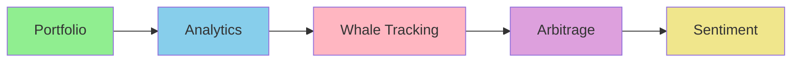

# 💰 Crypto Trader Learning Path

**Goal**: Master cryptocurrency trading automation from portfolio tracking to advanced arbitrage and whale monitoring.

**Time**: 3-4 hours total
**Difficulty**: Beginner → Expert

---

## Learning Journey



---

## Table of Contents

1. [Portfolio Management](#stage-1-portfolio-management-45-min) (45 min)
2. [On-Chain Analytics](#stage-2-on-chain-analytics-1-hour) (1 hour)
3. [Whale Alert Monitoring](#stage-3-whale-alert-monitoring-1-hour) (1 hour)
4. [Arbitrage Trading](#stage-4-arbitrage-trading-1-hour) (1 hour)
5. [Market Sentiment & Automation](#stage-5-market-sentiment--automation-1-hour) (1 hour)

---

## Stage 1: Portfolio Management (45 min)

### Install Crypto Tools
```bash
/plugin install crypto-portfolio-tracker@claude-code-plugins-plus
```

### Track Your Portfolio

**1. Add Positions**
```bash
/track-position BTC 1.5 45000
/track-position ETH 10 3000
/track-position SOL 500 150
```

**2. Portfolio Analysis**
```bash
/portfolio-analysis
```

**Output**:
```
📊 Portfolio Summary

Total Value: $145,000 USD
24h Change: +$3,200 (+2.26%)

Holdings:
🟡 BTC: 1.5 ($67,500)  +1.8%  46.5% allocation
🔷 ETH: 10 ($30,000)   +3.2%  20.7% allocation
🟣 SOL: 500 ($75,000)  +2.1%  51.7% allocation

Diversification: Medium (3 assets, Gini: 0.42)

Recommendations:
⚠️  Heavy SOL concentration (>50%)
✅ Good BTC/ETH balance
💡 Consider stablecoins for risk management
```

**3. PnL Tracking**
```python
# Auto-generated tracking code
from crypto_portfolio import Portfolio

portfolio = Portfolio()

# Add transactions
portfolio.add_buy("BTC", amount=1.5, price=45000)
portfolio.add_sell("BTC", amount=0.5, price=52000)

# Calculate PnL
pnl = portfolio.calculate_pnl()
print(f"Realized P&L: ${pnl.realized:,.2f}")
print(f"Unrealized P&L: ${pnl.unrealized:,.2f}")

# Tax reporting (FIFO, LIFO, HIFO)
tax_report = portfolio.generate_tax_report(method="FIFO")
```

**Practice**: Track your real portfolio

---

## Stage 2: On-Chain Analytics (1 hour)

### Advanced Market Analysis
```bash
/plugin install on-chain-analytics@claude-code-plugins-plus
```

**1. Analyze Network Activity**
```bash
/analyze-chain ethereum
```

**Metrics**:
```
⛓️  Ethereum Network Analysis

Transaction Activity:
- TPS: 15.3 (↑ 12% from avg)
- Gas Price: 25 gwei (Low)
- Active Addresses: 450,000 (24h)

Network Health:
✅ Hash Rate: 950 TH/s (Secure)
✅ Node Count: 7,890 (Decentralized)
⚠️  Mempool Size: 180k txns (Congested)

DeFi Metrics:
- TVL: $48.2B (↑ 3.2%)
- DEX Volume: $2.1B (24h)
- Top Protocol: Uniswap ($1.8B)
```

**2. Whale Movement Tracking**
```bash
/whale-movements BTC 24h
```

**Detects**:
- Large transfers (>$1M)
- Exchange inflows/outflows
- Smart money movements
- Institutional activity

**3. Holder Distribution**
```bash
/holder-analysis BTC
```

**Shows**:
```
🐋 Holder Distribution

Top 10 Wallets: 5.2% of supply
Top 100 Wallets: 15.8% of supply
Top 1000 Wallets: 35.6% of supply

Gini Coefficient: 0.78 (Moderately Concentrated)

Exchange Holdings: 12.3% of supply
- Binance: 4.2%
- Coinbase: 3.1%
- Kraken: 2.8%
```

**Practice**: Analyze your favorite chain

---

## Stage 3: Whale Alert Monitoring (1 hour)

### Real-Time Whale Tracking
```bash
/plugin install whale-alert-monitor@claude-code-plugins-plus
```

**Production-grade monitoring** (1,148 lines of code):
- Real-time WebSocket feeds
- Multi-chain support
- Automated alerting

**1. Configure Monitoring**
```bash
/monitor-whales --chains eth,bsc,sol --threshold 1000000
```

**Configuration**:
```yaml
# whale-config.yaml
chains:
  ethereum:
    websocket_url: wss://mainnet.infura.io/ws/v3/YOUR_KEY
    threshold_usd: 1000000
    alert_channels:
      - slack
      - discord
      - telegram

  bsc:
    websocket_url: wss://bsc-ws-node.nariox.org:443
    threshold_usd: 500000

  solana:
    websocket_url: wss://api.mainnet-beta.solana.com
    threshold_usd: 1000000

alerts:
  slack_webhook: https://hooks.slack.com/services/YOUR/WEBHOOK
  discord_webhook: https://discord.com/api/webhooks/YOUR/WEBHOOK
  telegram_bot_token: YOUR_BOT_TOKEN
  telegram_chat_id: YOUR_CHAT_ID
```

**2. Receive Alerts**
```
🐋 WHALE ALERT

$5,200,000 USDT transferred
From: Binance Hot Wallet
To: Unknown Wallet (0x742d...)

Time: 2024-01-15 14:32:18 UTC
Tx: 0xabc123...
Severity: HIGH (Score: 87/100)

Market Impact: BEARISH
- Large exchange outflow
- Potential OTC sale
- Watch for sell pressure
```

**3. Analyze Patterns**
```bash
/whale-pattern-analysis
```

**Insights**:
- Exchange flow trends
- Smart money movements
- Historical correlation with price
- Predictive signals

**Practice**: Set up whale monitoring

---

## Stage 4: Arbitrage Trading (1 hour)

### Find Profitable Opportunities
```bash
/plugin install arbitrage-opportunity-finder@claude-code-plugins-plus
```

**Advanced arbitrage scanner**:
- 100+ exchanges
- Flash loan detection
- Real-time profitability

**1. Scan for Opportunities**
```bash
/find-arbitrage --min-profit 0.5
```

**Results**:
```
🔍 Arbitrage Opportunities Found: 7

#1 - CEX Arbitrage (HIGHEST PROFIT)
BTC/USDT Price Difference:
- Binance: $64,150
- Kraken: $64,380
Profit: $230 per BTC (0.36%)
After Fees: $185 (0.29%)
Risk: LOW | Execution: 30 sec

#2 - Triangular Arbitrage
Path: USDT → BTC → ETH → USDT
Entry: 10,000 USDT
Exit: 10,087 USDT
Profit: $87 (0.87%)
After Gas: $65 (0.65%)
Risk: MEDIUM | Execution: 45 sec

#3 - Cross-Chain Arbitrage
ETH on Ethereum: $3,200
ETH on Arbitrum: $3,215
Bridge Fee: $8
Profit: $7 per ETH (0.22%)
Risk: HIGH | Execution: 5-10 min
```

**2. Flash Loan Arbitrage**
```bash
/flash-loan-simulator
```

**Simulates strategy**:
```solidity
// Generated flash loan contract
contract FlashArbitrage {
    function executeArbitrage(
        address token,
        uint256 amount,
        address[] memory path
    ) external {
        // 1. Borrow from Aave
        IPool(AAVE_POOL).flashLoanSimple(
            address(this),
            token,
            amount,
            abi.encode(path),
            0
        );
    }

    function executeOperation(
        address asset,
        uint256 amount,
        uint256 premium,
        address initiator,
        bytes calldata params
    ) external returns (bool) {
        // 2. Execute arbitrage
        // 3. Repay loan + premium
        // 4. Keep profit
    }
}
```

**3. Risk Analysis**
```bash
/arbitrage-risk-analysis
```

**Evaluates**:
- Slippage impact
- Gas costs (variable)
- MEV competition
- Execution speed
- Liquidity depth

**Practice**: Find and execute arbitrage

---

## Stage 5: Market Sentiment & Automation (1 hour)

### Sentiment Analysis
```bash
/plugin install market-sentiment-analyzer@claude-code-plugins-plus
```

**AI-powered sentiment** (15+ platforms):
- Twitter/X monitoring
- Reddit analysis
- News aggregation
- Social signals

**1. Analyze Market Sentiment**
```bash
/analyze-sentiment BTC
```

**Results**:
```
📊 Bitcoin Market Sentiment

Overall Score: 67/100 (BULLISH)

Social Media (Twitter/X):
😊 Positive: 58%
😐 Neutral: 32%
☹️  Negative: 10%
Volume: 45,000 tweets (24h, ↑ 23%)

Reddit Analysis:
r/Bitcoin: Bullish (72% positive)
r/CryptoCurrency: Mixed (48% positive)
Top Topics: ETF approval, halving

News Sentiment:
Positive: 12 articles
Neutral: 8 articles
Negative: 3 articles

Influencer Activity:
@elonmusk: Neutral mention (2h ago)
@saylor: Bullish thread (5h ago)
@VitalikButerin: Technical discussion

Fear & Greed Index: 65 (Greed)

Prediction: Likely uptrend next 24-48h
Confidence: 72%
```

**2. Trading Signals**
```bash
/generate-signals BTC
```

**Automated signals**:
```
🎯 Trading Signals - BTC/USDT

ENTRY SIGNALS:
✅ Whale Accumulation (Score: 8/10)
✅ Positive Sentiment Shift (+15%)
✅ Technical Breakout (MA cross)
⚠️  High Funding Rate (0.08%)

RECOMMENDATION: LONG
Entry: $64,200
Stop Loss: $62,800 (-2.2%)
Take Profit 1: $66,500 (+3.6%)
Take Profit 2: $68,000 (+5.9%)

Risk/Reward: 1:2.5
Confidence: 75%
```

**3. Automated Trading Bot**
```python
# Auto-generated trading bot
from crypto_bot import TradingBot, Strategy

class SentimentStrategy(Strategy):
    def __init__(self):
        self.sentiment_threshold = 65

    async def analyze(self):
        # Get sentiment
        sentiment = await self.get_sentiment("BTC")

        # Check whale activity
        whales = await self.get_whale_movements("BTC", "24h")

        # Technical analysis
        price = await self.get_price("BTC/USDT")
        ma_50 = await self.get_ma(50)

        # Generate signal
        if (sentiment.score > self.sentiment_threshold and
            whales.net_flow > 0 and
            price > ma_50):
            return "BUY"

        return "HOLD"

# Run bot
bot = TradingBot(strategy=SentimentStrategy())
bot.run()
```

**Practice**: Build automated trading system

---

## Complete Trading System (3 hours)

### Build Production Trading Bot

**1. Portfolio Setup** (20 min)
```bash
/track-position  # Add all positions
/portfolio-analysis  # Analyze allocation
```

**2. Monitoring** (30 min)
```bash
/monitor-whales  # Real-time whale alerts
/analyze-chain  # Network health
```

**3. Opportunity Scanner** (40 min)
```bash
/find-arbitrage  # Cross-exchange arbitrage
/flash-loan-simulator  # DeFi arbitrage
```

**4. Sentiment Engine** (30 min)
```bash
/analyze-sentiment  # Social sentiment
/generate-signals  # Trading signals
```

**5. Risk Management** (30 min)
```python
# Position sizing
def calculate_position_size(
    account_balance: float,
    risk_per_trade: float,  # 1-2%
    stop_loss_pct: float
) -> float:
    risk_amount = account_balance * risk_per_trade
    position_size = risk_amount / stop_loss_pct
    return position_size

# Portfolio risk
max_portfolio_risk = 0.05  # 5% total risk
position_size = calculate_position_size(
    account_balance=100000,
    risk_per_trade=0.02,
    stop_loss_pct=0.05
)
```

**6. Execution** (30 min)
```python
# Trading execution
async def execute_trade(signal):
    if signal == "BUY":
        # Place order with risk management
        order = await exchange.create_limit_order(
            symbol="BTC/USDT",
            side="buy",
            amount=position_size,
            price=entry_price
        )

        # Set stop loss
        await exchange.create_stop_loss_order(
            symbol="BTC/USDT",
            side="sell",
            amount=position_size,
            stop_price=stop_loss_price
        )

        # Set take profit
        await exchange.create_take_profit_order(
            symbol="BTC/USDT",
            side="sell",
            amount=position_size / 2,
            price=take_profit_price
        )
```

---

## Advanced Strategies

### DeFi Yield Optimization
```bash
/optimize-yield
```

**Finds best yields**:
- Staking rewards
- Liquidity pools
- Lending protocols
- Yield aggregators

### NFT Floor Price Tracking
```bash
/nft-floor-tracker
```

**Monitors**:
- Bored Ape Yacht Club
- CryptoPunks
- Azuki
- Custom collections

### Crypto Tax Reporting
```bash
/calculate-tax 2024
```

**Generates**:
- IRS Form 8949
- Capital gains/losses
- Income from staking
- DeFi transaction history

---

## Plugin Reference

| Plugin | Use Case | Time to Learn |
|--------|----------|---------------|
| `crypto-portfolio-tracker` | Portfolio management | 20 min |
| `on-chain-analytics` | Network analysis | 30 min |
| `whale-alert-monitor` | Whale tracking | 30 min |
| `arbitrage-opportunity-finder` | Arbitrage trading | 40 min |
| `market-sentiment-analyzer` | Sentiment analysis | 25 min |
| `defi-yield-optimizer` | DeFi yields | 25 min |
| `crypto-tax-calculator` | Tax reporting | 20 min |

**Featured Plugins**: 5 production-grade crypto tools (3 hours to master)

---

## Risk Management Checklist

**Portfolio Management** ✅
- [ ] Diversify across 5+ assets
- [ ] Max 20% per position
- [ ] Rebalance monthly

**Trading Risk** ✅
- [ ] 1-2% risk per trade
- [ ] Always use stop losses
- [ ] Max 5% portfolio risk

**Security** ✅
- [ ] Hardware wallet for long-term
- [ ] 2FA on all exchanges
- [ ] Regular security audits

---

## Next Steps

**Expand Your Skills**:
- [DevOps Path](./devops-engineer.md): Automate trading infrastructure
- [Security Path](./security-specialist.md): Secure your trading bots
- [AI/ML Path](./ai-ml-developer.md): Build ML trading models

**Resources**:
- [Crypto Plugins](../../../plugins/crypto/)
- [CoinGecko API](https://www.coingecko.com/api)
- [Etherscan API](https://docs.etherscan.io/)

---

**Congratulations!** You're now a Claude Code crypto trading expert! 💰
