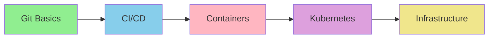

# 🚀 DevOps Engineer Learning Path

**Goal**: Master DevOps automation with Claude Code plugins from basic Git workflows to full infrastructure automation.

**Time**: 4-6 hours total
**Difficulty**: Beginner → Advanced

---

## Learning Journey



---

## Table of Contents

1. [Git Workflow Mastery](#stage-1-git-workflow-mastery-1-hour) (1 hour)
2. [CI/CD Pipeline Automation](#stage-2-cicd-pipeline-automation-15-hours) (1.5 hours)
3. [Container Orchestration](#stage-3-container-orchestration-15-hours) (1.5 hours)
4. [Kubernetes Deployment](#stage-4-kubernetes-deployment-15-hours) (1.5 hours)
5. [Infrastructure as Code](#stage-5-infrastructure-as-code-1-hour) (1 hour)

---

## Stage 1: Git Workflow Mastery (1 hour)

### Install Plugins
```bash
/plugin install git-commit-smart@claude-code-plugins
/plugin install devops-automation-pack@claude-code-plugins
```

### Learn: Smart Commits
```bash
# Make changes to your code
git add .

# Generate semantic commit message
/commit-smart

# Claude analyzes diff and creates:
# feat: add user authentication system
#
# - Implement JWT token generation
# - Add password hashing with bcrypt
# - Create login/logout endpoints
#
# 🤖 Generated with Claude Code
# Co-Authored-By: Claude <noreply@anthropic.com>
```

### Key Commands from Pack
- `/branch-create`: Create feature branches with naming conventions
- `/pr-create`: Generate comprehensive pull request descriptions
- `/merge-safe`: Safe merge with conflict detection
- `/rebase-interactive`: Interactive rebase guidance

**Practice**: Create a feature branch, make commits, and create a PR

---

## Stage 2: CI/CD Pipeline Automation (1.5 hours)

### Plugins for CI/CD
From the DevOps Automation Pack:
- `ci-cd-expert` agent
- `/github-actions-create` command
- `/gitlab-ci-create` command
- `/pipeline-optimize` command

### Build a CI/CD Pipeline

**1. GitHub Actions**
```bash
/github-actions-create
```

Claude will create:
```yaml
name: CI/CD Pipeline
on: [push, pull_request]

jobs:
  test:
    runs-on: ubuntu-latest
    steps:
      - uses: actions/checkout@v4
      - name: Run tests
        run: npm test

  build:
    needs: test
    runs-on: ubuntu-latest
    steps:
      - name: Build
        run: npm run build

  deploy:
    needs: build
    if: github.ref == 'refs/heads/main'
    steps:
      - name: Deploy to production
        run: ./deploy.sh
```

**2. Optimize Your Pipeline**
```bash
/pipeline-optimize
```

Claude analyzes and suggests:
- Caching strategies
- Parallel job execution
- Conditional workflows
- Security best practices

**3. GitLab CI/CD**
```bash
/gitlab-ci-create
```

Generates `.gitlab-ci.yml` with stages, caching, and deployment

**Practice**: Set up CI/CD for a real project

---

## Stage 3: Container Orchestration (1.5 hours)

### Docker Expertise

Install Docker tools:
```bash
# Already included in devops-automation-pack
```

**1. Generate Dockerfile**
```bash
/dockerfile-generate
```

Example output:
```dockerfile
FROM node:18-alpine AS builder
WORKDIR /app
COPY package*.json ./
RUN npm ci --only=production

FROM node:18-alpine
WORKDIR /app
COPY --from=builder /app/node_modules ./node_modules
COPY . .
EXPOSE 3000
USER node
CMD ["node", "server.js"]
```

**2. Docker Compose Setup**
```bash
/docker-compose-create
```

Creates `docker-compose.yml` with:
- Multi-service orchestration
- Volume management
- Network configuration
- Environment variables

**3. Optimize Images**
```bash
/docker-optimize
```

Claude suggests:
- Multi-stage builds
- Layer caching
- Base image selection
- Security scanning

**Practice**: Containerize a microservices application

---

## Stage 4: Kubernetes Deployment (1.5 hours)

### Kubernetes Tools

**1. Generate K8s Manifests**
```bash
/k8s-manifest-generate
```

Creates production-ready manifests:
- Deployments
- Services
- Ingress
- ConfigMaps/Secrets
- HPA (Horizontal Pod Autoscaler)

**2. Helm Chart Creation**
```bash
/k8s-helm-chart
```

Generates Helm chart with:
```
my-app/
├── Chart.yaml
├── values.yaml
├── templates/
│   ├── deployment.yaml
│   ├── service.yaml
│   ├── ingress.yaml
│   └── hpa.yaml
```

**3. Troubleshooting**
```bash
/k8s-troubleshoot
```

Interactive debugging:
- Pod crash analysis
- Network connectivity
- Resource constraints
- Configuration issues

**Practice**: Deploy a production app to Kubernetes

---

## Stage 5: Infrastructure as Code (1 hour)

### Terraform & CloudFormation

**1. Terraform Modules**
```bash
/terraform-module-create
```

Creates reusable modules:
```hcl
# modules/vpc/main.tf
resource "aws_vpc" "main" {
  cidr_block = var.cidr_block
  enable_dns_hostnames = true
  enable_dns_support = true

  tags = merge(var.tags, {
    Name = "${var.project}-vpc"
  })
}
```

**2. Plan Analysis**
```bash
/terraform-plan-analyze
```

Reviews Terraform plans for:
- Security risks
- Cost implications
- Best practices
- Resource dependencies

**3. CloudFormation**
```bash
/cloudformation-generate
```

Generates AWS CloudFormation templates with nested stacks

**Practice**: Deploy infrastructure with Terraform

---

## Real-World Scenario: Complete DevOps Workflow

### Scenario: Deploy a Microservices App

**1. Start with Git** (5 min)
```bash
/branch-create feature/user-service
# Make changes
/commit-smart
/pr-create
```

**2. Set Up CI/CD** (10 min)
```bash
/github-actions-create
# Review and commit .github/workflows/ci.yml
```

**3. Containerize** (15 min)
```bash
/dockerfile-generate
/docker-compose-create
/docker-optimize
```

**4. Deploy to Kubernetes** (20 min)
```bash
/k8s-manifest-generate
/k8s-helm-chart
kubectl apply -f manifests/
```

**5. Infrastructure** (15 min)
```bash
/terraform-module-create
terraform plan
/terraform-plan-analyze
terraform apply
```

**6. Monitor & Optimize** (10 min)
```bash
/monitoring-setup
/deployment-strategy
```

---

## Advanced Techniques

### Multi-Cloud Deployment
```bash
# Install cloud plugins
/plugin install cloud-architect@claude-code-plugins

# Generate multi-cloud configs
/multi-cloud-deploy
```

### GitOps Workflow
```bash
/gitops-workflow-builder

# Creates:
# - ArgoCD configurations
# - Flux setup
# - Repository structure
```

### Observability Stack
```bash
/monitoring-stack-deployer

# Deploys:
# - Prometheus
# - Grafana
# - Loki
# - Jaeger
```

---

## Plugin Reference

| Plugin | Use Case | Time to Learn |
|--------|----------|---------------|
| `git-commit-smart` | Semantic commits | 10 min |
| `github-actions-create` | CI/CD pipelines | 20 min |
| `dockerfile-generate` | Containerization | 15 min |
| `docker-compose-create` | Multi-container apps | 20 min |
| `k8s-manifest-generate` | Kubernetes deployment | 30 min |
| `terraform-module-create` | Infrastructure as Code | 30 min |
| `monitoring-setup` | Observability | 20 min |

**Full Pack**: `devops-automation-pack` (25 plugins, 2 hours to master)

---

## Certification Path

**Junior DevOps** ✅
- [ ] Master Git workflows
- [ ] Create CI/CD pipelines
- [ ] Containerize applications

**Mid-Level DevOps** ✅
- [ ] Deploy to Kubernetes
- [ ] Write Terraform modules
- [ ] Implement monitoring

**Senior DevOps** ✅
- [ ] Multi-cloud deployments
- [ ] GitOps workflows
- [ ] Security automation

---

## Next Steps

**Expand Your Skills**:
- [Security Path](./security-specialist.md): Add security automation
- [AI/ML Path](./ai-ml-developer.md): Deploy ML models
- [Advanced Developer](../03-advanced-developer/): Build custom tools

**Join Community**:
- 💬 [GitHub Discussions](https://github.com/jeremylongshore/claude-code-plugins/discussions)
- 🗨️ [Discord - #devops](https://discord.com/invite/6PPFFzqPDZ)

**Official Resources**:
- [DevOps Pack Docs](../../../plugins/packages/devops-automation-pack/)
- [Claude Code DevOps Guide](https://docs.claude.com/en/docs/claude-code/use-cases/devops)

---

**Congratulations!** You're now equipped to automate your entire DevOps workflow with Claude Code! 🚀
