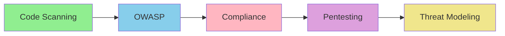

# 🔒 Security Specialist Learning Path

**Goal**: Master security automation from basic vulnerability scanning to advanced threat modeling and compliance.

**Time**: 3-5 hours total
**Difficulty**: Beginner → Expert

---

## Learning Journey



---

## Stage 1: Security Basics (45 min)

### Install Security Tools
```bash
/plugin install security-pro-pack@claude-code-plugins
/plugin install security-agent@claude-code-plugins
```

**Security Pro Pack includes**:
- 10 security plugins
- OWASP Top 10 coverage
- Compliance frameworks
- Penetration testing guides

### Quick Security Scan
```bash
/security-scan-quick
```

**What it checks**:
- Hardcoded secrets
- SQL injection vulnerabilities
- XSS attack vectors
- Insecure dependencies
- Weak cryptography

**Example Output**:
```
🔒 Security Scan Results

❌ HIGH: Hardcoded API key found
   File: config/settings.py:15
   Fix: Use environment variables

⚠️  MEDIUM: SQL query concatenation
   File: api/users.py:42
   Fix: Use parameterized queries

✅ PASSED: No XSS vulnerabilities
✅ PASSED: Strong password hashing (bcrypt)

Overall Score: 6/10
```

**Practice**: Scan your project and fix issues

---

## Stage 2: OWASP Top 10 Compliance (1 hour)

### OWASP Security Checker
```bash
/owasp-compliance-checker
```

Scans for OWASP Top 10 (2021):
1. **A01 - Broken Access Control**
2. **A02 - Cryptographic Failures**
3. **A03 - Injection**
4. **A04 - Insecure Design**
5. **A05 - Security Misconfiguration**
6. **A06 - Vulnerable Components**
7. **A07 - Identification/Authentication**
8. **A08 - Software/Data Integrity**
9. **A09 - Logging/Monitoring**
10. **A10 - SSRF**

### Fix Injection Vulnerabilities

**SQL Injection Detection**:
```bash
# Command analyzes code for SQL injection
# Provides specific fixes

Before:
query = f"SELECT * FROM users WHERE id = {user_id}"

After:
query = "SELECT * FROM users WHERE id = ?"
cursor.execute(query, (user_id,))
```

**XSS Prevention**:
```bash
# Detects XSS vulnerabilities
# Suggests sanitization

Before:
<div>{userInput}</div>

After:
<div>{DOMPurify.sanitize(userInput)}</div>
```

### Authentication Validation
```bash
/authentication-validator
```

Checks:
- Password strength requirements
- MFA implementation
- Session management
- Token expiration
- Secure cookie flags

**Practice**: Fix all OWASP Top 10 issues

---

## Stage 3: Compliance & Standards (1 hour)

### GDPR Compliance
```bash
/gdpr-compliance-scanner
```

**Checks for**:
- Data collection consent
- Privacy policy presence
- Data retention policies
- Right to deletion
- Data portability
- Breach notification

**Generates**:
- Compliance checklist
- Required documentation
- Implementation guide

### Generate Compliance Docs
```bash
/compliance-docs-generate
```

**Creates**:
- Privacy Policy
- Terms of Service
- Cookie Policy
- Data Processing Agreement
- GDPR compliance report

### PCI DSS (Payment Security)
```bash
# For payment processing compliance
/pci-dss-checker
```

Validates:
- Network security
- Cardholder data protection
- Encryption standards
- Access control
- Monitoring and testing

**Practice**: Make your app GDPR & PCI compliant

---

## Stage 4: Advanced Security (1.5 hours)

### Penetration Testing
```bash
/penetration-test-guide
```

**Guided pentesting**:
1. **Reconnaissance**
   - Port scanning
   - Service enumeration
   - Technology fingerprinting

2. **Vulnerability Analysis**
   - Automated scanning
   - Manual testing
   - Configuration review

3. **Exploitation**
   - PoC development
   - Privilege escalation
   - Lateral movement

4. **Reporting**
   - Severity classification
   - Remediation steps
   - Executive summary

### Security Headers Analysis
```bash
/security-headers-analyzer
```

**Checks HTTP headers**:
```
✅ Content-Security-Policy: present
✅ X-Frame-Options: DENY
✅ X-Content-Type-Options: nosniff
❌ Strict-Transport-Security: MISSING
⚠️  Permissions-Policy: incomplete
```

**Suggests fixes**:
```nginx
# Nginx configuration
add_header Strict-Transport-Security "max-age=31536000; includeSubDomains" always;
add_header X-Frame-Options "DENY" always;
add_header X-Content-Type-Options "nosniff" always;
add_header Content-Security-Policy "default-src 'self'" always;
```

### Dependency Security
```bash
/dependency-checker
```

**Scans for**:
- Known CVEs
- Outdated packages
- License compliance
- Supply chain risks

**Example Output**:
```
🔍 Dependency Security Report

❌ CRITICAL: lodash@4.17.15 (CVE-2020-8203)
   Upgrade to: lodash@4.17.21
   Impact: Prototype pollution

⚠️  HIGH: axios@0.19.0 (CVE-2021-3749)
   Upgrade to: axios@0.21.2

✅ 142 dependencies: 138 secure, 4 vulnerable
```

**Practice**: Conduct a full security audit

---

## Stage 5: Threat Modeling & Incident Response (1 hour)

### Threat Modeling
```bash
/threat-model-generator
```

**Creates STRIDE analysis**:
- **S**poofing
- **T**ampering
- **R**epudiation
- **I**nformation Disclosure
- **D**enial of Service
- **E**levation of Privilege

**Generates**:
```markdown
# Threat Model: User Authentication

## Assets
- User credentials
- Session tokens
- Personal data

## Threats
1. Spoofing: Attacker impersonates user
   - Mitigation: MFA, strong passwords

2. Tampering: Session token modification
   - Mitigation: JWT signing, HTTPS only

3. Information Disclosure: Password exposure
   - Mitigation: Bcrypt hashing, no logging
```

### Security Incident Response
```bash
/security-incident-responder
```

**Guides through**:
1. **Detection**: Identify security incidents
2. **Containment**: Isolate affected systems
3. **Eradication**: Remove threat
4. **Recovery**: Restore services
5. **Lessons Learned**: Post-mortem analysis

### Cryptography Audit
```bash
/crypto-audit
```

**Validates**:
- Encryption algorithms (AES-256, RSA-2048)
- Key management
- Secure random generation
- Certificate validation
- Perfect Forward Secrecy

**Practice**: Create threat model and incident plan

---

## Real-World Scenario: Secure a Production App

### Complete Security Audit (90 minutes)

**1. Initial Scan** (10 min)
```bash
/security-scan-quick
# Fix critical issues immediately
```

**2. OWASP Compliance** (20 min)
```bash
/owasp-compliance-checker
# Address Top 10 vulnerabilities
```

**3. Authentication Hardening** (15 min)
```bash
/authentication-validator
# Implement MFA
# Strengthen password policies
```

**4. Dependency Security** (15 min)
```bash
/dependency-checker
# Update vulnerable packages
# Review licenses
```

**5. Compliance** (20 min)
```bash
/gdpr-compliance-scanner
/compliance-docs-generate
# Ensure regulatory compliance
```

**6. Pentesting** (30 min)
```bash
/penetration-test-guide
# Conduct security assessment
# Document findings
```

**7. Security Headers** (10 min)
```bash
/security-headers-analyzer
# Configure all security headers
```

**8. Threat Model** (20 min)
```bash
/threat-model-generator
# Create comprehensive threat model
```

---

## Security Best Practices

### Code-Level Security

**Input Validation**:
```python
# ✅ Good
from pydantic import BaseModel, validator

class UserInput(BaseModel):
    email: str
    age: int

    @validator('email')
    def validate_email(cls, v):
        if not re.match(r'^[\w\.-]+@[\w\.-]+\.\w+$', v):
            raise ValueError('Invalid email')
        return v
```

**Output Encoding**:
```javascript
// ✅ Good
import DOMPurify from 'dompurify';
const clean = DOMPurify.sanitize(dirty);
```

**Secure Authentication**:
```python
# ✅ Good
from passlib.hash import bcrypt
hashed = bcrypt.hash(password)
bcrypt.verify(password, hashed)
```

### Infrastructure Security

**Docker Security**:
```dockerfile
# ✅ Good practices
FROM node:18-alpine  # Minimal base image
USER node            # Non-root user
COPY --chown=node:node . /app
RUN npm ci --only=production
```

**API Security**:
```yaml
# ✅ Rate limiting
rate_limit:
  requests_per_minute: 60
  burst: 10

# ✅ API key rotation
api_keys:
  rotation_days: 90
  min_length: 32
```

---

## Security Automation Pipeline

### CI/CD Security Integration

```yaml
# .github/workflows/security.yml
name: Security Scan
on: [push, pull_request]

jobs:
  security:
    runs-on: ubuntu-latest
    steps:
      - uses: actions/checkout@v4

      - name: OWASP Dependency Check
        run: /owasp-dependency-check

      - name: Code Security Scan
        run: /security-scan-quick

      - name: Container Security Scan
        run: /docker-security-scan

      - name: Secret Scanning
        run: /secret-scanner

      - name: Fail on Critical
        run: |
          if grep -q "CRITICAL" security-report.json; then
            exit 1
          fi
```

---

## Plugin Reference

| Plugin | Security Area | Time to Learn |
|--------|---------------|---------------|
| `security-scan-quick` | General scanning | 10 min |
| `owasp-compliance-checker` | OWASP Top 10 | 30 min |
| `authentication-validator` | Auth security | 20 min |
| `dependency-checker` | Supply chain | 15 min |
| `gdpr-compliance-scanner` | Privacy/GDPR | 25 min |
| `security-headers-analyzer` | HTTP headers | 15 min |
| `penetration-test-guide` | Pentesting | 45 min |
| `threat-model-generator` | Threat modeling | 30 min |
| `crypto-audit` | Cryptography | 20 min |
| `security-incident-responder` | Incident response | 30 min |

**Full Pack**: `security-pro-pack` (10 plugins, 3 hours to master)

---

## Certification Checklist

**Security Analyst** ✅
- [ ] Run automated scans
- [ ] Fix OWASP Top 10
- [ ] Implement security headers

**Security Engineer** ✅
- [ ] Conduct pentests
- [ ] Achieve compliance (GDPR/PCI)
- [ ] Create threat models

**Security Architect** ✅
- [ ] Design secure architectures
- [ ] Implement zero-trust
- [ ] Lead incident response

---

## Next Steps

**Expand Your Skills**:
- [DevOps Path](./devops-engineer.md): Secure CI/CD pipelines
- [AI/ML Path](./ai-ml-developer.md): Secure ML models
- [Advanced Developer](../03-advanced-developer/): Build security tools

**Resources**:
- [OWASP Top 10](https://owasp.org/www-project-top-ten/)
- [Security Pro Pack](../../../plugins/packages/security-pro-pack/)
- [Claude Code Security](https://docs.claude.com/en/docs/claude-code/use-cases/security)

---

**Congratulations!** You're now a Claude Code security expert! 🔒
