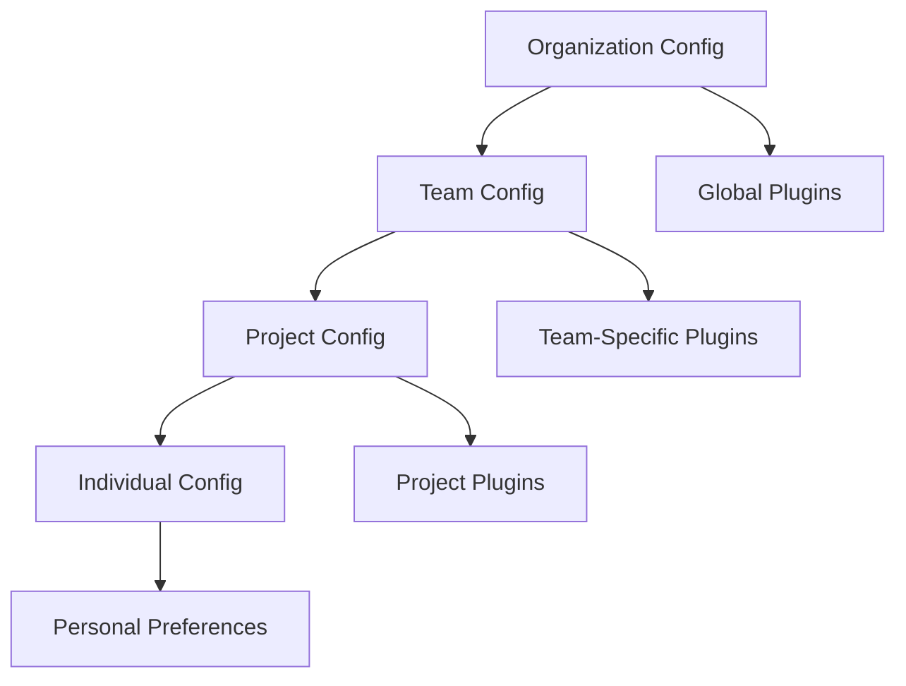

# Team Presets & Workflows: Standardized Team Configurations

**Production Playbook for Team Leads and Engineering Managers**

Standardizing Claude Code configurations across engineering teams accelerates onboarding, ensures consistency, and enables collaborative development. This playbook provides team plugin bundles, workflow templates, configuration management strategies, and automation for distributed teams.

## Table of Contents

1. [Team Configuration Strategy](#team-configuration-strategy)
2. [Plugin Bundles](#plugin-bundles)
3. [Workflow Templates](#workflow-templates)
4. [Onboarding Automation](#onboarding-automation)
5. [Configuration Management](#configuration-management)
6. [Collaborative Development](#collaborative-development)
7. [Best Practices](#best-practices)
8. [Tools & Resources](#tools--resources)
9. [Summary](#summary)

---

## Team Configuration Strategy

### Configuration Layers



**Configuration Precedence**:
1. **Organization** - Security policies, approved plugins, compliance settings
2. **Team** - Team-specific workflows, shared plugins, coding standards
3. **Project** - Project dependencies, custom agents, specific tools
4. **Individual** - Personal preferences, API keys, editor settings

### Team Configuration File

```jsonc
// .claude/team-config.json
{
  "teamId": "engineering-team-backend",
  "organization": "acme-corp",
  "version": "1.0.0",

  "plugins": {
    "required": [
      "code-reviewer@claude-code-plugins-plus",
      "test-automator@claude-code-plugins-plus",
      "security-auditor@claude-code-plugins-plus"
    ],
    "recommended": [
      "performance-engineer@claude-code-plugins-plus",
      "database-optimizer@claude-code-plugins-plus"
    ],
    "forbidden": [
      "untrusted-plugin"  // Security risk
    ]
  },

  "workflows": {
    "default": "code-review-workflow",
    "available": [
      "code-review-workflow",
      "hotfix-workflow",
      "feature-development-workflow"
    ]
  },

  "standards": {
    "coding": {
      "linter": "eslint",
      "formatter": "prettier",
      "typeChecker": "typescript"
    },
    "security": {
      "scanOnCommit": true,
      "preventSecrets": true
    },
    "review": {
      "minReviewers": 2,
      "requireTests": true
    }
  },

  "onboarding": {
    "steps": [
      "install-required-plugins",
      "configure-git-hooks",
      "setup-local-environment",
      "run-first-workflow"
    ],
    "documentation": "https://wiki.acme.com/claude-code-setup"
  }
}
```

---

## Plugin Bundles

### Team-Specific Plugin Packs

**Backend Engineering Team**:
```json
{
  "name": "backend-engineering-pack",
  "version": "1.0.0",
  "plugins": [
    "code-reviewer@claude-code-plugins-plus",
    "test-automator@claude-code-plugins-plus",
    "database-optimizer@claude-code-plugins-plus",
    "security-auditor@claude-code-plugins-plus",
    "api-documenter@claude-code-plugins-plus",
    "performance-engineer@claude-code-plugins-plus"
  ],
  "skills": [
    "typescript-pro",
    "nodejs-expert",
    "postgresql-optimizer",
    "rest-api-designer"
  ]
}
```

**Frontend Engineering Team**:
```json
{
  "name": "frontend-engineering-pack",
  "version": "1.0.0",
  "plugins": [
    "code-reviewer@claude-code-plugins-plus",
    "ui-visual-validator@claude-code-plugins-plus",
    "frontend-security-coder@claude-code-plugins-plus",
    "seo-content-auditor@claude-code-plugins-plus"
  ],
  "skills": [
    "react-expert",
    "css-architect",
    "accessibility-specialist",
    "responsive-design"
  ]
}
```

**DevOps Team**:
```json
{
  "name": "devops-pack",
  "version": "1.0.0",
  "plugins": [
    "cloud-architect@claude-code-plugins-plus",
    "kubernetes-architect@claude-code-plugins-plus",
    "terraform-specialist@claude-code-plugins-plus",
    "observability-engineer@claude-code-plugins-plus",
    "deployment-engineer@claude-code-plugins-plus"
  ],
  "skills": [
    "kubernetes-ops",
    "terraform-infra",
    "prometheus-monitoring",
    "docker-containerization"
  ]
}
```

### Bundle Installation Script

```bash
#!/bin/bash
# install-team-bundle.sh - Install team plugin bundle

BUNDLE=$1

if [ -z "$BUNDLE" ]; then
  echo "Usage: ./install-team-bundle.sh <backend|frontend|devops>"
  exit 1
fi

BUNDLE_FILE="team-bundles/${BUNDLE}-engineering-pack.json"

if [ ! -f "$BUNDLE_FILE" ]; then
  echo "Bundle not found: $BUNDLE_FILE"
  exit 1
fi

# Parse plugins from bundle
PLUGINS=$(jq -r '.plugins[]' $BUNDLE_FILE)

# Install each plugin
for plugin in $PLUGINS; do
  echo "Installing: $plugin"
  /plugin install $plugin
done

# Verify installation
/plugin list

echo "✓ Team bundle installed: $BUNDLE"
```

---

## Workflow Templates

### Code Review Workflow

```markdown
<!-- .claude/workflows/code-review-workflow.md -->
# Code Review Workflow

## Steps

1. **Pre-Review Analysis**
   - Run linter: `npm run lint`
   - Run tests: `npm test`
   - Check types: `npm run typecheck`

2. **Automated Code Review**
   - Activate: `code-reviewer` plugin
   - Scan for security issues: `security-auditor`
   - Check performance: `performance-engineer`

3. **Generate Review Report**
   - Create summary of findings
   - Categorize issues by severity (critical, major, minor)
   - Suggest fixes with code examples

4. **Submit for Human Review**
   - Create GitHub PR with AI review in description
   - Assign to team members
   - Link Jira ticket if applicable

## Triggers

- **Manual**: `/review-pr <pr-number>`
- **Automated**: Git hook on `git push origin <branch>`
- **CI/CD**: GitHub Actions on PR creation

## Success Criteria

- ✅ No critical security issues
- ✅ Test coverage >= 80%
- ✅ All tests passing
- ✅ Linter passing
- ✅ Performance within acceptable range
```

### Hotfix Workflow

```markdown
<!-- .claude/workflows/hotfix-workflow.md -->
# Hotfix Workflow

## Steps

1. **Create Hotfix Branch**
   ```bash
   git checkout -b hotfix/issue-description main
   ```

2. **Implement Fix**
   - Make minimal changes
   - Focus on immediate issue
   - Defer refactoring to follow-up

3. **Expedited Testing**
   - Run affected tests only
   - Manual verification in staging

4. **Deploy**
   - Deploy to staging
   - Verify fix
   - Deploy to production

5. **Post-Deployment**
   - Monitor metrics (error rate, latency)
   - Create postmortem (if SEV-1/SEV-2)
   - Schedule follow-up refactoring

## Approval

- **SEV-1**: Single approver required (on-call engineer)
- **SEV-2**: Two approvers required
- **SEV-3**: Standard review process

## Rollback Plan

- Keep previous version ready
- Monitor for 30 minutes post-deploy
- Auto-rollback if error rate > 5%
```

### Feature Development Workflow

```typescript
// .claude/workflows/feature-development.ts

interface FeatureWorkflow {
  name: string;
  steps: Step[];
  approvals: string[];
  testing: TestRequirement[];
}

const featureDevelopmentWorkflow: FeatureWorkflow = {
  name: 'feature-development',
  steps: [
    {
      name: 'Requirements Gathering',
      duration: '1-2 days',
      deliverables: ['PRD', 'Technical spec', 'UX mockups'],
      agents: ['product-manager', 'architect-reviewer']
    },
    {
      name: 'Design Review',
      duration: '0.5 days',
      deliverables: ['Architecture diagram', 'API contracts'],
      agents: ['backend-architect', 'database-optimizer']
    },
    {
      name: 'Implementation',
      duration: '3-5 days',
      deliverables: ['Code', 'Unit tests', 'Integration tests'],
      agents: ['code-reviewer', 'test-automator']
    },
    {
      name: 'Code Review',
      duration: '0.5 days',
      deliverables: ['Approved PR', 'Security scan', 'Performance review'],
      agents: ['code-reviewer', 'security-auditor', 'performance-engineer']
    },
    {
      name: 'QA Testing',
      duration: '1 day',
      deliverables: ['Test plan', 'Bug reports', 'Sign-off'],
      agents: ['test-automator']
    },
    {
      name: 'Deployment',
      duration: '0.5 days',
      deliverables: ['Production deployment', 'Monitoring setup'],
      agents: ['deployment-engineer', 'observability-engineer']
    }
  ],
  approvals: [
    'tech-lead',
    'product-manager',
    'security-reviewer'
  ],
  testing: [
    { type: 'unit', coverage: 0.8 },
    { type: 'integration', coverage: 0.6 },
    { type: 'e2e', coverage: 0.4 }
  ]
};
```

---

## Onboarding Automation

### New Team Member Setup Script

```bash
#!/bin/bash
# onboard-team-member.sh - Automated onboarding

MEMBER_NAME=$1
TEAM=$2

if [ -z "$MEMBER_NAME" ] || [ -z "$TEAM" ]; then
  echo "Usage: ./onboard-team-member.sh <name> <team>"
  exit 1
fi

echo "🚀 Onboarding: $MEMBER_NAME to $TEAM team"

# 1. Install Claude Code
echo "Installing Claude Code..."
npm install -g claude-code

# 2. Configure team settings
echo "Configuring team settings..."
mkdir -p ~/.claude
cp team-configs/$TEAM/config.json ~/.claude/config.json

# 3. Install team plugin bundle
echo "Installing team plugins..."
./install-team-bundle.sh $TEAM

# 4. Set up Git hooks
echo "Setting up Git hooks..."
cp team-configs/$TEAM/hooks/* .git/hooks/
chmod +x .git/hooks/*

# 5. Install Beads (task tracker)
echo "Installing Beads..."
npm install -g @beads/cli

# 6. Clone team repositories
echo "Cloning team repositories..."
while read repo; do
  git clone git@github.com:acme-corp/$repo.git
done < team-configs/$TEAM/repositories.txt

# 7. Generate welcome document
cat > ONBOARDING_$MEMBER_NAME.md <<EOF
# Welcome to the $TEAM Team!

## Your Setup
- Claude Code: Installed ✅
- Team Plugins: Installed ✅
- Git Hooks: Configured ✅
- Repositories: Cloned ✅

## Next Steps
1. Read team docs: https://wiki.acme.com/$TEAM
2. Join Slack: #team-$TEAM
3. Attend standup: Daily at 9:30 AM
4. Review team workflows: .claude/workflows/

## Quick Commands
- Review code: /review-pr <number>
- Run tests: npm test
- Deploy to staging: npm run deploy:staging

## Team Contacts
- Tech Lead: @tech-lead
- Product Manager: @product-manager
- DevOps: @devops

Happy coding! 🎉
EOF

echo "✅ Onboarding complete!"
echo "Review: ONBOARDING_$MEMBER_NAME.md"
```

### Interactive Onboarding CLI

```typescript
// onboard-cli.ts
import inquirer from 'inquirer';

interface OnboardingAnswers {
  name: string;
  team: string;
  role: string;
  projects: string[];
}

async function runOnboarding(): Promise<void> {
  console.log('🎯 Claude Code Team Onboarding\n');

  const answers = await inquirer.prompt<OnboardingAnswers>([
    {
      type: 'input',
      name: 'name',
      message: 'Your name:',
      validate: (input) => input.length > 0
    },
    {
      type: 'list',
      name: 'team',
      message: 'Select your team:',
      choices: ['backend', 'frontend', 'devops', 'mobile', 'qa']
    },
    {
      type: 'list',
      name: 'role',
      message: 'Your role:',
      choices: ['engineer', 'senior-engineer', 'staff-engineer', 'manager']
    },
    {
      type: 'checkbox',
      name: 'projects',
      message: 'Projects you\'ll work on:',
      choices: ['api-server', 'web-app', 'mobile-app', 'analytics', 'infrastructure']
    }
  ]);

  console.log('\n⚙️  Setting up your environment...\n');

  // Install team bundle
  console.log('📦 Installing plugins...');
  await installTeamBundle(answers.team);

  // Configure projects
  console.log('📂 Configuring projects...');
  for (const project of answers.projects) {
    await configureProject(project);
  }

  // Set up workflows
  console.log('🔧 Setting up workflows...');
  await setupWorkflows(answers.team);

  console.log('\n✅ Onboarding complete!\n');
  console.log('Next steps:');
  console.log('1. Read team docs: https://wiki.acme.com/' + answers.team);
  console.log('2. Join Slack: #team-' + answers.team);
  console.log('3. Run your first workflow: /code-review');
}

runOnboarding().catch(console.error);
```

---

## Configuration Management

### Centralized Configuration Repository

```
team-configs/
├── backend/
│   ├── config.json
│   ├── plugins.json
│   ├── workflows/
│   ├── hooks/
│   └── repositories.txt
├── frontend/
│   ├── config.json
│   ├── plugins.json
│   └── ...
└── devops/
    ├── config.json
    └── ...
```

### Configuration Sync

```typescript
// sync-team-config.ts
import { execSync } from 'child_process';
import { readFileSync, writeFileSync } from 'fs';

class TeamConfigSync {
  private readonly configRepo = 'git@github.com:acme-corp/team-configs.git';

  async syncFromCentral(team: string): Promise<void> {
    // Clone/pull config repo
    execSync(`git clone ${this.configRepo} /tmp/team-configs || (cd /tmp/team-configs && git pull)`);

    // Copy team config
    const teamConfig = readFileSync(`/tmp/team-configs/${team}/config.json`, 'utf-8');
    writeFileSync(`${process.env.HOME}/.claude/config.json`, teamConfig);

    // Copy workflows
    execSync(`cp -r /tmp/team-configs/${team}/workflows/* ${process.env.HOME}/.claude/workflows/`);

    // Copy hooks
    execSync(`cp /tmp/team-configs/${team}/hooks/* .git/hooks/`);

    console.log(`✓ Synced configuration for ${team} team`);
  }

  async pushLocalChanges(team: string, message: string): Promise<void> {
    // Copy local config back to central repo
    execSync(`cp ${process.env.HOME}/.claude/config.json /tmp/team-configs/${team}/config.json`);

    // Commit and push
    execSync(`
      cd /tmp/team-configs &&
      git add ${team}/ &&
      git commit -m "${message}" &&
      git push origin main
    `);

    console.log(`✓ Pushed changes to central repository`);
  }
}

// Usage
const sync = new TeamConfigSync();
await sync.syncFromCentral('backend');
```

---

## Collaborative Development

### Pair Programming with AI

```typescript
// pair-programming.ts

interface PairSession {
  driver: string;  // Human writing code
  navigator: string;  // AI agent providing guidance
  task: string;
  startTime: number;
}

class AIPairProgramming {
  async startSession(task: string): Promise<PairSession> {
    const session: PairSession = {
      driver: 'user-123',
      navigator: 'code-reviewer-agent',
      task,
      startTime: Date.now()
    };

    console.log(`🎯 Pair Programming Session Started`);
    console.log(`Task: ${task}`);
    console.log(`Navigator: ${session.navigator}`);
    console.log('------------------------------------------\n');

    return session;
  }

  async provideGuidance(code: string, context: string): Promise<string> {
    // AI agent analyzes code and provides real-time feedback
    const response = await callClaude({
      agent: 'code-reviewer',
      prompt: `As a pair programming navigator, review this code:\n\n${code}\n\nContext: ${context}\n\nProvide:\n1. Immediate feedback\n2. Suggestions for improvement\n3. Potential bugs\n4. Best practices`
    });

    return response;
  }

  async endSession(session: PairSession): Promise<void> {
    const duration = Date.now() - session.startTime;
    console.log(`\n✅ Pair Programming Session Complete`);
    console.log(`Duration: ${Math.floor(duration / 60000)} minutes`);
  }
}
```

### Code Review Automation

```typescript
// automated-code-review.ts

interface ReviewResult {
  approved: boolean;
  issues: Issue[];
  suggestions: string[];
  score: number;  // 0-100
}

interface Issue {
  severity: 'critical' | 'major' | 'minor';
  file: string;
  line: number;
  description: string;
  suggestion?: string;
}

class AutomatedCodeReview {
  async reviewPullRequest(prNumber: number): Promise<ReviewResult> {
    // Get PR diff
    const diff = await getPRDiff(prNumber);

    // Run parallel reviews
    const [
      securityReview,
      performanceReview,
      styleReview,
      testCoverage
    ] = await Promise.all([
      this.securityAudit(diff),
      this.performanceAnalysis(diff),
      this.styleCheck(diff),
      this.checkTestCoverage(diff)
    ]);

    // Aggregate results
    const issues = [
      ...securityReview.issues,
      ...performanceReview.issues,
      ...styleReview.issues
    ];

    const score = this.calculateScore(issues, testCoverage);

    // Auto-approve if score >= 85 and no critical issues
    const criticalIssues = issues.filter(i => i.severity === 'critical');
    const approved = score >= 85 && criticalIssues.length === 0;

    return {
      approved,
      issues,
      suggestions: this.generateSuggestions(issues),
      score
    };
  }

  private calculateScore(issues: Issue[], testCoverage: number): number {
    let score = 100;

    // Deduct points for issues
    score -= issues.filter(i => i.severity === 'critical').length * 20;
    score -= issues.filter(i => i.severity === 'major').length * 10;
    score -= issues.filter(i => i.severity === 'minor').length * 5;

    // Factor in test coverage
    score = Math.min(score, testCoverage);

    return Math.max(0, score);
  }

  private async securityAudit(diff: string): Promise<{ issues: Issue[] }> {
    // Use security-auditor plugin
    return { issues: [] };
  }

  private async performanceAnalysis(diff: string): Promise<{ issues: Issue[] }> {
    // Use performance-engineer plugin
    return { issues: [] };
  }

  private async styleCheck(diff: string): Promise<{ issues: Issue[] }> {
    // Run linter
    return { issues: [] };
  }

  private async checkTestCoverage(diff: string): Promise<number> {
    // Calculate test coverage
    return 85;
  }

  private generateSuggestions(issues: Issue[]): string[] {
    return issues
      .filter(i => i.suggestion)
      .map(i => i.suggestion!);
  }
}
```

---

## Best Practices

### DO ✅

1. **Standardize configurations**
   ```json
   {
     "team": "backend",
     "plugins": [...],
     "workflows": [...]
   }
   ```

2. **Automate onboarding**
   ```bash
   ./onboard-team-member.sh alice backend
   ```

3. **Version control team configs**
   ```bash
   git commit -m "Update team workflow templates"
   ```

4. **Document workflows**
   ```markdown
   # Code Review Workflow
   1. Run linter
   2. Run tests
   ...
   ```

### DON'T ❌

1. **Don't hardcode credentials**
   ```json
   // ❌ Hardcoded API key
   { "apiKey": "sk-..." }

   // ✅ Environment variable
   { "apiKey": "${ANTHROPIC_API_KEY}" }
   ```

2. **Don't skip testing workflows**
   ```bash
   # ❌ Deploy untested workflow
   # ✅ Test first
   ./test-workflow.sh code-review
   ```

---

## Tools & Resources

### Configuration Management

- **Git**: Version control for configs
- **Ansible**: Configuration automation
- **Terraform**: Infrastructure as code

### Collaboration Tools

- **GitHub**: Code review, PRs
- **Slack**: Team communication
- **Jira**: Task tracking

---

## Summary

**Key Takeaways**:

1. **Standardize configurations** - Team-wide consistency
2. **Create plugin bundles** - Backend, frontend, DevOps packs
3. **Define workflows** - Code review, hotfix, feature development
4. **Automate onboarding** - Scripts for new team members
5. **Version control configs** - Git repo for team settings
6. **Enable collaboration** - Pair programming, automated reviews
7. **Document everything** - Workflows, standards, processes

**Team Setup Checklist**:
- [ ] Create team configuration file
- [ ] Define plugin bundle for team
- [ ] Document workflows (code review, hotfix, feature)
- [ ] Write onboarding script
- [ ] Set up configuration repository
- [ ] Configure Git hooks
- [ ] Establish coding standards
- [ ] Create workflow templates
- [ ] Train team on workflows
- [ ] Schedule quarterly config reviews

---

**Last Updated**: 2025-12-24
**Author**: Jeremy Longshore
**Related Playbooks**: [Cost Caps & Budget Management](./02-cost-caps.md), [Compliance & Audit Guide](./07-compliance-audit.md)
