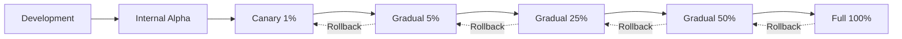

# Progressive Enhancement Patterns: Safe AI Feature Rollouts

**Production Playbook for Product Engineers and SREs**

Rolling out AI features requires progressive enhancement strategies to minimize risk, gather feedback, and ensure graceful degradation. This playbook provides feature flag implementation, A/B testing frameworks, canary deployment patterns, and fallback strategies for Claude Code AI features.

## Table of Contents

1. [Progressive Enhancement Strategy](#progressive-enhancement-strategy)
2. [Feature Flags](#feature-flags)
3. [A/B Testing](#ab-testing)
4. [Canary Deployments](#canary-deployments)
5. [Graceful Degradation](#graceful-degradation)
6. [Rollback Strategies](#rollback-strategies)
7. [Monitoring & Metrics](#monitoring--metrics)
8. [Best Practices](#best-practices)
9. [Tools & Resources](#tools--resources)
10. [Summary](#summary)

---

## Progressive Enhancement Strategy

### Rollout Phases



**Phase Durations** (for SEV-2 or lower changes):
- **Internal Alpha**: 1-2 days (employees only)
- **Canary 1%**: 1 day (monitor closely)
- **Gradual 5%**: 2 days
- **Gradual 25%**: 3 days
- **Gradual 50%**: 3 days
- **Full 100%**: Indefinite (or rollback)

**Metrics to Monitor**:
- Error rate (must be < 1%)
- Latency p95 (< 3 seconds)
- User satisfaction (survey or implicit signals)
- Cost impact (< 10% increase)
- Rollback rate (< 5% of users)

---

## Feature Flags

### Feature Flag Implementation

```typescript
enum FeatureFlag {
  AI_CODE_REVIEW = 'ai_code_review',
  OLLAMA_MIGRATION = 'ollama_migration',
  ADVANCED_ANALYTICS = 'advanced_analytics',
  EXPERIMENTAL_AGENT = 'experimental_agent'
}

interface FeatureFlagConfig {
  enabled: boolean;
  rolloutPercentage: number;  // 0-100
  allowlist?: string[];       // User IDs
  blocklist?: string[];       // User IDs
  startDate?: number;
  endDate?: number;
}

class FeatureFlagManager {
  private flags: Map<FeatureFlag, FeatureFlagConfig> = new Map();

  constructor() {
    // Load from database or config file
    this.loadFlags();
  }

  async isEnabled(flag: FeatureFlag, userId: string): Promise<boolean> {
    const config = this.flags.get(flag);
    if (!config) return false;

    // Explicit blocklist
    if (config.blocklist?.includes(userId)) {
      return false;
    }

    // Explicit allowlist
    if (config.allowlist?.includes(userId)) {
      return true;
    }

    // Time-based gating
    const now = Date.now();
    if (config.startDate && now < config.startDate) return false;
    if (config.endDate && now > config.endDate) return false;

    // Percentage rollout (deterministic based on user ID)
    if (!config.enabled) return false;

    const hash = this.hashUserId(userId);
    const userPercentile = (hash % 100) + 1;  // 1-100

    return userPercentile <= config.rolloutPercentage;
  }

  async setFlag(flag: FeatureFlag, config: FeatureFlagConfig): Promise<void> {
    this.flags.set(flag, config);
    await this.saveFlags();
  }

  async incrementRollout(flag: FeatureFlag, step: number = 5): Promise<void> {
    const config = this.flags.get(flag);
    if (!config) throw new Error(`Flag not found: ${flag}`);

    config.rolloutPercentage = Math.min(100, config.rolloutPercentage + step);
    await this.setFlag(flag, config);

    console.log(`🚀 Increased ${flag} rollout to ${config.rolloutPercentage}%`);
  }

  private hashUserId(userId: string): number {
    let hash = 0;
    for (let i = 0; i < userId.length; i++) {
      hash = ((hash << 5) - hash) + userId.charCodeAt(i);
      hash = hash & hash;  // Convert to 32-bit integer
    }
    return Math.abs(hash);
  }

  private async loadFlags(): Promise<void> {
    // Load from database or config file
    const configs = await db.featureFlags.find();
    for (const config of configs) {
      this.flags.set(config.flag, config.config);
    }
  }

  private async saveFlags(): Promise<void> {
    for (const [flag, config] of this.flags) {
      await db.featureFlags.upsert({ flag, config });
    }
  }
}
```

### Usage Example

```typescript
const flags = new FeatureFlagManager();

// Enable AI code review for 10% of users
await flags.setFlag(FeatureFlag.AI_CODE_REVIEW, {
  enabled: true,
  rolloutPercentage: 10
});

// Check flag before using feature
async function reviewCode(userId: string, code: string): Promise<string> {
  const useAI = await flags.isEnabled(FeatureFlag.AI_CODE_REVIEW, userId);

  if (useAI) {
    // New AI-powered review
    return await aiCodeReview(code);
  } else {
    // Traditional linter-based review
    return await linterReview(code);
  }
}

// Gradual rollout (automated)
setInterval(async () => {
  await flags.incrementRollout(FeatureFlag.AI_CODE_REVIEW, 5);  // +5% every hour
}, 3600000);
```

---

## A/B Testing

### A/B Test Framework

```typescript
enum Variant {
  CONTROL = 'control',
  TREATMENT = 'treatment'
}

interface ABTest {
  name: string;
  startDate: number;
  endDate: number;
  controlPercentage: number;  // e.g., 50
  treatmentPercentage: number; // e.g., 50
  metrics: string[];  // ['conversion_rate', 'latency', 'satisfaction']
}

class ABTestManager {
  private tests: Map<string, ABTest> = new Map();

  async assignVariant(testName: string, userId: string): Promise<Variant> {
    const test = this.tests.get(testName);
    if (!test) throw new Error(`Test not found: ${testName}`);

    // Check if test is active
    const now = Date.now();
    if (now < test.startDate || now > test.endDate) {
      return Variant.CONTROL;
    }

    // Deterministic assignment based on user ID
    const hash = this.hashUserId(userId);
    const percentile = (hash % 100) + 1;

    if (percentile <= test.controlPercentage) {
      return Variant.CONTROL;
    } else if (percentile <= test.controlPercentage + test.treatmentPercentage) {
      return Variant.TREATMENT;
    } else {
      return Variant.CONTROL;
    }
  }

  async recordMetric(testName: string, userId: string, metric: string, value: number): Promise<void> {
    const variant = await this.assignVariant(testName, userId);

    await db.abTestMetrics.insert({
      test: testName,
      variant,
      userId,
      metric,
      value,
      timestamp: Date.now()
    });
  }

  async analyzeResults(testName: string): Promise<{
    control: Record<string, number>;
    treatment: Record<string, number>;
    significant: boolean;
  }> {
    const metrics = await db.abTestMetrics.find({ test: testName });

    const controlMetrics = metrics.filter(m => m.variant === Variant.CONTROL);
    const treatmentMetrics = metrics.filter(m => m.variant === Variant.TREATMENT);

    const controlAvg = this.calculateAverages(controlMetrics);
    const treatmentAvg = this.calculateAverages(treatmentMetrics);

    // Simplified statistical significance (use proper t-test in production)
    const significant = this.checkSignificance(controlMetrics, treatmentMetrics);

    return {
      control: controlAvg,
      treatment: treatmentAvg,
      significant
    };
  }

  private calculateAverages(metrics: any[]): Record<string, number> {
    const grouped = this.groupBy(metrics, 'metric');
    const averages: Record<string, number> = {};

    for (const [metric, values] of Object.entries(grouped)) {
      const sum = values.reduce((acc: number, v: any) => acc + v.value, 0);
      averages[metric] = sum / values.length;
    }

    return averages;
  }

  private groupBy(items: any[], key: string): Record<string, any[]> {
    return items.reduce((acc, item) => {
      const groupKey = item[key];
      if (!acc[groupKey]) acc[groupKey] = [];
      acc[groupKey].push(item);
      return acc;
    }, {});
  }

  private checkSignificance(control: any[], treatment: any[]): boolean {
    // Simplified: Check if sample sizes are sufficient
    return control.length >= 100 && treatment.length >= 100;
  }

  private hashUserId(userId: string): number {
    let hash = 0;
    for (let i = 0; i < userId.length; i++) {
      hash = ((hash << 5) - hash) + userId.charCodeAt(i);
      hash = hash & hash;
    }
    return Math.abs(hash);
  }
}
```

### A/B Test Example

```typescript
const abTest = new ABTestManager();

// Create A/B test: Claude Sonnet vs Ollama Llama
await abTest.createTest({
  name: 'ollama-vs-claude',
  startDate: Date.now(),
  endDate: Date.now() + 7 * 86400000,  // 7 days
  controlPercentage: 50,    // Claude (control)
  treatmentPercentage: 50,  // Ollama (treatment)
  metrics: ['latency', 'quality', 'cost']
});

// Assign variant and execute
async function generateCode(userId: string, prompt: string): Promise<string> {
  const variant = await abTest.assignVariant('ollama-vs-claude', userId);

  const start = Date.now();
  let result: string;
  let cost: number;

  if (variant === Variant.CONTROL) {
    // Control: Claude 3.5 Sonnet
    result = await callClaude(prompt);
    cost = 0.015;  // $0.015 per request (example)
  } else {
    // Treatment: Ollama Llama 3.3 70B
    result = await callOllama(prompt, 'llama3.3:70b');
    cost = 0;  // Free
  }

  const latency = Date.now() - start;

  // Record metrics
  await abTest.recordMetric('ollama-vs-claude', userId, 'latency', latency);
  await abTest.recordMetric('ollama-vs-claude', userId, 'cost', cost);

  return result;
}

// Analyze after 7 days
const results = await abTest.analyzeResults('ollama-vs-claude');
console.log('Control (Claude):', results.control);
// { latency: 4500, cost: 0.015, quality: 9.2 }

console.log('Treatment (Ollama):', results.treatment);
// { latency: 3800, cost: 0, quality: 8.5 }

console.log('Statistically significant?', results.significant);
// true (if sample size sufficient)
```

---

## Canary Deployments

### Canary Deployment Strategy

```typescript
interface CanaryConfig {
  percentage: number;
  duration: number;  // milliseconds
  autoPromote: boolean;
  thresholds: {
    errorRate: number;    // e.g., 0.01 (1%)
    latencyP95: number;   // e.g., 3000 (3 seconds)
  };
}

class CanaryDeployment {
  async deploy(newVersion: string, config: CanaryConfig): Promise<boolean> {
    console.log(`🐤 Starting canary deployment: ${newVersion} (${config.percentage}%)`);

    // Route traffic
    await this.routeTraffic(newVersion, config.percentage);

    // Monitor for duration
    await sleep(config.duration);

    // Check metrics
    const metrics = await this.collectMetrics(newVersion, config.duration);

    const healthy = this.evaluateHealth(metrics, config.thresholds);

    if (healthy) {
      console.log(`✅ Canary healthy. Promoting ${newVersion}`);
      if (config.autoPromote) {
        await this.promote(newVersion);
      }
      return true;
    } else {
      console.error(`❌ Canary failed. Rolling back ${newVersion}`);
      await this.rollback(newVersion);
      return false;
    }
  }

  private async routeTraffic(version: string, percentage: number): Promise<void> {
    // Update load balancer routing rules
    await updateLoadBalancer({
      versions: [
        { version: 'stable', weight: 100 - percentage },
        { version, weight: percentage }
      ]
    });
  }

  private async collectMetrics(version: string, duration: number): Promise<any> {
    // Query Prometheus for metrics
    const errorRate = await prometheus.query(
      `rate(http_requests_errors{version="${version}"}[${duration / 1000}s])`
    );

    const latencyP95 = await prometheus.query(
      `histogram_quantile(0.95, rate(http_request_duration_seconds_bucket{version="${version}"}[${duration / 1000}s]))`
    );

    return { errorRate, latencyP95 };
  }

  private evaluateHealth(metrics: any, thresholds: any): boolean {
    if (metrics.errorRate > thresholds.errorRate) {
      console.warn(`Error rate too high: ${metrics.errorRate} > ${thresholds.errorRate}`);
      return false;
    }

    if (metrics.latencyP95 > thresholds.latencyP95) {
      console.warn(`Latency too high: ${metrics.latencyP95}ms > ${thresholds.latencyP95}ms`);
      return false;
    }

    return true;
  }

  private async promote(version: string): Promise<void> {
    // Gradually increase traffic to 100%
    await this.routeTraffic(version, 100);
    console.log(`🚀 Promoted ${version} to 100%`);
  }

  private async rollback(version: string): Promise<void> {
    // Route all traffic back to stable
    await this.routeTraffic('stable', 100);
    console.log(`⏪ Rolled back ${version}`);
  }
}

// Usage
const canary = new CanaryDeployment();
await canary.deploy('v2.5.0', {
  percentage: 5,           // 5% of traffic
  duration: 600000,        // 10 minutes
  autoPromote: false,      // Manual promotion
  thresholds: {
    errorRate: 0.01,       // Max 1% errors
    latencyP95: 3000       // Max 3s p95 latency
  }
});
```

---

## Graceful Degradation

### Fallback Strategies

```typescript
enum FallbackStrategy {
  SIMPLER_MODEL = 'simpler_model',
  CACHED_RESPONSE = 'cached_response',
  TRADITIONAL_METHOD = 'traditional_method',
  REDUCED_FUNCTIONALITY = 'reduced_functionality'
}

class GracefulDegradation {
  async executeWithFallback<T>(
    primary: () => Promise<T>,
    fallback: () => Promise<T>,
    strategy: FallbackStrategy
  ): Promise<{ result: T; usedFallback: boolean }> {
    try {
      const result = await primary();
      return { result, usedFallback: false };
    } catch (error) {
      console.warn(`Primary method failed: ${error.message}`);
      console.log(`Using fallback strategy: ${strategy}`);

      const result = await fallback();
      return { result, usedFallback: true };
    }
  }
}

// Strategy 1: Simpler Model
async function codeReviewWithFallback(code: string): Promise<string> {
  const degradation = new GracefulDegradation();

  return (await degradation.executeWithFallback(
    // Primary: Claude 3.5 Sonnet (high quality)
    async () => {
      return await callClaude(code, 'claude-3-5-sonnet-20241022');
    },
    // Fallback: Claude 3.5 Haiku (faster, cheaper)
    async () => {
      return await callClaude(code, 'claude-3-5-haiku-20241022');
    },
    FallbackStrategy.SIMPLER_MODEL
  )).result;
}

// Strategy 2: Cached Response
async function summarizeWithCache(text: string): Promise<string> {
  const cache = new Map<string, string>();
  const degradation = new GracefulDegradation();

  return (await degradation.executeWithFallback(
    // Primary: Fresh AI summary
    async () => {
      const summary = await callClaude(text, 'claude-3-5-haiku-20241022');
      cache.set(text, summary);
      return summary;
    },
    // Fallback: Cached summary
    async () => {
      const cached = cache.get(text);
      if (!cached) throw new Error('No cache available');
      return cached + '\n\n(Cached response)';
    },
    FallbackStrategy.CACHED_RESPONSE
  )).result;
}

// Strategy 3: Traditional Method
async function formatCodeWithFallback(code: string): Promise<string> {
  const degradation = new GracefulDegradation();

  return (await degradation.executeWithFallback(
    // Primary: AI-powered formatting with context awareness
    async () => {
      return await callClaude(`Format this code:\n${code}`, 'claude-3-5-haiku-20241022');
    },
    // Fallback: Traditional Prettier
    async () => {
      return prettier.format(code, { parser: 'typescript' });
    },
    FallbackStrategy.TRADITIONAL_METHOD
  )).result;
}
```

---

## Rollback Strategies

### Automated Rollback

```typescript
class AutomatedRollback {
  private readonly errorRateThreshold = 0.05;  // 5%
  private readonly checkInterval = 60000;      // 1 minute

  async monitorAndRollback(version: string): Promise<void> {
    const startTime = Date.now();

    const monitor = setInterval(async () => {
      const metrics = await this.collectMetrics(version, this.checkInterval);

      // Check error rate
      if (metrics.errorRate > this.errorRateThreshold) {
        console.error(`🚨 Error rate ${metrics.errorRate} > threshold ${this.errorRateThreshold}`);
        console.error(`⏪ Auto-rolling back ${version}`);

        clearInterval(monitor);
        await this.rollback(version);
        await this.alertTeam(`Auto-rollback triggered for ${version}: error rate ${metrics.errorRate}`);
      }

      // Stop monitoring after 1 hour if healthy
      if (Date.now() - startTime > 3600000) {
        console.log(`✅ ${version} stable after 1 hour. Stopping auto-rollback monitor.`);
        clearInterval(monitor);
      }
    }, this.checkInterval);
  }

  private async collectMetrics(version: string, window: number): Promise<any> {
    const errorRate = await prometheus.query(
      `rate(http_requests_errors{version="${version}"}[${window / 1000}s])`
    );

    return { errorRate };
  }

  private async rollback(version: string): Promise<void> {
    // Route traffic back to stable
    await updateLoadBalancer({
      versions: [{ version: 'stable', weight: 100 }]
    });
  }

  private async alertTeam(message: string): Promise<void> {
    // Send to PagerDuty, Slack, etc.
    console.log(`ALERT: ${message}`);
  }
}
```

---

## Monitoring & Metrics

### Rollout Metrics Dashboard

```typescript
interface RolloutMetrics {
  version: string;
  percentage: number;
  errorRate: number;
  latencyP50: number;
  latencyP95: number;
  latencyP99: number;
  requestCount: number;
  userSatisfaction: number;  // 0-5 star rating
}

class RolloutMonitor {
  async getMetrics(version: string): Promise<RolloutMetrics> {
    const errorRate = await prometheus.query(
      `rate(http_requests_errors{version="${version}"}[5m])`
    );

    const latencyP50 = await prometheus.query(
      `histogram_quantile(0.50, rate(http_request_duration_seconds_bucket{version="${version}"}[5m]))`
    );

    const latencyP95 = await prometheus.query(
      `histogram_quantile(0.95, rate(http_request_duration_seconds_bucket{version="${version}"}[5m]))`
    );

    const latencyP99 = await prometheus.query(
      `histogram_quantile(0.99, rate(http_request_duration_seconds_bucket{version="${version}"}[5m]))`
    );

    const requestCount = await prometheus.query(
      `sum(rate(http_requests_total{version="${version}"}[5m]))`
    );

    const userSatisfaction = await this.calculateSatisfaction(version);

    return {
      version,
      percentage: await this.getCurrentRolloutPercentage(version),
      errorRate,
      latencyP50,
      latencyP95,
      latencyP99,
      requestCount,
      userSatisfaction
    };
  }

  private async calculateSatisfaction(version: string): Promise<number> {
    // Calculate from user feedback
    const ratings = await db.userRatings.find({ version });
    const avg = ratings.reduce((sum, r) => sum + r.rating, 0) / ratings.length;
    return avg || 0;
  }

  private async getCurrentRolloutPercentage(version: string): Promise<number> {
    // Get from load balancer config
    return 50;  // Example
  }
}
```

---

## Best Practices

### DO ✅

1. **Use feature flags**
   ```typescript
   const enabled = await flags.isEnabled(FeatureFlag.AI_CODE_REVIEW, userId);
   if (enabled) { /* new feature */ } else { /* old feature */ }
   ```

2. **Test with real users**
   ```typescript
   const variant = await abTest.assignVariant('experiment', userId);
   // Run both variants, measure results
   ```

3. **Monitor metrics**
   ```typescript
   const metrics = await monitor.getMetrics('v2.0');
   if (metrics.errorRate > 0.01) await rollback();
   ```

4. **Gradual rollouts**
   ```typescript
   // Day 1: 1%, Day 2: 5%, Day 3: 25%, Day 4: 100%
   await incrementRollout(5);
   ```

### DON'T ❌

1. **Don't skip canary phase**
   ```typescript
   // ❌ Deploy directly to 100%
   await deploy('v2.0', { percentage: 100 });

   // ✅ Start with canary
   await deploy('v2.0', { percentage: 1 });
   ```

2. **Don't ignore metrics**
   ```typescript
   // ❌ No monitoring
   await deploy('v2.0');

   // ✅ Monitor and auto-rollback
   await monitorAndRollback('v2.0');
   ```

3. **Don't forget fallbacks**
   ```typescript
   // ❌ No fallback
   const result = await newAIFeature();

   // ✅ Always have fallback
   const result = await executeWithFallback(newAIFeature, traditionalMethod);
   ```

---

## Tools & Resources

### Feature Flag Platforms

- **LaunchDarkly**: Enterprise feature flags
- **Split.io**: Feature flags + experimentation
- **Unleash**: Open-source feature toggles

### A/B Testing Tools

- **Optimizely**: A/B testing platform
- **VWO**: Visual testing
- **Google Optimize**: Free A/B testing

### Deployment Tools

- **Spinnaker**: Multi-cloud continuous delivery
- **Flagger**: Progressive delivery for Kubernetes
- **Argo Rollouts**: Canary deployments on K8s

---

## Summary

**Key Takeaways**:

1. **Feature flags enable safe rollouts** - Gradual percentage-based rollouts
2. **A/B testing validates changes** - Compare control vs treatment
3. **Canary deployments minimize risk** - 1% → 5% → 25% → 100%
4. **Graceful degradation prevents outages** - Fallback to simpler models
5. **Automated rollbacks protect users** - Monitor error rates, auto-rollback
6. **Metrics guide decisions** - Error rate, latency, satisfaction
7. **Progressive enhancement is continuous** - Always improving safely

**Rollout Checklist**:
- [ ] Implement feature flags for new AI features
- [ ] Define rollout phases (1% → 5% → 25% → 50% → 100%)
- [ ] Set up A/B testing framework
- [ ] Configure canary deployment thresholds
- [ ] Implement graceful degradation fallbacks
- [ ] Enable automated rollback monitoring
- [ ] Create rollout metrics dashboard
- [ ] Document rollback procedures
- [ ] Train team on progressive enhancement
- [ ] Schedule quarterly rollout reviews

---

**Last Updated**: 2025-12-24
**Author**: Jeremy Longshore
**Related Playbooks**: [Cost Caps & Budget Management](./02-cost-caps.md), [Incident Debugging Playbook](./05-incident-debugging.md)
