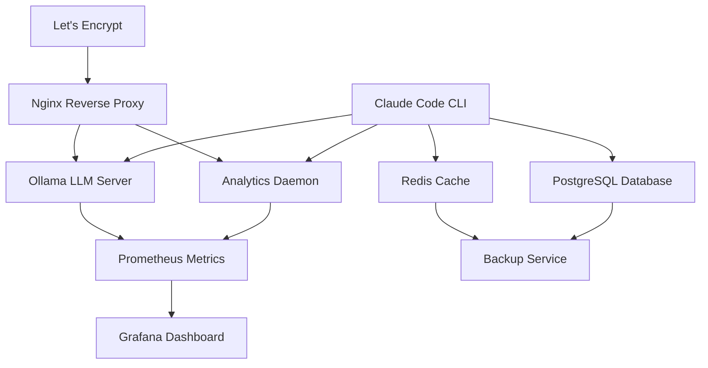

# Self-Hosted Stack Setup: Complete Infrastructure Guide

**Production Playbook for Infrastructure Engineers and DevOps**

Building a complete self-hosted AI infrastructure for Claude Code plugins eliminates cloud dependencies, ensures data privacy, and provides full control. This playbook provides production-ready Docker Compose configurations, Kubernetes deployments, monitoring with Prometheus/Grafana, automated backups, and disaster recovery procedures.

## Table of Contents

1. [Architecture Overview](#architecture-overview)
2. [Docker Compose Setup](#docker-compose-setup)
3. [Kubernetes Deployment](#kubernetes-deployment)
4. [Monitoring with Prometheus & Grafana](#monitoring-with-prometheus--grafana)
5. [Backup Strategies](#backup-strategies)
6. [Security Hardening](#security-hardening)
7. [Scaling & High Availability](#scaling--high-availability)
8. [Best Practices](#best-practices)
9. [Tools & Resources](#tools--resources)
10. [Summary](#summary)

---

## Architecture Overview

### Self-Hosted Stack Components



### Infrastructure Tiers

| Component | Purpose | Port | Storage |
|-----------|---------|------|---------|
| **Ollama** | Local LLM inference | 11434 | 100GB (models) |
| **Analytics Daemon** | Real-time monitoring | 3333, 3456 | 10GB (logs) |
| **PostgreSQL** | Persistent data | 5432 | 50GB (database) |
| **Redis** | Caching, sessions | 6379 | 5GB (cache) |
| **Prometheus** | Metrics collection | 9090 | 20GB (metrics) |
| **Grafana** | Dashboards | 3000 | 5GB (config) |
| **Nginx** | Reverse proxy, SSL | 80, 443 | 1GB (logs) |

**Total Storage**: ~191GB minimum

---

## Docker Compose Setup

### Complete Stack (docker-compose.yml)

```yaml
# docker-compose.yml
version: '3.8'

services:
  # Ollama LLM Server
  ollama:
    image: ollama/ollama:latest
    container_name: ollama
    ports:
      - "11434:11434"
    volumes:
      - ollama_models:/root/.ollama
    deploy:
      resources:
        reservations:
          devices:
            - driver: nvidia
              count: 1
              capabilities: [gpu]
    restart: unless-stopped
    healthcheck:
      test: ["CMD", "curl", "-f", "http://localhost:11434/api/tags"]
      interval: 30s
      timeout: 10s
      retries: 3

  # Analytics Daemon
  analytics:
    build: ./packages/analytics-daemon
    container_name: analytics-daemon
    ports:
      - "3333:3333"  # HTTP API
      - "3456:3456"  # WebSocket
    volumes:
      - analytics_data:/data
      - ${HOME}/.claude:/root/.claude:ro
    environment:
      - NODE_ENV=production
      - PORT=3333
      - WS_PORT=3456
    restart: unless-stopped
    healthcheck:
      test: ["CMD", "curl", "-f", "http://localhost:3333/health"]
      interval: 30s
      timeout: 5s
      retries: 3

  # PostgreSQL Database
  postgres:
    image: postgres:16-alpine
    container_name: postgres
    ports:
      - "5432:5432"
    volumes:
      - postgres_data:/var/lib/postgresql/data
      - ./backups/postgres:/backups
    environment:
      - POSTGRES_USER=claude
      - POSTGRES_PASSWORD=${POSTGRES_PASSWORD}
      - POSTGRES_DB=claude_prod
    restart: unless-stopped
    healthcheck:
      test: ["CMD-SHELL", "pg_isready -U claude"]
      interval: 10s
      timeout: 5s
      retries: 5

  # Redis Cache
  redis:
    image: redis:7-alpine
    container_name: redis
    ports:
      - "6379:6379"
    volumes:
      - redis_data:/data
    command: redis-server --appendonly yes --maxmemory 2gb --maxmemory-policy allkeys-lru
    restart: unless-stopped
    healthcheck:
      test: ["CMD", "redis-cli", "ping"]
      interval: 10s
      timeout: 3s
      retries: 3

  # Prometheus Metrics
  prometheus:
    image: prom/prometheus:latest
    container_name: prometheus
    ports:
      - "9090:9090"
    volumes:
      - ./prometheus.yml:/etc/prometheus/prometheus.yml
      - prometheus_data:/prometheus
    command:
      - '--config.file=/etc/prometheus/prometheus.yml'
      - '--storage.tsdb.path=/prometheus'
      - '--storage.tsdb.retention.time=30d'
    restart: unless-stopped

  # Grafana Dashboards
  grafana:
    image: grafana/grafana:latest
    container_name: grafana
    ports:
      - "3000:3000"
    volumes:
      - grafana_data:/var/lib/grafana
      - ./grafana/dashboards:/etc/grafana/provisioning/dashboards
      - ./grafana/datasources:/etc/grafana/provisioning/datasources
    environment:
      - GF_SECURITY_ADMIN_PASSWORD=${GRAFANA_PASSWORD}
      - GF_INSTALL_PLUGINS=redis-datasource
    restart: unless-stopped
    depends_on:
      - prometheus

  # Nginx Reverse Proxy
  nginx:
    image: nginx:alpine
    container_name: nginx
    ports:
      - "80:80"
      - "443:443"
    volumes:
      - ./nginx/nginx.conf:/etc/nginx/nginx.conf:ro
      - ./nginx/ssl:/etc/nginx/ssl:ro
      - nginx_logs:/var/log/nginx
    restart: unless-stopped
    depends_on:
      - ollama
      - analytics
      - grafana

  # Automated Backups
  backup:
    image: alpine:latest
    container_name: backup-service
    volumes:
      - postgres_data:/source/postgres:ro
      - redis_data:/source/redis:ro
      - analytics_data:/source/analytics:ro
      - ./backups:/backups
    command: |
      sh -c '
        apk add --no-cache postgresql-client redis
        while true; do
          DATE=$(date +%Y-%m-%d_%H-%M-%S)

          # Backup PostgreSQL
          PGPASSWORD=$$POSTGRES_PASSWORD pg_dump -h postgres -U claude claude_prod > /backups/postgres/backup_$$DATE.sql

          # Backup Redis
          redis-cli -h redis --rdb /backups/redis/dump_$$DATE.rdb

          # Backup Analytics
          tar -czf /backups/analytics/backup_$$DATE.tar.gz /source/analytics

          # Delete old backups (keep 7 days)
          find /backups -name "backup_*.sql" -mtime +7 -delete
          find /backups -name "dump_*.rdb" -mtime +7 -delete
          find /backups -name "backup_*.tar.gz" -mtime +7 -delete

          echo "Backup completed: $$DATE"
          sleep 86400  # Daily backups
        done
      '
    environment:
      - POSTGRES_PASSWORD=${POSTGRES_PASSWORD}
    restart: unless-stopped

volumes:
  ollama_models:
  analytics_data:
  postgres_data:
  redis_data:
  prometheus_data:
  grafana_data:
  nginx_logs:

networks:
  default:
    name: claude_network
```

### Environment Configuration (.env)

```bash
# .env
POSTGRES_PASSWORD=your-secure-password-here
GRAFANA_PASSWORD=your-grafana-password-here
```

### Nginx Configuration

```nginx
# nginx/nginx.conf
events {
    worker_connections 1024;
}

http {
    upstream ollama {
        server ollama:11434;
    }

    upstream analytics {
        server analytics:3333;
    }

    upstream grafana {
        server grafana:3000;
    }

    # HTTP -> HTTPS redirect
    server {
        listen 80;
        server_name claude.example.com;
        return 301 https://$server_name$request_uri;
    }

    # HTTPS
    server {
        listen 443 ssl http2;
        server_name claude.example.com;

        ssl_certificate /etc/nginx/ssl/fullchain.pem;
        ssl_certificate_key /etc/nginx/ssl/privkey.pem;
        ssl_protocols TLSv1.2 TLSv1.3;
        ssl_ciphers HIGH:!aNULL:!MD5;

        # Ollama API
        location /api/ollama/ {
            proxy_pass http://ollama/;
            proxy_set_header Host $host;
            proxy_set_header X-Real-IP $remote_addr;
        }

        # Analytics API
        location /api/analytics/ {
            proxy_pass http://analytics/api/;
            proxy_set_header Host $host;
            proxy_set_header X-Real-IP $remote_addr;
        }

        # Analytics WebSocket
        location /ws/ {
            proxy_pass http://analytics/;
            proxy_http_version 1.1;
            proxy_set_header Upgrade $http_upgrade;
            proxy_set_header Connection "upgrade";
        }

        # Grafana
        location / {
            proxy_pass http://grafana/;
            proxy_set_header Host $host;
        }
    }
}
```

### Deployment Commands

```bash
# Setup
mkdir -p backups/{postgres,redis,analytics}
mkdir -p grafana/{dashboards,datasources}
touch .env  # Add passwords

# Start stack
docker-compose up -d

# Download Ollama models
docker exec ollama ollama pull llama3.3:70b
docker exec ollama ollama pull qwen2.5-coder:32b

# Verify health
docker-compose ps
docker-compose logs -f

# Access services
# Ollama: http://localhost:11434
# Analytics: http://localhost:3333
# Grafana: http://localhost:3000
# Prometheus: http://localhost:9090
```

---

## Kubernetes Deployment

### Complete Kubernetes Manifests

**Namespace**:
```yaml
# namespace.yaml
apiVersion: v1
kind: Namespace
metadata:
  name: claude-stack
```

**Ollama Deployment**:
```yaml
# ollama-deployment.yaml
apiVersion: apps/v1
kind: Deployment
metadata:
  name: ollama
  namespace: claude-stack
spec:
  replicas: 3  # Scale with GPUs
  selector:
    matchLabels:
      app: ollama
  template:
    metadata:
      labels:
        app: ollama
    spec:
      containers:
      - name: ollama
        image: ollama/ollama:latest
        ports:
        - containerPort: 11434
        resources:
          limits:
            nvidia.com/gpu: 1
          requests:
            memory: "16Gi"
            cpu: "4"
        volumeMounts:
        - name: models
          mountPath: /root/.ollama
        livenessProbe:
          httpGet:
            path: /api/tags
            port: 11434
          initialDelaySeconds: 60
          periodSeconds: 30
      volumes:
      - name: models
        persistentVolumeClaim:
          claimName: ollama-models-pvc
---
apiVersion: v1
kind: Service
metadata:
  name: ollama-service
  namespace: claude-stack
spec:
  selector:
    app: ollama
  ports:
  - protocol: TCP
    port: 11434
    targetPort: 11434
  type: ClusterIP
---
apiVersion: v1
kind: PersistentVolumeClaim
metadata:
  name: ollama-models-pvc
  namespace: claude-stack
spec:
  accessModes:
    - ReadWriteOnce
  resources:
    requests:
      storage: 100Gi
  storageClassName: fast-ssd
```

**PostgreSQL StatefulSet**:
```yaml
# postgres-statefulset.yaml
apiVersion: apps/v1
kind: StatefulSet
metadata:
  name: postgres
  namespace: claude-stack
spec:
  serviceName: postgres
  replicas: 1
  selector:
    matchLabels:
      app: postgres
  template:
    metadata:
      labels:
        app: postgres
    spec:
      containers:
      - name: postgres
        image: postgres:16-alpine
        ports:
        - containerPort: 5432
        env:
        - name: POSTGRES_USER
          value: "claude"
        - name: POSTGRES_PASSWORD
          valueFrom:
            secretKeyRef:
              name: postgres-secret
              key: password
        - name: POSTGRES_DB
          value: "claude_prod"
        volumeMounts:
        - name: postgres-data
          mountPath: /var/lib/postgresql/data
        resources:
          requests:
            memory: "4Gi"
            cpu: "2"
          limits:
            memory: "8Gi"
            cpu: "4"
  volumeClaimTemplates:
  - metadata:
      name: postgres-data
    spec:
      accessModes: [ "ReadWriteOnce" ]
      resources:
        requests:
          storage: 50Gi
      storageClassName: fast-ssd
---
apiVersion: v1
kind: Service
metadata:
  name: postgres
  namespace: claude-stack
spec:
  selector:
    app: postgres
  ports:
  - protocol: TCP
    port: 5432
    targetPort: 5432
  clusterIP: None
```

**Monitoring Stack**:
```yaml
# prometheus-deployment.yaml
apiVersion: apps/v1
kind: Deployment
metadata:
  name: prometheus
  namespace: claude-stack
spec:
  replicas: 1
  selector:
    matchLabels:
      app: prometheus
  template:
    metadata:
      labels:
        app: prometheus
    spec:
      containers:
      - name: prometheus
        image: prom/prometheus:latest
        ports:
        - containerPort: 9090
        volumeMounts:
        - name: config
          mountPath: /etc/prometheus
        - name: data
          mountPath: /prometheus
        args:
          - '--config.file=/etc/prometheus/prometheus.yml'
          - '--storage.tsdb.retention.time=30d'
      volumes:
      - name: config
        configMap:
          name: prometheus-config
      - name: data
        persistentVolumeClaim:
          claimName: prometheus-data-pvc
---
apiVersion: v1
kind: ConfigMap
metadata:
  name: prometheus-config
  namespace: claude-stack
data:
  prometheus.yml: |
    global:
      scrape_interval: 15s
    scrape_configs:
      - job_name: 'ollama'
        static_configs:
          - targets: ['ollama-service:11434']
      - job_name: 'postgres'
        static_configs:
          - targets: ['postgres:5432']
      - job_name: 'analytics'
        static_configs:
          - targets: ['analytics-service:3333']
```

### Deploy to Kubernetes

```bash
# Create namespace
kubectl apply -f namespace.yaml

# Create secrets
kubectl create secret generic postgres-secret \
  --from-literal=password='your-secure-password' \
  -n claude-stack

# Deploy services
kubectl apply -f ollama-deployment.yaml
kubectl apply -f postgres-statefulset.yaml
kubectl apply -f prometheus-deployment.yaml

# Verify
kubectl get pods -n claude-stack
kubectl logs -f deployment/ollama -n claude-stack
```

---

## Monitoring with Prometheus & Grafana

### Prometheus Configuration

```yaml
# prometheus.yml
global:
  scrape_interval: 15s
  evaluation_interval: 15s

scrape_configs:
  # Ollama metrics
  - job_name: 'ollama'
    static_configs:
      - targets: ['ollama:11434']
    metrics_path: '/metrics'

  # Analytics daemon metrics
  - job_name: 'analytics'
    static_configs:
      - targets: ['analytics:3333']
    metrics_path: '/metrics'

  # PostgreSQL metrics (using postgres_exporter)
  - job_name: 'postgres'
    static_configs:
      - targets: ['postgres-exporter:9187']

  # Redis metrics (using redis_exporter)
  - job_name: 'redis'
    static_configs:
      - targets: ['redis-exporter:9121']

  # Node metrics
  - job_name: 'node'
    static_configs:
      - targets: ['localhost:9100']

alerting:
  alertmanagers:
    - static_configs:
        - targets: ['alertmanager:9093']

rule_files:
  - '/etc/prometheus/rules/*.yml'
```

### Alert Rules

```yaml
# prometheus/rules/alerts.yml
groups:
  - name: claude_stack_alerts
    interval: 30s
    rules:
      # High error rate
      - alert: HighErrorRate
        expr: rate(llm_errors_total[5m]) > 0.05
        for: 5m
        labels:
          severity: critical
        annotations:
          summary: "High LLM error rate"
          description: "Error rate is {{ $value | humanizePercentage }}"

      # Ollama down
      - alert: OllamaDown
        expr: up{job="ollama"} == 0
        for: 1m
        labels:
          severity: critical
        annotations:
          summary: "Ollama is down"

      # High memory usage
      - alert: HighMemoryUsage
        expr: (node_memory_MemTotal_bytes - node_memory_MemAvailable_bytes) / node_memory_MemTotal_bytes > 0.9
        for: 5m
        labels:
          severity: warning
        annotations:
          summary: "High memory usage"
          description: "Memory usage is {{ $value | humanizePercentage }}"

      # Database connection issues
      - alert: PostgreSQLDown
        expr: up{job="postgres"} == 0
        for: 1m
        labels:
          severity: critical
        annotations:
          summary: "PostgreSQL is down"
```

### Grafana Dashboards

**Claude Stack Dashboard (JSON)**:
```json
{
  "dashboard": {
    "title": "Claude Code Self-Hosted Stack",
    "panels": [
      {
        "title": "LLM Requests/sec",
        "targets": [
          {
            "expr": "rate(llm_requests_total[5m])"
          }
        ],
        "type": "graph"
      },
      {
        "title": "Error Rate",
        "targets": [
          {
            "expr": "rate(llm_errors_total[5m]) / rate(llm_requests_total[5m])"
          }
        ],
        "type": "graph"
      },
      {
        "title": "Response Latency (p95)",
        "targets": [
          {
            "expr": "histogram_quantile(0.95, rate(llm_request_duration_seconds_bucket[5m]))"
          }
        ],
        "type": "graph"
      },
      {
        "title": "GPU Utilization",
        "targets": [
          {
            "expr": "nvidia_gpu_duty_cycle"
          }
        ],
        "type": "gauge"
      },
      {
        "title": "Database Connections",
        "targets": [
          {
            "expr": "pg_stat_database_numbackends"
          }
        ],
        "type": "graph"
      }
    ]
  }
}
```

---

## Backup Strategies

### Automated Daily Backups

```bash
#!/bin/bash
# backup.sh - Automated backup script

DATE=$(date +%Y-%m-%d_%H-%M-%S)
BACKUP_DIR="/backups"

# PostgreSQL backup
echo "Backing up PostgreSQL..."
PGPASSWORD=$POSTGRES_PASSWORD pg_dump -h localhost -U claude claude_prod | \
  gzip > $BACKUP_DIR/postgres/backup_$DATE.sql.gz

# Redis backup
echo "Backing up Redis..."
redis-cli --rdb $BACKUP_DIR/redis/dump_$DATE.rdb

# Analytics data
echo "Backing up Analytics..."
tar -czf $BACKUP_DIR/analytics/backup_$DATE.tar.gz /var/lib/analytics

# Ollama models (weekly only)
if [ $(date +%u) -eq 1 ]; then
  echo "Backing up Ollama models (weekly)..."
  tar -czf $BACKUP_DIR/ollama/models_$DATE.tar.gz /root/.ollama
fi

# Upload to S3 (optional)
aws s3 sync $BACKUP_DIR s3://my-backups/claude-stack/

# Delete old local backups (keep 7 days)
find $BACKUP_DIR -name "backup_*.sql.gz" -mtime +7 -delete
find $BACKUP_DIR -name "dump_*.rdb" -mtime +7 -delete
find $BACKUP_DIR -name "backup_*.tar.gz" -mtime +7 -delete

echo "Backup completed: $DATE"
```

### Restore Procedures

```bash
#!/bin/bash
# restore.sh - Restore from backup

BACKUP_FILE=$1

if [ -z "$BACKUP_FILE" ]; then
  echo "Usage: ./restore.sh <backup_file>"
  exit 1
fi

# Stop services
docker-compose down

# Restore PostgreSQL
if [[ $BACKUP_FILE == *"postgres"* ]]; then
  gunzip -c $BACKUP_FILE | \
    PGPASSWORD=$POSTGRES_PASSWORD psql -h localhost -U claude claude_prod
fi

# Restore Redis
if [[ $BACKUP_FILE == *"redis"* ]]; then
  cp $BACKUP_FILE /var/lib/redis/dump.rdb
fi

# Restore Analytics
if [[ $BACKUP_FILE == *"analytics"* ]]; then
  tar -xzf $BACKUP_FILE -C /
fi

# Restart services
docker-compose up -d

echo "Restore completed from: $BACKUP_FILE"
```

---

## Security Hardening

### Firewall Rules (UFW)

```bash
# Allow SSH
sudo ufw allow 22/tcp

# Allow HTTP/HTTPS (nginx only)
sudo ufw allow 80/tcp
sudo ufw allow 443/tcp

# Block direct access to services
sudo ufw deny 11434/tcp  # Ollama
sudo ufw deny 3333/tcp   # Analytics
sudo ufw deny 5432/tcp   # PostgreSQL
sudo ufw deny 6379/tcp   # Redis

# Enable firewall
sudo ufw enable
```

### SSL/TLS Certificates (Let's Encrypt)

```bash
# Install certbot
sudo apt-get install certbot

# Generate certificate
sudo certbot certonly --standalone -d claude.example.com

# Auto-renewal cron
echo "0 0 * * * certbot renew --quiet" | sudo crontab -
```

### Database Security

```sql
-- PostgreSQL hardening

-- Create read-only user
CREATE USER claude_readonly WITH PASSWORD 'readonly-password';
GRANT CONNECT ON DATABASE claude_prod TO claude_readonly;
GRANT SELECT ON ALL TABLES IN SCHEMA public TO claude_readonly;

-- Disable remote root access
ALTER USER postgres PASSWORD 'strong-random-password';
REVOKE ALL ON DATABASE postgres FROM PUBLIC;

-- Enable SSL
ALTER SYSTEM SET ssl = on;
ALTER SYSTEM SET ssl_cert_file = '/etc/ssl/certs/server.crt';
ALTER SYSTEM SET ssl_key_file = '/etc/ssl/private/server.key';
```

---

## Scaling & High Availability

### Load Balancing Ollama

```yaml
# ollama-ha.yaml
apiVersion: v1
kind: Service
metadata:
  name: ollama-lb
  namespace: claude-stack
spec:
  selector:
    app: ollama
  ports:
  - protocol: TCP
    port: 11434
    targetPort: 11434
  type: LoadBalancer
  sessionAffinity: ClientIP  # Sticky sessions
---
apiVersion: apps/v1
kind: Deployment
metadata:
  name: ollama
  namespace: claude-stack
spec:
  replicas: 5  # 5 GPU nodes
  strategy:
    type: RollingUpdate
    rollingUpdate:
      maxSurge: 1
      maxUnavailable: 1
  template:
    metadata:
      labels:
        app: ollama
    spec:
      containers:
      - name: ollama
        image: ollama/ollama:latest
        resources:
          limits:
            nvidia.com/gpu: 1
```

### PostgreSQL High Availability

```yaml
# postgres-ha.yaml (using Patroni)
apiVersion: apps/v1
kind: StatefulSet
metadata:
  name: postgres-ha
  namespace: claude-stack
spec:
  serviceName: postgres-ha
  replicas: 3  # Primary + 2 replicas
  selector:
    matchLabels:
      app: postgres-ha
  template:
    metadata:
      labels:
        app: postgres-ha
    spec:
      containers:
      - name: postgres
        image: postgres:16-alpine
        env:
        - name: PATRONI_SCOPE
          value: "postgres-cluster"
        - name: PATRONI_REPLICATION_USERNAME
          value: "replicator"
        - name: PATRONI_REPLICATION_PASSWORD
          valueFrom:
            secretKeyRef:
              name: postgres-ha-secret
              key: replication-password
```

---

## Best Practices

### DO ✅

1. **Use persistent volumes**
   ```yaml
   volumes:
     - ollama_models:/root/.ollama  # Persistent
     - type: tmpfs                    # Temporary cache
       target: /tmp
   ```

2. **Implement health checks**
   ```yaml
   healthcheck:
     test: ["CMD", "curl", "-f", "http://localhost:11434/api/tags"]
     interval: 30s
     timeout: 10s
     retries: 3
     start_period: 60s
   ```

3. **Use resource limits**
   ```yaml
   resources:
     limits:
       memory: "16Gi"
       cpu: "4"
       nvidia.com/gpu: 1
     requests:
       memory: "8Gi"
       cpu: "2"
   ```

4. **Automate backups**
   ```bash
   # Daily cron
   0 2 * * * /opt/backup.sh
   ```

### DON'T ❌

1. **Don't expose services publicly**
   ```yaml
   # ❌ Direct internet exposure
   ports:
     - "5432:5432"  # PostgreSQL exposed!

   # ✅ Use reverse proxy
   # Access via Nginx only
   ```

2. **Don't skip SSL/TLS**
   ```nginx
   # ❌ HTTP only
   listen 80;

   # ✅ HTTPS with redirect
   listen 443 ssl http2;
   ```

3. **Don't use default passwords**
   ```bash
   # ❌ Weak password
   POSTGRES_PASSWORD=password

   # ✅ Strong random password
   POSTGRES_PASSWORD=$(openssl rand -base64 32)
   ```

---

## Tools & Resources

### Infrastructure as Code

**Terraform** (provision cloud resources):
```hcl
# main.tf
resource "aws_instance" "ollama_server" {
  ami           = "ami-0c55b159cbfafe1f0"
  instance_type = "g4dn.xlarge"  # GPU instance

  tags = {
    Name = "ollama-production"
  }
}
```

**Ansible** (configure servers):
```yaml
# playbook.yml
- hosts: ollama_servers
  tasks:
    - name: Install Docker
      apt:
        name: docker.io
        state: present

    - name: Deploy stack
      community.docker.docker_compose:
        project_src: /opt/claude-stack
        state: present
```

### Monitoring Tools

- **Prometheus**: Metrics collection
- **Grafana**: Dashboards
- **AlertManager**: Alert routing
- **Loki**: Log aggregation
- **Jaeger**: Distributed tracing

---

## Summary

**Key Takeaways**:

1. **Docker Compose for dev/small deployments** - Simple, fast setup
2. **Kubernetes for production/scale** - High availability, auto-scaling
3. **Monitor everything** - Prometheus + Grafana provide visibility
4. **Automate backups** - Daily PostgreSQL, weekly models
5. **Harden security** - Firewalls, SSL, strong passwords
6. **Scale horizontally** - Multiple Ollama instances with load balancing
7. **Test disaster recovery** - Practice restores monthly

**Self-Hosted Stack Checklist**:
- [ ] Deploy Ollama with GPU support
- [ ] Set up PostgreSQL with backups
- [ ] Configure Redis for caching
- [ ] Deploy Analytics Daemon
- [ ] Install Prometheus + Grafana
- [ ] Configure Nginx reverse proxy
- [ ] Enable SSL/TLS with Let's Encrypt
- [ ] Set up automated backups (daily)
- [ ] Configure firewall rules
- [ ] Test disaster recovery
- [ ] Document runbooks

---

**Last Updated**: 2025-12-24
**Author**: Jeremy Longshore
**Related Playbooks**: [Ollama Migration Guide](./04-ollama-migration.md), [MCP Server Reliability](./03-mcp-reliability.md)
