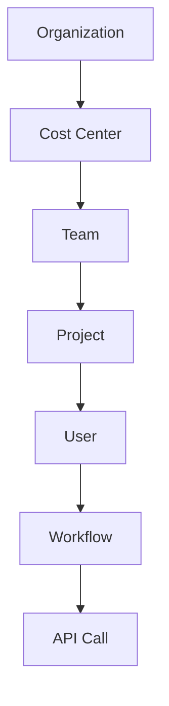

# Cost Attribution System: Track and Optimize AI Spending

**Production Playbook for Finance Teams and Engineering Managers**

Tracking AI infrastructure costs by team, project, user, and workflow enables accurate chargeback, budget management, and cost optimization. This playbook provides cost tagging strategies, budget enforcement, chargeback models, usage analytics, and optimization recommendations for Claude Code deployments.

## Table of Contents

1. [Cost Attribution Strategy](#cost-attribution-strategy)
2. [Cost Tagging](#cost-tagging)
3. [Budget Management](#budget-management)
4. [Chargeback Models](#chargeback-models)
5. [Usage Analytics](#usage-analytics)
6. [Cost Optimization](#cost-optimization)
7. [Reporting & Dashboards](#reporting--dashboards)
8. [Best Practices](#best-practices)
9. [Tools & Resources](#tools--resources)
10. [Summary](#summary)

---

## Cost Attribution Strategy

### Cost Dimensions

```typescript
interface CostAttribution {
  // Primary dimensions
  team: string;              // engineering-backend
  project: string;           // api-server
  user: string;              // user-123
  workflow: string;          // code-review

  // Secondary dimensions
  environment: 'dev' | 'staging' | 'production';
  region: string;            // us-east-1
  costCenter: string;        // eng-001

  // Cost details
  provider: 'anthropic' | 'ollama' | 'self-hosted';
  model: string;             // claude-3-5-sonnet-20241022
  inputTokens: number;
  outputTokens: number;
  cost: number;              // USD
  timestamp: number;
}
```

### Attribution Hierarchy



**Roll-up Example**:
- **API Call**: $0.015 (Claude API call)
- **Workflow** (code-review): $0.045 (3 API calls)
- **User** (alice): $2.50/day (multiple workflows)
- **Project** (api-server): $75/day (multiple users)
- **Team** (backend): $300/day (4 projects)
- **Cost Center** (eng-001): $1,200/day (4 teams)

---

## Cost Tagging

### Automatic Cost Tagging

```typescript
class CostTagger {
  async tagAPICall(
    request: any,
    context: {
      userId: string;
      teamId: string;
      projectId: string;
      workflow: string;
    }
  ): Promise<CostAttribution> {
    // Calculate cost
    const inputCost = (request.inputTokens / 1_000_000) * 3.00;  // $3/1M
    const outputCost = (request.outputTokens / 1_000_000) * 15.00; // $15/1M
    const totalCost = inputCost + outputCost;

    // Create attribution record
    const attribution: CostAttribution = {
      team: context.teamId,
      project: context.projectId,
      user: context.userId,
      workflow: context.workflow,
      environment: process.env.NODE_ENV as any,
      region: process.env.AWS_REGION || 'us-east-1',
      costCenter: await this.getCostCenter(context.teamId),
      provider: 'anthropic',
      model: request.model,
      inputTokens: request.inputTokens,
      outputTokens: request.outputTokens,
      cost: totalCost,
      timestamp: Date.now()
    };

    // Store for analysis
    await this.storeCostData(attribution);

    return attribution;
  }

  private async getCostCenter(teamId: string): Promise<string> {
    const teamMapping: Record<string, string> = {
      'engineering-backend': 'eng-001',
      'engineering-frontend': 'eng-002',
      'product': 'prod-001',
      'marketing': 'mkt-001'
    };

    return teamMapping[teamId] || 'unallocated';
  }

  private async storeCostData(attribution: CostAttribution): Promise<void> {
    // Option 1: PostgreSQL
    await db.costs.insert(attribution);

    // Option 2: Time-series database (InfluxDB)
    await influx.writePoint({
      measurement: 'api_costs',
      tags: {
        team: attribution.team,
        project: attribution.project,
        environment: attribution.environment
      },
      fields: {
        cost: attribution.cost,
        inputTokens: attribution.inputTokens,
        outputTokens: attribution.outputTokens
      },
      timestamp: attribution.timestamp
    });

    // Option 3: Export to CSV for billing
    await this.appendToCSV(attribution);
  }

  private async appendToCSV(attribution: CostAttribution): Promise<void> {
    const line = [
      new Date(attribution.timestamp).toISOString(),
      attribution.team,
      attribution.project,
      attribution.user,
      attribution.workflow,
      attribution.provider,
      attribution.model,
      attribution.inputTokens,
      attribution.outputTokens,
      attribution.cost.toFixed(4)
    ].join(',') + '\n';

    await appendFile('/var/log/costs/costs.csv', line);
  }
}
```

### Usage Example

```typescript
// Intercept all API calls and tag costs
const tagger = new CostTagger();

async function callClaudeWithTagging(prompt: string, context: any): Promise<string> {
  const startTime = Date.now();

  const response = await anthropic.messages.create({
    model: 'claude-3-5-sonnet-20241022',
    max_tokens: 1024,
    messages: [{ role: 'user', content: prompt }]
  });

  // Tag costs
  await tagger.tagAPICall({
    model: 'claude-3-5-sonnet-20241022',
    inputTokens: response.usage.input_tokens,
    outputTokens: response.usage.output_tokens
  }, {
    userId: context.userId,
    teamId: context.teamId,
    projectId: context.projectId,
    workflow: context.workflow
  });

  return response.content[0].text;
}
```

---

## Budget Management

### Budget Enforcement

```typescript
interface Budget {
  id: string;
  entity: { type: 'team' | 'project' | 'user'; id: string };
  period: 'daily' | 'weekly' | 'monthly';
  limit: number;  // USD
  alertThresholds: number[];  // [0.5, 0.8, 0.9]
  enforced: boolean;
}

class BudgetManager {
  private budgets: Map<string, Budget> = new Map();

  async setBudget(budget: Budget): Promise<void> {
    this.budgets.set(budget.id, budget);
    await db.budgets.upsert(budget);
  }

  async checkBudget(
    entityType: 'team' | 'project' | 'user',
    entityId: string
  ): Promise<{ allowed: boolean; spent: number; limit: number; remaining: number }> {
    // Find budget
    const budget = await this.findBudget(entityType, entityId);
    if (!budget) {
      return { allowed: true, spent: 0, limit: Infinity, remaining: Infinity };
    }

    // Calculate current period spend
    const periodStart = this.getPeriodStart(budget.period);
    const spent = await this.calculateSpend(entityType, entityId, periodStart);

    // Check against limit
    const allowed = !budget.enforced || spent < budget.limit;
    const remaining = budget.limit - spent;

    // Check alert thresholds
    const utilizationRate = spent / budget.limit;
    for (const threshold of budget.alertThresholds) {
      if (utilizationRate >= threshold && utilizationRate < threshold + 0.01) {
        await this.sendBudgetAlert(budget, spent, utilizationRate);
      }
    }

    return { allowed, spent, limit: budget.limit, remaining };
  }

  private getPeriodStart(period: 'daily' | 'weekly' | 'monthly'): number {
    const now = new Date();

    switch (period) {
      case 'daily':
        return new Date(now.getFullYear(), now.getMonth(), now.getDate()).getTime();
      case 'weekly':
        const weekStart = new Date(now);
        weekStart.setDate(now.getDate() - now.getDay());
        return weekStart.getTime();
      case 'monthly':
        return new Date(now.getFullYear(), now.getMonth(), 1).getTime();
    }
  }

  private async calculateSpend(
    entityType: string,
    entityId: string,
    since: number
  ): Promise<number> {
    const costs = await db.costs.find({
      [entityType]: entityId,
      timestamp: { $gte: since }
    });

    return costs.reduce((sum, c) => sum + c.cost, 0);
  }

  private async findBudget(entityType: string, entityId: string): Promise<Budget | null> {
    return await db.budgets.findOne({
      'entity.type': entityType,
      'entity.id': entityId
    });
  }

  private async sendBudgetAlert(budget: Budget, spent: number, rate: number): Promise<void> {
    const message = `
Budget Alert: ${budget.entity.type} ${budget.entity.id}

Current spend: $${spent.toFixed(2)}
Budget limit: $${budget.limit.toFixed(2)}
Utilization: ${(rate * 100).toFixed(1)}%

Period: ${budget.period}
    `.trim();

    // Send to Slack, email, PagerDuty, etc.
    console.warn(message);
  }
}
```

### Usage with Budget Enforcement

```typescript
const budgetManager = new BudgetManager();

// Set team budget: $500/month
await budgetManager.setBudget({
  id: 'budget-backend-monthly',
  entity: { type: 'team', id: 'engineering-backend' },
  period: 'monthly',
  limit: 500,
  alertThresholds: [0.5, 0.8, 0.9],  // Alert at 50%, 80%, 90%
  enforced: true
});

// Check budget before API call
async function callWithBudgetCheck(prompt: string, teamId: string): Promise<string> {
  const budget = await budgetManager.checkBudget('team', teamId);

  if (!budget.allowed) {
    throw new Error(`Budget exceeded for team ${teamId}. Spent: $${budget.spent.toFixed(2)}, Limit: $${budget.limit.toFixed(2)}`);
  }

  return await callClaude(prompt);
}
```

---

## Chargeback Models

### Model 1: Direct Chargeback (Pay-per-use)

```typescript
interface ChargebackModel {
  type: 'direct' | 'allocated' | 'tiered';
  rates: {
    inputTokens: number;   // $/1M tokens
    outputTokens: number;  // $/1M tokens
  };
  markup?: number;  // e.g., 1.2 for 20% markup
}

class DirectChargeback {
  async calculateMonthlyChargeback(teamId: string, month: string): Promise<number> {
    // Get all costs for team in month
    const costs = await db.costs.find({
      team: teamId,
      timestamp: {
        $gte: new Date(`${month}-01`).getTime(),
        $lt: new Date(`${month}-01`).getTime() + 30 * 86400000
      }
    });

    // Sum costs
    const total = costs.reduce((sum, c) => sum + c.cost, 0);

    // Apply markup (if infrastructure overhead)
    const markup = 1.2;  // 20% overhead
    return total * markup;
  }
}
```

### Model 2: Allocated Chargeback (Fixed budgets)

```typescript
class AllocatedChargeback {
  async allocateBudget(totalBudget: number, teams: string[]): Promise<Record<string, number>> {
    // Get usage share for each team
    const usageShares = await this.calculateUsageShares(teams);

    // Allocate budget proportionally
    const allocations: Record<string, number> = {};
    for (const team of teams) {
      allocations[team] = totalBudget * usageShares[team];
    }

    return allocations;
  }

  private async calculateUsageShares(teams: string[]): Promise<Record<string, number>> {
    const usage: Record<string, number> = {};
    let total = 0;

    for (const team of teams) {
      const costs = await db.costs.find({ team });
      const teamCost = costs.reduce((sum, c) => sum + c.cost, 0);
      usage[team] = teamCost;
      total += teamCost;
    }

    // Convert to shares (0-1)
    const shares: Record<string, number> = {};
    for (const team of teams) {
      shares[team] = usage[team] / total;
    }

    return shares;
  }
}
```

### Model 3: Tiered Pricing (Volume discounts)

```typescript
interface PricingTier {
  minTokens: number;
  maxTokens: number;
  pricePerMillion: number;
}

class TieredChargeback {
  private tiers: PricingTier[] = [
    { minTokens: 0, maxTokens: 1_000_000, pricePerMillion: 15 },        // 0-1M: $15/M
    { minTokens: 1_000_000, maxTokens: 10_000_000, pricePerMillion: 12 }, // 1M-10M: $12/M
    { minTokens: 10_000_000, maxTokens: Infinity, pricePerMillion: 10 }   // 10M+: $10/M
  ];

  calculateCost(tokens: number): number {
    let cost = 0;
    let remaining = tokens;

    for (const tier of this.tiers) {
      const tierSize = tier.maxTokens - tier.minTokens;
      const tokensInTier = Math.min(remaining, tierSize);

      if (tokensInTier > 0) {
        cost += (tokensInTier / 1_000_000) * tier.pricePerMillion;
        remaining -= tokensInTier;
      }

      if (remaining === 0) break;
    }

    return cost;
  }
}

// Example
const tiered = new TieredChargeback();
console.log(tiered.calculateCost(15_000_000));
// 0-1M: $15
// 1M-10M: $108 (9M × $12)
// 10M-15M: $50 (5M × $10)
// Total: $173
```

---

## Usage Analytics

### Cost Analytics Dashboard

```typescript
interface UsageMetrics {
  totalCost: number;
  totalTokens: number;
  avgCostPerRequest: number;
  topProjects: Array<{ project: string; cost: number }>;
  topUsers: Array<{ user: string; cost: number }>;
  costTrend: Array<{ date: string; cost: number }>;
}

class UsageAnalytics {
  async generateMonthlyReport(month: string): Promise<UsageMetrics> {
    const costs = await db.costs.find({
      timestamp: {
        $gte: new Date(`${month}-01`).getTime(),
        $lt: new Date(`${month}-01`).getTime() + 30 * 86400000
      }
    });

    // Total cost
    const totalCost = costs.reduce((sum, c) => sum + c.cost, 0);
    const totalTokens = costs.reduce((sum, c) => sum + c.inputTokens + c.outputTokens, 0);

    // Average cost per request
    const avgCostPerRequest = totalCost / costs.length;

    // Top projects by cost
    const projectCosts = this.groupBy(costs, 'project');
    const topProjects = Object.entries(projectCosts)
      .map(([project, costs]) => ({
        project,
        cost: costs.reduce((sum: number, c: any) => sum + c.cost, 0)
      }))
      .sort((a, b) => b.cost - a.cost)
      .slice(0, 10);

    // Top users by cost
    const userCosts = this.groupBy(costs, 'user');
    const topUsers = Object.entries(userCosts)
      .map(([user, costs]) => ({
        user,
        cost: costs.reduce((sum: number, c: any) => sum + c.cost, 0)
      }))
      .sort((a, b) => b.cost - a.cost)
      .slice(0, 10);

    // Daily cost trend
    const dailyCosts = this.groupByDate(costs);
    const costTrend = Object.entries(dailyCosts)
      .map(([date, costs]) => ({
        date,
        cost: costs.reduce((sum: number, c: any) => sum + c.cost, 0)
      }))
      .sort((a, b) => a.date.localeCompare(b.date));

    return {
      totalCost,
      totalTokens,
      avgCostPerRequest,
      topProjects,
      topUsers,
      costTrend
    };
  }

  private groupBy(items: any[], key: string): Record<string, any[]> {
    return items.reduce((acc, item) => {
      const groupKey = item[key];
      if (!acc[groupKey]) acc[groupKey] = [];
      acc[groupKey].push(item);
      return acc;
    }, {});
  }

  private groupByDate(costs: any[]): Record<string, any[]> {
    return costs.reduce((acc, cost) => {
      const date = new Date(cost.timestamp).toISOString().split('T')[0];
      if (!acc[date]) acc[date] = [];
      acc[date].push(cost);
      return acc;
    }, {});
  }
}
```

---

## Cost Optimization

### Optimization Recommendations

```typescript
interface OptimizationRecommendation {
  category: 'model-selection' | 'caching' | 'batching' | 'workflow';
  description: string;
  potentialSavings: number;  // USD/month
  effort: 'low' | 'medium' | 'high';
  implementation: string;
}

class CostOptimizer {
  async analyzeAndRecommend(teamId: string): Promise<OptimizationRecommendation[]> {
    const recommendations: OptimizationRecommendation[] = [];

    // Analyze model usage
    const modelRecommendation = await this.analyzeModelUsage(teamId);
    if (modelRecommendation) recommendations.push(modelRecommendation);

    // Analyze caching opportunities
    const cacheRecommendation = await this.analyzeCachingOpportunities(teamId);
    if (cacheRecommendation) recommendations.push(cacheRecommendation);

    // Analyze batching opportunities
    const batchRecommendation = await this.analyzeBatchingOpportunities(teamId);
    if (batchRecommendation) recommendations.push(batchRecommendation);

    return recommendations.sort((a, b) => b.potentialSavings - a.potentialSavings);
  }

  private async analyzeModelUsage(teamId: string): Promise<OptimizationRecommendation | null> {
    // Check if using expensive model for simple tasks
    const costs = await db.costs.find({ team: teamId });

    const sonnetUsage = costs.filter(c => c.model.includes('sonnet'));
    const simplePrompts = sonnetUsage.filter(c =>
      c.inputTokens < 1000 && c.outputTokens < 500
    );

    if (simplePrompts.length > sonnetUsage.length * 0.5) {
      const currentCost = simplePrompts.reduce((sum, c) => sum + c.cost, 0);
      const haikuCost = currentCost * (0.8 / 3.0);  // Haiku is cheaper
      const monthlySavings = (currentCost - haikuCost) * 30;

      return {
        category: 'model-selection',
        description: `${simplePrompts.length} simple prompts use Claude 3.5 Sonnet. Switch to Claude 3.5 Haiku for 73% cost reduction.`,
        potentialSavings: monthlySavings,
        effort: 'low',
        implementation: 'Update model parameter in simple workflows to claude-3-5-haiku-20241022'
      };
    }

    return null;
  }

  private async analyzeCachingOpportunities(teamId: string): Promise<OptimizationRecommendation | null> {
    const costs = await db.costs.find({ team: teamId });

    // Find duplicate prompts
    const promptCounts = new Map<string, number>();
    for (const cost of costs) {
      const hash = this.hashPrompt(cost);
      promptCounts.set(hash, (promptCounts.get(hash) || 0) + 1);
    }

    const duplicates = Array.from(promptCounts.entries()).filter(([_, count]) => count > 1);
    const duplicateCost = duplicates.reduce((sum, [hash, count]) => {
      const prompt = costs.find(c => this.hashPrompt(c) === hash);
      return sum + (prompt?.cost || 0) * (count - 1);
    }, 0);

    if (duplicateCost > 10) {
      return {
        category: 'caching',
        description: `${duplicates.length} prompts are duplicated. Implement caching to avoid redundant API calls.`,
        potentialSavings: duplicateCost * 30,
        effort: 'medium',
        implementation: 'Add Redis cache for LLM responses with 1-hour TTL'
      };
    }

    return null;
  }

  private async analyzeBatchingOpportunities(teamId: string): Promise<OptimizationRecommendation | null> {
    // Find sequential requests that could be batched
    const costs = await db.costs.find({ team: teamId }).sort({ timestamp: 1 });

    let batchableCount = 0;
    for (let i = 0; i < costs.length - 1; i++) {
      const timeDiff = costs[i + 1].timestamp - costs[i].timestamp;
      if (timeDiff < 1000) {  // Within 1 second
        batchableCount++;
      }
    }

    if (batchableCount > costs.length * 0.3) {
      const savings = (batchableCount / costs.length) * costs.reduce((sum, c) => sum + c.cost, 0);

      return {
        category: 'batching',
        description: `${batchableCount} requests could be batched. Combine multiple prompts into single API call.`,
        potentialSavings: savings * 30 * 0.3,  // 30% reduction from batching
        effort: 'high',
        implementation: 'Implement request batching with 100ms window'
      };
    }

    return null;
  }

  private hashPrompt(cost: any): string {
    return `${cost.workflow}-${cost.inputTokens}-${cost.outputTokens}`;
  }
}
```

---

## Reporting & Dashboards

### Monthly Cost Report

```typescript
class CostReporter {
  async generateMonthlyReport(month: string): Promise<string> {
    const analytics = new UsageAnalytics();
    const metrics = await analytics.generateMonthlyReport(month);

    const report = `
# Cost Report - ${month}

## Summary
- **Total Cost**: $${metrics.totalCost.toFixed(2)}
- **Total Tokens**: ${metrics.totalTokens.toLocaleString()}
- **Avg Cost/Request**: $${metrics.avgCostPerRequest.toFixed(4)}

## Top Projects by Cost
${metrics.topProjects.map((p, i) => `${i + 1}. ${p.project}: $${p.cost.toFixed(2)}`).join('\n')}

## Top Users by Cost
${metrics.topUsers.map((u, i) => `${i + 1}. ${u.user}: $${u.cost.toFixed(2)}`).join('\n')}

## Daily Cost Trend
${metrics.costTrend.map(d => `${d.date}: $${d.cost.toFixed(2)}`).join('\n')}

## Optimization Recommendations
${await this.getOptimizationRecommendations()}

---
Generated: ${new Date().toISOString()}
    `.trim();

    return report;
  }

  private async getOptimizationRecommendations(): Promise<string> {
    const optimizer = new CostOptimizer();
    const recommendations = await optimizer.analyzeAndRecommend('engineering-backend');

    return recommendations
      .map(r => `- **${r.category}**: ${r.description} (Savings: $${r.potentialSavings.toFixed(2)}/month, Effort: ${r.effort})`)
      .join('\n');
  }
}
```

---

## Best Practices

### DO ✅

1. **Tag all costs**
   ```typescript
   await tagger.tagAPICall(request, { teamId, projectId, userId, workflow });
   ```

2. **Enforce budgets**
   ```typescript
   const budget = await budgetManager.checkBudget('team', teamId);
   if (!budget.allowed) throw new Error('Budget exceeded');
   ```

3. **Monitor trends**
   ```typescript
   const report = await analytics.generateMonthlyReport('2025-12');
   ```

### DON'T ❌

1. **Don't skip cost tracking**
   ```typescript
   // ❌ No cost tracking
   await callClaude(prompt);

   // ✅ Track costs
   await callClaudeWithTagging(prompt, context);
   ```

2. **Don't ignore optimization**
   ```typescript
   const recommendations = await optimizer.analyzeAndRecommend(teamId);
   // Implement high-value, low-effort optimizations
   ```

---

## Tools & Resources

### Analytics Tools

- **PostgreSQL**: Cost data storage
- **InfluxDB**: Time-series metrics
- **Grafana**: Dashboards
- **Metabase**: BI reporting

### Cost Management

- **AWS Cost Explorer**: Cloud infrastructure costs
- **CloudHealth**: Multi-cloud cost management
- **Kubecost**: Kubernetes cost allocation

---

## Summary

**Key Takeaways**:

1. **Tag all costs** - Team, project, user, workflow dimensions
2. **Enforce budgets** - Hard limits with alerts at 50%/80%/90%
3. **Implement chargeback** - Direct, allocated, or tiered models
4. **Analyze usage** - Monthly reports with top consumers
5. **Optimize continuously** - Model selection, caching, batching
6. **Report transparently** - Share costs with stakeholders
7. **Monitor trends** - Daily cost tracking

**Cost Attribution Checklist**:
- [ ] Implement cost tagging on all API calls
- [ ] Set up PostgreSQL/InfluxDB for cost data
- [ ] Define budgets for teams and projects
- [ ] Configure budget alerts (50%, 80%, 90%)
- [ ] Implement chargeback model
- [ ] Generate monthly cost reports
- [ ] Create Grafana dashboard for cost visualization
- [ ] Run cost optimizer monthly
- [ ] Implement top 3 optimization recommendations
- [ ] Share cost reports with finance team

---

**Last Updated**: 2025-12-24
**Author**: Jeremy Longshore
**Related Playbooks**: [Cost Caps & Budget Management](./02-cost-caps.md), [Team Presets & Workflows](./08-team-presets.md)
